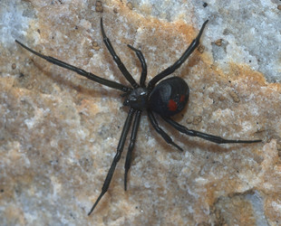

## Phylogeny 

-   « Ancestral Groups  
    -   [Latrodectus](Latrodectus)
    -   [Theridiidae](Theridiidae)
    -   [Orbiculariae](Orbiculariae)
    -   [Entelegynae](Entelegynae)
    -   [Araneomorphae](Araneomorphae)
    -   [Spider](../../../../../../Spider.md)
    -   [Arachnida](Arachnida)
    -   [Arthropoda](Arthropoda)
    -   [Bilateria](Bilateria)
    -   [Animals](Animals)
    -   [Eukaryotes](Eukaryotes)
    -   [Tree of Life](../../../../../../../../../../../../Tree_of_Life.md)

-   ◊ Sibling Groups of  Latrodectus
    -   [Latrodectus geometricus](Latrodectus_geometricus)
    -   [Latrodectus diaguita](Latrodectus_diaguita)
    -   [Latrodectus antheratus](Latrodectus_antheratus)
    -   Latrodectus mirabilis
    -   [Latrodectus         renivulvatus](Latrodectus_renivulvatus)
    -   [Latrodectus         indistinctus](Latrodectus_indistinctus)
    -   [Latrodectus quartus](Latrodectus_quartus)

-   » Sub-Groups 

# *Latrodectus mirabilis* 

[Jeremy Miller]()

Containing group: *[Latrodectus](Latrodectus.md)*

## Title Illustrations



  ---------------------------------------------------------------------------------------
  Scientific Name ::     Latrodectus mirabilis
  Location ::           Parque Provincial Tornquist, Buenos Aires Prov., Argentina
  Specimen Condition   Live Specimen
  Identified By        Jeremy Miller
  Sex ::                Female
  Life Cycle Stage ::     Adult
  Copyright ::            © [Jeremy Miller](http://www.calacademy.org/research/entomology/personnel/jmiller/index.htm) 
  ---------------------------------------------------------------------------------------


  ---------------------------------------------------------------------------------------
  Scientific Name ::     Latrodectus mirabilis
  Location ::           Parque Provincial Tornquist, Buenos Aires Prov., Argentina
  Specimen Condition   Live Specimen
  Identified By        Jeremy Miller
  Sex ::                Female
  Life Cycle Stage ::     Adult
  Copyright ::            © [Jeremy Miller](http://www.calacademy.org/research/entomology/personnel/jmiller/index.htm) 
  ---------------------------------------------------------------------------------------


  ---------------------------------------------------------------------------------------
  Scientific Name ::     Latrodectus mirabilis
  Location ::           5 km E La Toma, San Luis Prov., Argentina
  Specimen Condition   Live Specimen
  Identified By        Jeremy Miller
  Sex ::                Female
  Life Cycle Stage ::     Adult
  Copyright ::            © [Jeremy Miller](http://www.calacademy.org/research/entomology/personnel/jmiller/index.htm) 
  ---------------------------------------------------------------------------------------


  ---------------------------------------------------------------------------------------
  Scientific Name ::     Latrodectus mirabilis
  Location ::           5 km E La Toma, San Luis Prov., Argentina
  Specimen Condition   Live Specimen
  Identified By        Jeremy Miller
  Sex ::                Male and Female
  Life Cycle Stage ::     Adults
  Copyright ::            © [Jeremy Miller](http://www.calacademy.org/research/entomology/personnel/jmiller/index.htm) 
  ---------------------------------------------------------------------------------------


  ---------------------------------------------------------------------------------------
  Scientific Name ::     Latrodectus mirabilis
  Location ::           5 km E La Toma, San Luis Prov., Argentina
  Specimen Condition   Live Specimen
  Identified By        Jeremy Miller
  Sex ::                Male
  Life Cycle Stage ::     Adult
  Copyright ::            © [Jeremy Miller](http://www.calacademy.org/research/entomology/personnel/jmiller/index.htm) 
  ---------------------------------------------------------------------------------------


  ---------------------------------------------------------------------------------------
  Scientific Name ::     Latrodectus mirabilis
  Location ::           5 km E La Toma, San Luis Prov., Argentina
  Specimen Condition   Dead Specimen
  Identified By        Jeremy Miller
  Life Cycle Stage ::     Egg case
  Copyright ::            © [Jeremy Miller](http://www.calacademy.org/research/entomology/personnel/jmiller/index.htm) 
  ---------------------------------------------------------------------------------------
