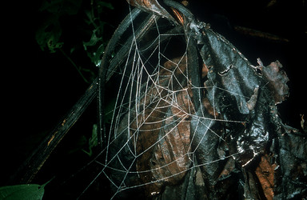

## Phylogeny 

-   « Ancestral Groups  
    -   [Orbiculariae](Orbiculariae)
    -   [Entelegynae](Entelegynae)
    -   [Araneomorphae](Araneomorphae)
    -   [Spider](../../../../Spider.md)
    -   [Arachnida](Arachnida)
    -   [Arthropoda](Arthropoda)
    -   [Bilateria](Bilateria)
    -   [Animals](Animals)
    -   [Eukaryotes](Eukaryotes)
    -   [Tree of Life](../../../../../../../../../../Tree_of_Life.md)

-   ◊ Sibling Groups of  Orbiculariae
    -   [Anapidae](Anapidae)
    -   [Mysmenidae](Mysmenidae)
    -   [Deinopidae](Deinopidae)
    -   [Uloboridae](Uloboridae)
    -   [Araneidae](Araneidae)
    -   Theridiosomatidae
    -   [Symphytognathidae](Symphytognathidae)
    -   [Linyphiidae](Linyphiidae)
    -   [Pimoidae](Pimoidae)
    -   [Synotaxidae](Synotaxidae)
    -   [Cyatholipidae](Cyatholipidae)
    -   [Nesticidae](Nesticidae)
    -   [Theridiidae](Theridiidae)

-   » Sub-Groups 

# Theridiosomatidae 

Tree from Griswold et al. 1998.

Containing group: [Orbiculariae](Orbiculariae.md)

### References

Coddington, J. A. 1986. The genera of the spider family
Theridiosomatidae. Smithsonian Contributions to Zoology, 422: 1--96.

Coddington, J.A. 2005. Phylogeny and Classification of Spiders. In D.
Ubick, P. Paquin, P. E. Cushing, and V. Roth (eds.) Spiders of North
America: an identification manual, American Arachnological Society. 377
pages. Chapter 2, pp. 18-24.

Coddington, J. A. and C. E. Valerio. 1981. Observations on the web and
behavior of Wendilgarda spiders (Spider: Theridiosomatidae). Psyche,
87:93--105.

Eberhard, W.G. 1986. Ontogenetic changes in the web of Epeirotypus sp.
(Spider, Theridiosomatidae). J. Arachnology 14:125-128.

Eberhard, W.G. 1989. Niche expansion in the spider Wendilgarda
galapagensis (Spider, Theridiosomatidae) on Cocos Island (Pacific
Ocean). Revista De Biologia Tropical 37:163-168.

Eberhard, W.G. 1991. Notes on the natural history of Wendilgarda
galapagensis (Spider: Theridiosomatidae). Bulletin Of The British
Arachnological Society 8:246-248.

Griswold, C. E., J. A. Coddington, G. Hormiga, and N. Scharff. 1998.
Phylogeny of the orb-web building spiders (Spider, Orbiculariae:
Deinopoidea, Araneoidea). Zoological Journal of the Linnean Society
123:1-99.

Jocqué, R. & A.S. Dippenaar-Schoeman. 2006. Spider Families of the
World. Musée Royal de l\'Afrique Centrale, Tevuren. 336pp.

## Title Illustrations



  ---------------------------------------------------------------------------------
  Scientific Name ::     Chthonos sp.
  Location ::           French Guiana. Commune Regina. Les Nouragues Field Station
  Specimen Condition   Live Specimen
  Identified By        Jonathan Coddington
  Behavior             Eggsacs of Chthonos are small and cubical\--one of the few cubical constructions in the animal kingdo
  Sex ::                Female
  Life Cycle Stage ::     eggsac
  Copyright ::            © [Jonathan Coddington](http://entomology.si.edu/StaffPages/coddington.html) 
  ---------------------------------------------------------------------------------


  ---------------------------------------------------------------------------------
  Scientific Name ::     Ogulnius sp.
  Location ::           Costa Rica
  Specimen Condition   Live Specimen
  Identified By        Jonathan Coddington
  Behavior             Ogulnius webs lack frames and apparent radii are actually remnants of exploration behavior, not ster
  Life Cycle Stage ::     adult
  Size                 10cm
  Copyright ::            © [Jonathan Coddington](http://entomology.si.edu/StaffPages/coddington.html) 
  ---------------------------------------------------------------------------------


  ---------------------------------------------------------------------------------
  Scientific Name ::     Theridiosoma gemmosum
  Location ::           North Carolina
  Specimen Condition   Live Specimen
  Identified By        Jonathan Coddington
  Behavior             Most theridiosomatid genera make a \"temporary circle\" (derived) rather than the plesiomorphic tempor
  Sex ::                Female
  Life Cycle Stage ::     adult
  Size                 ca 20 cm high
  Copyright ::            © [Jonathan Coddington](http://entomology.si.edu/StaffPages/coddington.html) 
  ---------------------------------------------------------------------------------


  ---------------------------------------------------------------------------------
  Scientific Name ::     Theridiosoma gemmosum
  Location ::           North Carolina
  Specimen Condition   Live Specimen
  Identified By        Jonathan Coddington
  Behavior             Several theridiosomatid genera actively distort the planar orb into a cone by reeling in a silk line
  Sex ::                Female
  Life Cycle Stage ::     ad
  Size                 ca. 20 cm high
  Copyright ::            © [Jonathan Coddington](http://entomology.si.edu/StaffPages/coddington.html) 
  ---------------------------------------------------------------------------------

## Confidential Links & Embeds: 

### #is_/same_as :: [Theridiosomatidae](/_Standards/bio/bio~Domain/Eukaryotes/Animals/Bilateria/Arthropoda/Chelicerata/Arachnida/Spider/Araneomorphae/Entelegynae/Orbiculariae/Theridiosomatidae.md) 

### #is_/same_as :: [Theridiosomatidae.public](/_public/bio/bio~Domain/Eukaryotes/Animals/Bilateria/Arthropoda/Chelicerata/Arachnida/Spider/Araneomorphae/Entelegynae/Orbiculariae/Theridiosomatidae.public.md) 

### #is_/same_as :: [Theridiosomatidae.internal](/_internal/bio/bio~Domain/Eukaryotes/Animals/Bilateria/Arthropoda/Chelicerata/Arachnida/Spider/Araneomorphae/Entelegynae/Orbiculariae/Theridiosomatidae.internal.md) 

### #is_/same_as :: [Theridiosomatidae.protect](/_protect/bio/bio~Domain/Eukaryotes/Animals/Bilateria/Arthropoda/Chelicerata/Arachnida/Spider/Araneomorphae/Entelegynae/Orbiculariae/Theridiosomatidae.protect.md) 

### #is_/same_as :: [Theridiosomatidae.private](/_private/bio/bio~Domain/Eukaryotes/Animals/Bilateria/Arthropoda/Chelicerata/Arachnida/Spider/Araneomorphae/Entelegynae/Orbiculariae/Theridiosomatidae.private.md) 

### #is_/same_as :: [Theridiosomatidae.personal](/_personal/bio/bio~Domain/Eukaryotes/Animals/Bilateria/Arthropoda/Chelicerata/Arachnida/Spider/Araneomorphae/Entelegynae/Orbiculariae/Theridiosomatidae.personal.md) 

### #is_/same_as :: [Theridiosomatidae.secret](/_secret/bio/bio~Domain/Eukaryotes/Animals/Bilateria/Arthropoda/Chelicerata/Arachnida/Spider/Araneomorphae/Entelegynae/Orbiculariae/Theridiosomatidae.secret.md)

