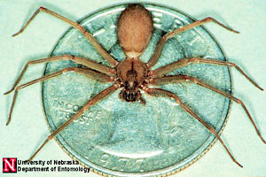
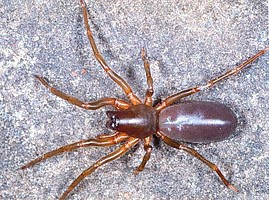

# [[Haplogynae]] 

   

## #has_/text_of_/abstract 

> The **Haplogynae** or haplogynes are one of the two main groups 
> into which araneomorph spiders have traditionally been divided, the other being the Entelegynae. 
> 
> Morphological phylogenetic studies suggested that the Haplogynae formed a clade; 
> more recent molecular phylogenetic studies refute this, 
> although many of the ecribellate haplogynes do appear to form a clade, Synspermiata.
>
> Unlike the Entelegynae, haplogynes lack hardened (sclerotized) female genitalia (epigynes).
>
> Most of the species within this group have six eyes, as opposed to most other spiders. 
> Spiders in the genus Tetrablemma (Tetrablemmidae) have only four eyes, 
> as do some members of the family Caponiidae; 
> caponiids may even have only two eyes. However, spiders in the family Plectreuridae have the normal eight eyes.
>
> [Wikipedia](https://en.wikipedia.org/wiki/Haplogynae) 

## Phylogeny 

-   « Ancestral Groups  
    -   [Araneomorphae](Araneomorphae)
    -   [Spider](../../Spider.md)
    -   [Arachnida](Arachnida)
    -   [Arthropoda](Arthropoda)
    -   [Bilateria](Bilateria)
    -   [Animals](Animals)
    -   [Eukaryotes](Eukaryotes)
    -   [Tree of Life](../../../../../../../../Tree_of_Life.md)

-   ◊ Sibling Groups of  Araneomorphae
    -   Haplogynae
    -   [Hypochilidae](Hypochilidae)
    -   [Entelegynae](Entelegynae)

-   » Sub-Groups
    -   [Sicariidae](Sicariidae.md)

## Title Illustrations

----------------------------------------------------------------------

Scientific Name ::  Loxosceles reclusa
Comments          Brown recluse spider
Copyright ::         © [Jim Kalisch](http://entomology.unl.edu/) 

----------------------------------------------------------------------------

Scientific Name ::     Arachnida:Spider:Dysderidae: Dysdera erythrina
Location ::           "Corno alle Scale" Park, Bologna Province, Emilia Romagna, Italy
Specimen Condition   Live Specimen
Image Use ::    [Attribution-NonCommercial 2.0 Creative Commons License](http://creativecommons.org/licenses/by-nc/2.0/).
Copyright ::            © 2005 [Cesare Brizio](http://xoomer.virgilio.it/cebrizio/) 

## Confidential Links & Embeds: 

### [Haplogynae](/_Standards/bio/bio~Domain/Eukaryotes/Animals/Bilateria/Arthropoda/Chelicerata/Arachnida/Spider/Araneomorphae/Haplogynae.md) 

### [Haplogynae.public](/_public/bio/bio~Domain/Eukaryotes/Animals/Bilateria/Arthropoda/Chelicerata/Arachnida/Spider/Araneomorphae/Haplogynae.public.md) 

### [Haplogynae.internal](/_internal/bio/bio~Domain/Eukaryotes/Animals/Bilateria/Arthropoda/Chelicerata/Arachnida/Spider/Araneomorphae/Haplogynae.internal.md) 

### [Haplogynae.protect](/_protect/bio/bio~Domain/Eukaryotes/Animals/Bilateria/Arthropoda/Chelicerata/Arachnida/Spider/Araneomorphae/Haplogynae.protect.md) 

### [Haplogynae.private](/_private/bio/bio~Domain/Eukaryotes/Animals/Bilateria/Arthropoda/Chelicerata/Arachnida/Spider/Araneomorphae/Haplogynae.private.md) 

### [Haplogynae.personal](/_personal/bio/bio~Domain/Eukaryotes/Animals/Bilateria/Arthropoda/Chelicerata/Arachnida/Spider/Araneomorphae/Haplogynae.personal.md) 

### [Haplogynae.secret](/_secret/bio/bio~Domain/Eukaryotes/Animals/Bilateria/Arthropoda/Chelicerata/Arachnida/Spider/Araneomorphae/Haplogynae.secret.md)

