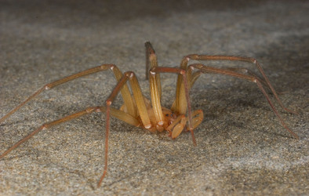

# [[Sicariidae]] 

     

## #has_/text_of_/abstract 

> **Sicariidae** is a family of six-eyed venomous spiders known for their potentially necrotic bites. 
> The family consists of three genera and about 160 species. 
> Well known spiders in this family include the brown recluse spider and the six-eyed sand spider.
>
> [Wikipedia](https://en.wikipedia.org/wiki/Sicariidae) 

### Characteristics

Note the violin shaped mark on the cephalothorax (front half of body)
and the six eyes, grouped in pairs.\

## Phylogeny 

-   « Ancestral Groups  
    -   [Haplogynae](Haplogynae)
    -   [Araneomorphae](Araneomorphae)
    -   [Spider](../../../Spider.md)
    -   [Arachnida](Arachnida)
    -   [Arthropoda](Arthropoda)
    -   [Bilateria](Bilateria)
    -   [Animals](Animals)
    -   [Eukaryotes](Eukaryotes)
    -   [Tree of Life](../../../../../../../../../Tree_of_Life.md)

-   ◊ Sibling Groups of  Haplogynae
    -   Sicariidae

-   » Sub-Groups 

## Title Illustrations

---------------------------------------------------------------------------------

Scientific Name ::     Loxosceles laeta
Location ::           ex Instituto Butanan, Sao Paulo, Brazil
Specimen Condition   Live Specimen
Identified By        Jonathan Coddington
Sex ::                Female
Life Cycle Stage ::     adult
Copyright ::            © [Jonathan Coddington](http://entomology.si.edu/StaffPages/coddington.html) 

---------------------------------------------------------------------------------

Scientific Name ::     Loxoscleles laeta
Location ::           ex Instituto Butanan, Sao Paulo, Brazil
Specimen Condition   Live Specimen
Identified By        Jonathan Coddington
Sex ::                Female
Life Cycle Stage ::     adult
Copyright ::            © [Jonathan Coddington](http://entomology.si.edu/StaffPages/coddington.html) 

---------------------------------------------------------------------------------

Scientific Name ::   Loxosceles laeta
Location ::         ex Instituto Butanan, Sao Paulo Brazil
Identified By      Jonathan Coddington
Sex ::              Male
Life Cycle Stage ::   adult
Copyright ::          © [Jonathan Coddington](http://entomology.si.edu/StaffPages/coddington.html) 

## Confidential Links & Embeds: 

### #is_/same_as :: [Sicariidae](/_Standards/bio/bio~Domain/Eukaryotes/Animals/Bilateria/Arthropoda/Chelicerata/Arachnida/Spider/Araneomorphae/Haplogynae/Sicariidae.md) 

### #is_/same_as :: [Sicariidae.public](/_public/bio/bio~Domain/Eukaryotes/Animals/Bilateria/Arthropoda/Chelicerata/Arachnida/Spider/Araneomorphae/Haplogynae/Sicariidae.public.md) 

### #is_/same_as :: [Sicariidae.internal](/_internal/bio/bio~Domain/Eukaryotes/Animals/Bilateria/Arthropoda/Chelicerata/Arachnida/Spider/Araneomorphae/Haplogynae/Sicariidae.internal.md) 

### #is_/same_as :: [Sicariidae.protect](/_protect/bio/bio~Domain/Eukaryotes/Animals/Bilateria/Arthropoda/Chelicerata/Arachnida/Spider/Araneomorphae/Haplogynae/Sicariidae.protect.md) 

### #is_/same_as :: [Sicariidae.private](/_private/bio/bio~Domain/Eukaryotes/Animals/Bilateria/Arthropoda/Chelicerata/Arachnida/Spider/Araneomorphae/Haplogynae/Sicariidae.private.md) 

### #is_/same_as :: [Sicariidae.personal](/_personal/bio/bio~Domain/Eukaryotes/Animals/Bilateria/Arthropoda/Chelicerata/Arachnida/Spider/Araneomorphae/Haplogynae/Sicariidae.personal.md) 

### #is_/same_as :: [Sicariidae.secret](/_secret/bio/bio~Domain/Eukaryotes/Animals/Bilateria/Arthropoda/Chelicerata/Arachnida/Spider/Araneomorphae/Haplogynae/Sicariidae.secret.md)

