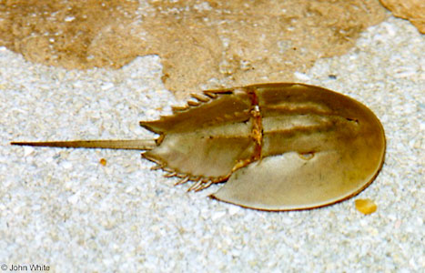

---
aliases:
- "Atlantic horseshoe crab"
- "Limulus polyphemus"
title: "Limulus polyphemus"
---

## Phylogeny 

-   « Ancestral Groups  
    -   [Limuloidea](../Limuloidea.md)
    -   [Horseshoe_Crab](../../Horseshoe_Crab.md)
    -   [Arthropoda](Arthropoda)
    -   [Bilateria](Bilateria)
    -   [Animals](Animals)
    -   [Eukaryotes](Eukaryotes)
    -   [Tree of Life](../../../../../../../Tree_of_Life.md)

-   ◊ Sibling Groups of  Limuloidea
    -   Limulus polyphemus

-   » Sub-Groups 

# Limulus polyphemus 

## #has_/text_of_/abstract 

> The Atlantic horseshoe crab (**Limulus polyphemus**), 
> also known as the American horseshoe crab, is a species of horseshoe crab, 
> a kind of marine and brackish chelicerate arthropod. 
> 
> It is found in the Gulf of Mexico and along the Atlantic coast of North America. 
> The main area of annual migration is Delaware Bay along the South Jersey Delaware Bayshore.
>
> Their eggs were eaten by Native Americans, 
> but today Atlantic horseshoe crabs are caught for use as fishing bait, 
> in biomedicine (especially for Limulus amebocyte lysate) and science. 
> 
> They play a major role in the local ecosystems, 
> with their eggs providing an important food source for shorebirds, 
> and the juveniles and adults being eaten by sea turtles.
>
> The other three extant (living) species in the family Limulidae 
> are also called horseshoe crabs, but they are restricted to Asia. 
> 
> Despite the name, horseshoe crabs are more closely related to arachnids 
> like spiders and scorpions than they are to crabs or other crustaceans.
>
> [Wikipedia](https://en.wikipedia.org/wiki/Atlantic%20horseshoe%20crab) 

### Information on the Internet

-   [The Horseshoe Crab](http://www.horseshoecrab.org/). Ecological
    Research and Development Group (ERDG).
-   [Horseshoe Crab](http://www.ocean.udel.edu/horseshoecrab/).
    University of Delaware Sea Grant College Program.

## Title Illustrations

-------------------

Scientific Name ::    Limulus polyphemus
Location ::          Washington D.C., USA
Source Collection   [CalPhotos](http://calphotos.berkeley.edu/)
Copyright ::           © 2000 [John White](mailto:reptiles@erols.com)

## Confidential Links & Embeds: 

### #is_/same_as :: [Limulus_polyphemus](/_Standards/bio/bio~Domain/Eukaryotes/Animals/Bilateria/Arthropoda/Chelicerata/Horseshoe_Crab/Limuloidea/Limulus_polyphemus.md) 

### #is_/same_as :: [Limulus_polyphemus.public](/_public/bio/bio~Domain/Eukaryotes/Animals/Bilateria/Arthropoda/Chelicerata/Horseshoe_Crab/Limuloidea/Limulus_polyphemus.public.md) 

### #is_/same_as :: [Limulus_polyphemus.internal](/_internal/bio/bio~Domain/Eukaryotes/Animals/Bilateria/Arthropoda/Chelicerata/Horseshoe_Crab/Limuloidea/Limulus_polyphemus.internal.md) 

### #is_/same_as :: [Limulus_polyphemus.protect](/_protect/bio/bio~Domain/Eukaryotes/Animals/Bilateria/Arthropoda/Chelicerata/Horseshoe_Crab/Limuloidea/Limulus_polyphemus.protect.md) 

### #is_/same_as :: [Limulus_polyphemus.private](/_private/bio/bio~Domain/Eukaryotes/Animals/Bilateria/Arthropoda/Chelicerata/Horseshoe_Crab/Limuloidea/Limulus_polyphemus.private.md) 

### #is_/same_as :: [Limulus_polyphemus.personal](/_personal/bio/bio~Domain/Eukaryotes/Animals/Bilateria/Arthropoda/Chelicerata/Horseshoe_Crab/Limuloidea/Limulus_polyphemus.personal.md) 

### #is_/same_as :: [Limulus_polyphemus.secret](/_secret/bio/bio~Domain/Eukaryotes/Animals/Bilateria/Arthropoda/Chelicerata/Horseshoe_Crab/Limuloidea/Limulus_polyphemus.secret.md)

