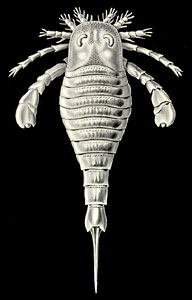
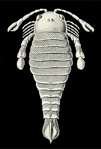

---
aliases:
- Eurypterids
- "sea scorpion"
- Eurypterida
title: Eurypterida
---

# [[Sea_Scorpion]]

Sea Scorpions 

## #has_/text_of_/abstract 

> Eurypterids, often informally called sea scorpions, are a group of extinct marine arthropods that form the order **Eurypterida**. The earliest known eurypterids date to the Darriwilian stage of the Ordovician period, 467.3 million years ago. The group is likely to have appeared first either during the Early Ordovician or Late Cambrian period. With approximately 250 species, the Eurypterida is the most diverse Paleozoic chelicerate order. Following their appearance during the Ordovician, eurypterids became major components of marine faunas during the Silurian, from which the majority of eurypterid species have been described. The Silurian genus Eurypterus accounts for more than 90% of all known eurypterid specimens. Though the group continued to diversify during the subsequent Devonian period, the eurypterids were heavily affected by the Late Devonian extinction event. They declined in numbers and diversity until becoming extinct during the Permian–Triassic extinction event (or sometime shortly before) 251.9 million years ago.
>
> Although popularly called "sea scorpions", only the earliest eurypterids were marine; many later forms lived in brackish or fresh water, and they were not true scorpions. Some studies suggest that a dual respiratory system was present, which would have allowed for short periods of time in terrestrial environments. The name Eurypterida comes from the Ancient Greek words εὐρύς (eurús), meaning 'broad' or 'wide', and πτερόν (pterón), meaning 'wing', referring to the pair of wide swimming appendages present in many members of the group.
>
> The eurypterid order includes the largest known arthropods ever to have lived. The largest, Jaekelopterus, reached 2.5 meters (8.2 ft) in length. Eurypterids were not uniformly large and most species were less than 20 centimeters (8 in) long; the smallest eurypterid, Alkenopterus, was only 2.03 centimeters (0.80 in) long. Eurypterid fossils have been recovered from every continent. A majority of fossils are from fossil sites in North America and Europe because the group lived primarily in the waters around and within the ancient supercontinent of Euramerica. Only a handful of eurypterid groups spread beyond the confines of Euramerica and a few genera, such as Adelophthalmus and Pterygotus, achieved a cosmopolitan distribution with fossils being found worldwide.
>
> [Wikipedia](https://en.wikipedia.org/wiki/Eurypterid) 

### Information on the Internet

-   [Simon J. Braddy, University of     Bristol](http://palaeo.gly.bris.ac.uk/personnel/braddy/Braddy.html)
    investigates the palaeobiology of eurypterids.
-   [EURYPTERIDS.NET](http://eurypterids.net/index.html). Samuel J.
    Ciurca, Jr.

## Phylogeny 

-   « Ancestral Groups  
    -   [Arthropoda](Arthropoda)
    -   [Bilateria](Bilateria)
    -   [Animals](Animals)
    -   [Eukaryotes](Eukaryotes)
    -   [Tree of Life](../../../../../Tree_of_Life.md)

-   ◊ Sibling Groups of  Arthropoda
    -   [Hexapoda](Hexapoda)
    -   [Crustacea](Crustacea)
    -   [Pauropoda](Pauropoda)
    -   [Diplopoda](Diplopoda)
    -   [Chilopoda](Chilopoda)
    -   [Symphyla](Symphyla)
    -   [Arachnida](Arachnida)
    -   Eurypterida
    -   [Horseshoe_Crab](Horseshoe_Crab.md)
    -   [Sea_Spider](Sea_Spider.md)
    -   [Trilobites](Trilobites)

-   » Sub-Groups 
	-   *Slimonioidea*
	    -   *Slimoniidae* †
	-   *Hughmillerioidea* †
	    -   *Hughmilleriidae* †
	    -   *Carcinosomatidae* †
	    -   *Adelophthalmidae* †
	-   *Mixopteroidea* †
	    -   *Mixopteridae* †
	    -   *Lanarkopteridae* †
	-   *Megalograptoidea*
	    -   *Megalograptidae* †
	-   *Eurypteroidea* †
	    -   *Eurypteridae* †
	    -   *Dolichopteridae* †
	    -   *Erieopteridae* †
	-   *Stylonuroidea* †
	    -   *Stylonuridae* †
	    -   *Drepanopteridae* †
	    -   *Parastylonuridae* †
	    -   *Laurieipteridae* †
	-   *Kokomopteroidea* †
	    -   *Kokomopteridae* †
	    -   *Hardieopteridae* †
	-   *Brachyopterelloidea*
	    -   *Brachyopterellidae* †
	-   *Rhenopteroidea*
	    -   *Rhenopteridae* †
	-   *Mycopteropoidea* †
	    -   *Mycteropidae* †
	    -   *Woodwardopteridae* †
	-   *Pterygotoidea* †
	    -   *Jaekelopteridae* †
	    -   *Pterygotidae* †
	-   *Willwerathia* †[ (incertae sedis) ]
	-   *Tylopterella* †[ (incertae sedis) ]
	-   *Tarsopterella* †[ (incertae sedis) ]
	-   *Pittsfordipterus* †[(incertae sedis) ]
	-   *Hastimima* †[ (incertae sedis) ]
	-   *Dorfopterus* †[ (incertae sedis) ]
	-   *Melbournopterus* †[(incertae sedis) ]

## Title Illustrations

-   Eurypterus (Eurypteridae)
-   Pterygotus (Pterygotidae)

Images from Ernst Haeckel\'s Kunstformen der Natur published 1899-1904
by Verlag des Bibliographischen Instituts, Leipzig and Vienna. Scans
courtesy of [Kurt Stüber\'s online library of historic and classical biology books.](http://caliban.mpiz-koeln.mpg.de/%7Estueber/stueber_library.html)

## Confidential Links & Embeds: 

### #is_/same_as :: [Sea_Scorpion](/_Standards/bio/bio~Domain/Eukaryotes/Animals/Bilateria/Arthropoda/Chelicerata/Sea_Scorpion.md) 

### #is_/same_as :: [Sea_Scorpion.public](/_public/bio/bio~Domain/Eukaryotes/Animals/Bilateria/Arthropoda/Chelicerata/Sea_Scorpion.public.md) 

### #is_/same_as :: [Sea_Scorpion.internal](/_internal/bio/bio~Domain/Eukaryotes/Animals/Bilateria/Arthropoda/Chelicerata/Sea_Scorpion.internal.md) 

### #is_/same_as :: [Sea_Scorpion.protect](/_protect/bio/bio~Domain/Eukaryotes/Animals/Bilateria/Arthropoda/Chelicerata/Sea_Scorpion.protect.md) 

### #is_/same_as :: [Sea_Scorpion.private](/_private/bio/bio~Domain/Eukaryotes/Animals/Bilateria/Arthropoda/Chelicerata/Sea_Scorpion.private.md) 

### #is_/same_as :: [Sea_Scorpion.personal](/_personal/bio/bio~Domain/Eukaryotes/Animals/Bilateria/Arthropoda/Chelicerata/Sea_Scorpion.personal.md) 

### #is_/same_as :: [Sea_Scorpion.secret](/_secret/bio/bio~Domain/Eukaryotes/Animals/Bilateria/Arthropoda/Chelicerata/Sea_Scorpion.secret.md)

