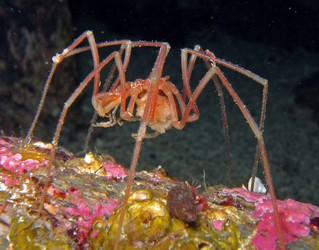

# [[Sea_Spider]]

Sea spiders, Pantopoda 

## #has_/text_of_/abstract 

> Sea spiders are marine arthropods of the class **Pycnogonida**, 
> hence they are also called pycnogonids (named after Pycnogonum, 
> the type genus; with the suffix -id). 
> 
> The class includes the only now-living order Pantopoda (lit. ‘all feet’), 
> alongside a few fossil species which could trace back to the early or mid Paleozoic. 
> 
> They are cosmopolitan, found in oceans around the world. The over 1,300 known species have leg spans ranging from 1 mm (0.04 in) to over 70 cm (2.3 ft). Most are toward the smaller end of this range in relatively shallow depths; however, they can grow to be quite large in Antarctic and deep waters.
>
> Despite their name and brief resemblance, "sea spiders" are not spiders, nor even arachnids. While some literature around the 2000s suggests they may be a sister group to all other living arthropods, their traditional classification as a member of chelicerates alongside horseshoe crabs and arachnids has regained wide support in subsequent studies.
>
> [Wikipedia](https://en.wikipedia.org/wiki/Sea%20spider)

## Phylogeny 

-   « Ancestral Groups  
    -   [Arthropoda](Arthropoda)
    -   [Bilateria](Bilateria)
    -   [Animals](Animals)
    -   [Eukaryotes](Eukaryotes)
    -   [Tree of Life](../../../../../Tree_of_Life.md)

-   ◊ Sibling Groups of  Arthropoda
    -   [Hexapoda](Hexapoda)
    -   [Crustacea](Crustacea)
    -   [Pauropoda](Pauropoda)
    -   [Diplopoda](Diplopoda)
    -   [Chilopoda](Chilopoda)
    -   [Symphyla](Symphyla)
    -   [Arachnida](Arachnida)
    -   [Sea_Scorpion](Sea_Scorpion.md)
    -   [Horseshoe_Crab](Horseshoe_Crab.md)
    -   Pycnogonida
    -   [Trilobites](Trilobites)

-   » Sub-Groups 

## Title Illustrations

-----------------------------

Scientific Name ::                    Nymphon gracile
Location ::                          Hitra, Norway
Acknowledgements                    The copyright owner has released this image under the
								  [Attribution-NonCommercial-NoDerivs 2.0 Creative Commons                                       License](http://creativecommons.org/licenses/by-nc-nd/2.0/).\
								  source: [flickr: Sea spider /                                       Havedderkopp](http://flickr.com/photos/xoto/108057513/)
Specimen Condition                  Live Specimen
Source Collection                   [Flickr](http://flickr.com/)
Copyright ::                           © 2006 [Asbjørn Hansen](http://flickr.com/people/xoto/)

## Confidential Links & Embeds: 

### #is_/same_as :: [Sea_Spider](/_Standards/bio/bio~Domain/Eukaryotes/Animals/Bilateria/Arthropoda/Chelicerata/Sea_Spider.md) 

### #is_/same_as :: [Sea_Spider.public](/_public/bio/bio~Domain/Eukaryotes/Animals/Bilateria/Arthropoda/Chelicerata/Sea_Spider.public.md) 

### #is_/same_as :: [Sea_Spider.internal](/_internal/bio/bio~Domain/Eukaryotes/Animals/Bilateria/Arthropoda/Chelicerata/Sea_Spider.internal.md) 

### #is_/same_as :: [Sea_Spider.protect](/_protect/bio/bio~Domain/Eukaryotes/Animals/Bilateria/Arthropoda/Chelicerata/Sea_Spider.protect.md) 

### #is_/same_as :: [Sea_Spider.private](/_private/bio/bio~Domain/Eukaryotes/Animals/Bilateria/Arthropoda/Chelicerata/Sea_Spider.private.md) 

### #is_/same_as :: [Sea_Spider.personal](/_personal/bio/bio~Domain/Eukaryotes/Animals/Bilateria/Arthropoda/Chelicerata/Sea_Spider.personal.md) 

### #is_/same_as :: [Sea_Spider.secret](/_secret/bio/bio~Domain/Eukaryotes/Animals/Bilateria/Arthropoda/Chelicerata/Sea_Spider.secret.md)

