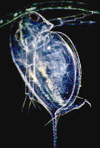
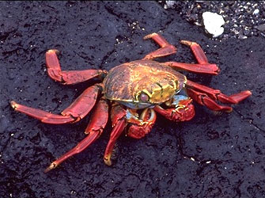
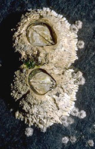

# [[Crustacea]]

Crabs, lobsters, shrimp, barnacles, sow bugs, etc. 

     

#is_/same_as :: [[../../../WikiData/WD~Crustacea,25364|WD~Crustacea,25364]]

## #has_/text_of_/abstract 

> **Crustacea**ns (from Latin meaning: "those with shells" or "crusted ones") 
> are invertebrate animals that constitute one group of arthropods 
> that are traditionally a part of the subphylum Crustacea, 
> a large, diverse group of mainly aquatic arthropods including decapods 
> (shrimps, prawns, crabs, lobsters and crayfish), seed shrimp, branchiopods, fish lice, krill, 
> remipedes, isopods, barnacles, copepods, opossum shrimps, amphipods and mantis shrimp. 
> 
> The crustacean group can be treated as a subphylum under the clade Mandibulata. 
> 
> It is now well accepted that the hexapods (insects and entognathans) emerged deep in the Crustacean group, 
> with the completed pan-group referred to as Pancrustacea. 
> 
> The three classes Cephalocarida, Branchiopoda and Remipedia are more closely related to the hexapods 
> than they are to any of the other crustaceans (oligostracans and multicrustaceans).
>
> The 67,000 described species range in size from Stygotantulus stocki at 0.1 mm (0.004 in), 
> to the Japanese spider crab with a leg span of up to 3.8 m (12.5 ft) and a mass of 20 kg (44 lb). 
> 
> Like other arthropods, crustaceans have an exoskeleton, which they moult to grow. 
> They are distinguished from other groups of arthropods, 
> such as insects, myriapods and chelicerates, by the possession of biramous (two-parted) limbs, 
> and by their larval forms, such as the nauplius stage of branchiopods and copepods.
>
> Most crustaceans are free-living aquatic animals, but some are terrestrial (e.g. woodlice, sandhoppers), 
> some are parasitic (e.g. Rhizocephala, fish lice, tongue worms) and some are sessile (e.g. barnacles). 
> 
> The group has an extensive fossil record, reaching back to the Cambrian. 
> More than 7.9 million tons of crustaceans per year are harvested by fishery or farming for human consumption, 
> consisting mostly of shrimp and prawns. 
> 
> Krill and copepods are not as widely fished, but may be the animals with the greatest biomass on the planet, 
> and form a vital part of the food chain. 
> 
> The scientific study of crustaceans is known as carcinology 
> (alternatively, malacostracology, crustaceology or crustalogy), 
> and a scientist who works in carcinology is a carcinologist.
>
> [Wikipedia](https://en.wikipedia.org/wiki/Crustacean) 

### Information on the Internet

-   [crustacea.net](http://crustacea.net/index.htm). An information retrieval system for crustaceans of the world. Australian Museum online.
-   [The Crustacean Society](http://www.vims.edu/tcs/)
-   [Crustacea at the Natural History Museum of Los Angeles     County](http://crustacea.nhm.org/).
-   [Marine Crustaceans of Southern     Australia](http://www.museum.vic.gov.au/crust/page1a.html). Museum Victoria.

## Phylogeny 

-   « Ancestral Groups  
    -   [Arthropoda](Arthropoda)
    -   [Bilateria](Bilateria)
    -   [Animals](Animals)
    -   [Eukaryotes](Eukaryotes)
    -   [Tree of Life](../../../../Tree_of_Life.md)

-   ◊ Sibling Groups of  Arthropoda
    -   [Hexapoda](Hexapoda)
    -   Crustacea
    -   [Pauropoda](Pauropoda)
    -   [Diplopoda](Diplopoda)
    -   [Chilopoda](Chilopoda)
    -   [Symphyla](Symphyla)
    -   [Arachnida](Arachnida)
    -   [Sea_Scorpion](Chelicerata/Sea_Scorpion.md)
    -   [Horseshoe_Crab](Chelicerata/Horseshoe_Crab.md)
    -   [Sea_Spider](Chelicerata/Sea_Spider.md)
    -   [Trilobites](Trilobites)

-   » Sub-Groups
    -   [Branchiopoda](Branchiopoda.md)
    -   [Remipedia](Remipedia.md)
    -   [Cephalocarida](Cephalocarida.md)
    -   [Copepoda](Copepoda.md)
    -   [Ostracoda](Ostracoda.md)
    -   [Branchiura](Branchiura.md)
    -   [Thecostraca](Thecostraca.md)
    -   [Malacostraca](Malacostraca.md)

## Title Illustrations

-   Water flea, Daphnia pulex (Branchiopoda, Cladocera).\
    Photograph by Jean-François Cornuet, copyright ©
    [BIODIDAC](http://biodidac.bio.uottawa.ca/).
	 
-   Sally Lightfoot crab, Grapsus grapsus (Malacostraca,
    Decapoda). Punta Espinosa (Ecuador).\
    Photograph by Gerald and Buff Corsi, courtesy
    [CalPhotos](http://elib.cs.berkeley.edu/photos/), copyright © 2001
    [California Academy of Sciences](mailto:manzanita@calacademy.org).
	
-   Barnacle, Semibalanus cariosus (Thecostraca, Cirripedia).  Ketchikan
    (Alaska, US).\
    Photograph by Gerald and Buff Corsi, courtesy
    [CalPhotos](http://elib.cs.berkeley.edu/photos/), copyright © 1999
    [California Academy of Sciences](mailto:manzanita@calacademy.org).
	 

