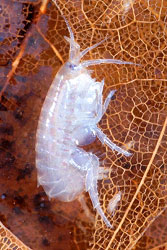
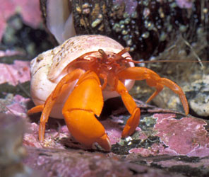

# [[Malacostraca]] 

     

#is_/same_as :: [[../../../../WikiData/WD~Malacostraca,182978|WD~Malacostraca,182978]] 

## #has_/text_of_/abstract 

> **Malacostraca** is the second largest of the six classes of pancrustaceans behind insects, 
> containing about 40,000 living species, divided among 16 orders. 
> 
> Its members, the malacostracans, display a great diversity of body forms 
> and include crabs, lobsters, spiny lobsters, crayfish, shrimp, krill, prawns, 
> isopods, amphipods, mantis shrimp, and many other less familiar animals. 
> 
> They are abundant in all marine environments 
> and have colonised freshwater and terrestrial habitats. 
> 
> They are segmented animals, united by a common body plan 
> comprising 20 body segments (rarely 21), and divided into a head, thorax, and abdomen.
>
> [Wikipedia](https://en.wikipedia.org/wiki/Malacostraca) 

## Phylogeny 

-   « Ancestral Groups  
    -   [Crustacea](Crustacea)
    -   [Arthropoda](Arthropoda)
    -   [Bilateria](Bilateria)
    -   [Animals](Animals)
    -   [Eukaryotes](Eukaryotes)
    -   [Tree of Life](../../../../../Tree_of_Life.md)

-   ◊ Sibling Groups of  Crustacea
    -   [Branchiopoda](Branchiopoda)
    -   [Remipedia](Remipedia)
    -   [Cephalocarida](Cephalocarida)
    -   [Copepoda](Copepoda)
    -   [Ostracoda](Ostracoda)
    -   [Branchiura](Branchiura)
    -   [Thecostraca](Thecostraca)
    -   Malacostraca

-   » Sub-Groups
    -   [Leptostraca](Leptostraca)
    -   [Stomatopoda](Stomatopoda.md)
    -   [Decapoda](Decapoda.md)
    -   [Peracarida](Peracarida.md)

## Title Illustrations

-   An amphipod, Hyalella azteca (Peracarida, Amphipoda).\
	Photograph by Scott Bauer, courtesy [USDA Agricultural Research     Service](http://www.ars.usda.gov/is/index.html).
	
-   Pacific red hermit, Elassochirus gilli (Decapoda, Anomura). NOAA
	Auke Bay Lab, Juneau, Alaska.\
	Photograph courtesy
	[CalPhotos](http://elib.cs.berkeley.edu/photos/), copyright © 2001 [William Leonard](mailto:mollusca1@attbi.com).
	
-   Larva of the mantis shrimp, Alima gracilis (Stomatopoda, Squillidae). 
  Image from Ernst Haeckel\'s Kunstformen der Natur
	published 1899-1904 by Verlag des Bibliographischen Instituts,
	Leipzig and Vienna. Scans courtesy of [Kurt Stüber\'s online library     of historic and classical biology     books.](http://caliban.mpiz-koeln.mpg.de/%7Estueber/stueber_library.html)
	

