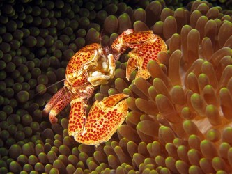
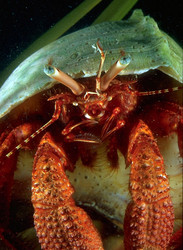

---
aliases:
- Anomura
- Anomala
title: Anomura
---

# [[Anomura]] 

   

## #has_/text_of_/abstract 

> **Anomura** (sometimes Anomala) is a group of decapod crustaceans, 
> including hermit crabs and others. 
> 
> Although the names of many anomurans include the word crab, 
> all true crabs are in the sister group to the Anomura, 
> the Brachyura (the two groups together form the clade Meiura).
>
> [Wikipedia](https://en.wikipedia.org/wiki/Anomura) 

## Phylogeny 

-   « Ancestral Groups  
    -   [Decapoda](Decapoda)
    -   [Malacostraca](Malacostraca)
    -   [Crustacea](Crustacea)
    -   [Arthropoda](Arthropoda)
    -   [Bilateria](Bilateria)
    -   [Animals](Animals)
    -   [Eukaryotes](Eukaryotes)
    -   [Tree of Life](../../../../../../../Tree_of_Life.md)

-   ◊ Sibling Groups of  Decapoda
    -   [Astacidea](Astacidea)
    -   Anomura

-   » Sub-Groups
    -   [Aegla](Aegla)

## Title Illustrations

-----------------------------

Scientific Name ::                    Porcellanidae
Location ::                          Sipadan, Malaysia
Acknowledgements                    The copyright owner has released this image under the
								  [Attribution-NonCommercial-NoDerivs 2.0 Creative Commons                                       license](http://creativecommons.org/licenses/by-nc-nd/2.0/).\
								  source: [flickr: Cangrejo de                                       Porcelana](http://flickr.com/photos/festeban/9201191/)
Specimen Condition                  Live Specimen
Source Collection                   [Flickr](http://flickr.com/)
Copyright ::                           © 2004 [Felix Esteban](http://flickr.com/people/festeban/)

-----------------------------------------------------------------------------

Scientific Name ::     Petrochirus diogenes
Location ::           from Gulf of Mexico, captive at Texas State Aquarium
Comments             giant red hermit crab
Specimen Condition   Live Specimen
Copyright ::            © [Greg and Marybeth Dimijian](http://www.dimijianimages.com/) 

## Confidential Links & Embeds: 

### #is_/same_as :: [Anomura](/_Standards/bio/bio~Domain/Eukaryotes/Animals/Bilateria/Arthropoda/Crustacea/Malacostraca/Decapoda/Anomura.md) 

### #is_/same_as :: [Anomura.public](/_public/bio/bio~Domain/Eukaryotes/Animals/Bilateria/Arthropoda/Crustacea/Malacostraca/Decapoda/Anomura.public.md) 

### #is_/same_as :: [Anomura.internal](/_internal/bio/bio~Domain/Eukaryotes/Animals/Bilateria/Arthropoda/Crustacea/Malacostraca/Decapoda/Anomura.internal.md) 

### #is_/same_as :: [Anomura.protect](/_protect/bio/bio~Domain/Eukaryotes/Animals/Bilateria/Arthropoda/Crustacea/Malacostraca/Decapoda/Anomura.protect.md) 

### #is_/same_as :: [Anomura.private](/_private/bio/bio~Domain/Eukaryotes/Animals/Bilateria/Arthropoda/Crustacea/Malacostraca/Decapoda/Anomura.private.md) 

### #is_/same_as :: [Anomura.personal](/_personal/bio/bio~Domain/Eukaryotes/Animals/Bilateria/Arthropoda/Crustacea/Malacostraca/Decapoda/Anomura.personal.md) 

### #is_/same_as :: [Anomura.secret](/_secret/bio/bio~Domain/Eukaryotes/Animals/Bilateria/Arthropoda/Crustacea/Malacostraca/Decapoda/Anomura.secret.md)

