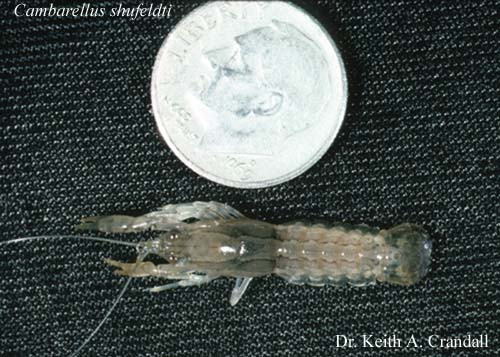

# [[Cambarellinae]] 

 
Copyright ::   © [Keith A. Crandall](http://inbio.byu.edu/Faculty/kac/crandall%5Flab/) 

## Phylogeny 

-   « Ancestral Groups  
    -   [Cambaridae](Cambaridae)
    -   [Astacidea](Astacidea)
    -   [Decapoda](Decapoda)
    -   [Malacostraca](Malacostraca)
    -   [Crustacea](Crustacea)
    -   [Arthropoda](Arthropoda)
    -   [Bilateria](Bilateria)
    -   [Animals](Animals)
    -   [Eukaryotes](Eukaryotes)
    -   [Tree of Life](../../../../../../../../../../Tree_of_Life.md)

-   ◊ Sibling Groups of  Cambaridae
    -   Cambarellinae
    -   [Cambarinae](Cambarinae)
    -   [Cambaroides](Cambaroides)

-   » Sub-Groups
    -   [Cambarellus (Dirigicambarus)         shufeldtii](Cambarellus_%28Dirigicambarus%29_shufeldtii)
    -   [Cambarellus         (Pandicambarus)](Cambarellus_%28Pandicambarus%29)
    -   [Cambarellus         (Cambarellus)](Cambarellus_%28Cambarellus%29)

