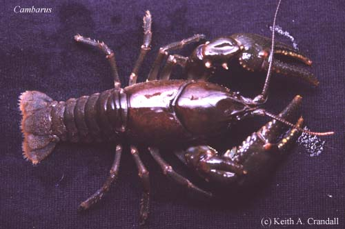

---
title: Cambarinae
---

## Phylogeny 

-   « Ancestral Groups  
    -   [Cambaridae](Cambaridae)
    -   [Astacidea](Astacidea)
    -   [Decapoda](Decapoda)
    -   [Malacostraca](Malacostraca)
    -   [Crustacea](Crustacea)
    -   [Arthropoda](Arthropoda)
    -   [Bilateria](Bilateria)
    -   [Animals](Animals)
    -   [Eukaryotes](Eukaryotes)
    -   [Tree of Life](../../../../../../../../../../Tree_of_Life.md)

-   ◊ Sibling Groups of  Cambaridae
    -   [Cambarellinae](Cambarellinae)
    -   Cambarinae
    -   [Cambaroides](Cambaroides)

-   » Sub-Groups
    -   [Fallicambarus](Fallicambarus)
    -   [Barbicambarus cornutus](Barbicambarus_cornutus)
    -   [Cambarus](Cambarus)
    -   [Hobbseus](Hobbseus)
    -   [Bouchardina robisoni](Bouchardina_robisoni)
    -   [Faxonella](Faxonella)
    -   [Orconectes](Orconectes)
    -   [Procambarus](Procambarus)
    -   [Troglocambarus maclanei](Troglocambarus_maclanei)
    -   [Distocambarus](Distocambarus)

# [[Cambarinae]] 

[Keith A. Crandall, James W. Fetzner, Jr., and Horton H. Hobbs, Jr.](http://www.tolweb.org/)

 
Photo copyright © Keith A. Crandall

## #has_/text_of_/abstract 

> The Cambaridae are the largest of the four families of freshwater crayfish, with over 400 species. Most of the species in the family are native to the United States east of the Great Divide and Mexico, but fewer range north to Canada, and south to Guatemala and Honduras. Three live on the island of Cuba. The species in the genus Cambaroides are only found outside North America, as they are restricted to eastern Asia.
>
> A few species, including the invasive Procambarus clarkii and Faxonius rusticus, have been introduced to regions far outside their native range (both in North America and other continents). Conversely, many species have tiny ranges and are seriously threatened; a few are already extinct.
>
> A 2006 molecular study suggested that the family Cambaridae may be paraphyletic, with the family Astacidae nested within it, and the status of the genus Cambaroides remains unclear.
>
> The oldest fossils of the family are known from the Late Jurassic Morrison Formation of western North America.
>
> [Wikipedia](https://en.wikipedia.org/wiki/Cambaridae) 

## Confidential Links & Embeds: 

### #is_/same_as :: [Cambarinae](/_Standards/bio/bio~Domain/Eukaryotes/Animals/Bilateria/Arthropoda/Crustacea/Malacostraca/Decapoda/Astacidea/Astacidae/Cambaridae/Cambarinae.md) 

### #is_/same_as :: [Cambarinae.public](/_public/bio/bio~Domain/Eukaryotes/Animals/Bilateria/Arthropoda/Crustacea/Malacostraca/Decapoda/Astacidea/Astacidae/Cambaridae/Cambarinae.public.md) 

### #is_/same_as :: [Cambarinae.internal](/_internal/bio/bio~Domain/Eukaryotes/Animals/Bilateria/Arthropoda/Crustacea/Malacostraca/Decapoda/Astacidea/Astacidae/Cambaridae/Cambarinae.internal.md) 

### #is_/same_as :: [Cambarinae.protect](/_protect/bio/bio~Domain/Eukaryotes/Animals/Bilateria/Arthropoda/Crustacea/Malacostraca/Decapoda/Astacidea/Astacidae/Cambaridae/Cambarinae.protect.md) 

### #is_/same_as :: [Cambarinae.private](/_private/bio/bio~Domain/Eukaryotes/Animals/Bilateria/Arthropoda/Crustacea/Malacostraca/Decapoda/Astacidea/Astacidae/Cambaridae/Cambarinae.private.md) 

### #is_/same_as :: [Cambarinae.personal](/_personal/bio/bio~Domain/Eukaryotes/Animals/Bilateria/Arthropoda/Crustacea/Malacostraca/Decapoda/Astacidea/Astacidae/Cambaridae/Cambarinae.personal.md) 

### #is_/same_as :: [Cambarinae.secret](/_secret/bio/bio~Domain/Eukaryotes/Animals/Bilateria/Arthropoda/Crustacea/Malacostraca/Decapoda/Astacidea/Astacidae/Cambaridae/Cambarinae.secret.md)

