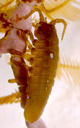
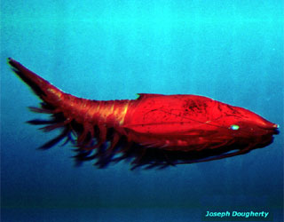

# [[Peracarida]]  

     

## #has_/text_of_/abstract 

> The superorder **Peracarida** is a large group of malacostracan crustaceans, 
> having members in marine, freshwater, and terrestrial habitats. 
> 
> They are chiefly defined by the presence of a brood pouch, or marsupium, 
> formed from thin flattened plates (oostegites) borne on the basalmost segments of the legs. 
> 
> Peracarida is one of the largest crustacean taxa and includes about 12,000 species. 
> Most members are less than 2 cm (0.8 in) in length, 
> but the largest is probably the giant isopod (Bathynomus giganteus) 
> which can reach 76 cm (30 in). 
> 
> The earliest known perecaridian was Oxyuropoda ligioides, 
> a fossil of which has been found dating to the Late Devonian (more than 360 mya) of Ireland.
>
> [Wikipedia](https://en.wikipedia.org/wiki/Peracarida) 

## Phylogeny 

-   « Ancestral Groups  
    -   [Malacostraca](Malacostraca)
    -   [Crustacea](Crustacea)
    -   [Arthropoda](Arthropoda)
    -   [Bilateria](Bilateria)
    -   [Animals](Animals)
    -   [Eukaryotes](Eukaryotes)
    -   [Tree of Life](../../../../../../Tree_of_Life.md)

-   ◊ Sibling Groups of  Malacostraca
    -   [Leptostraca](Leptostraca)
    -   [Stomatopoda](Stomatopoda)
    -   [Decapoda](Decapoda)
    -   Peracarida

-   » Sub-Groups
    -   [Isopoda](Isopoda.md)

## Title Illustrations

------------------------------------------------------------------------------
 
Scientific Name ::     Idotea
Specimen Condition   Live Specimen
Identified By        Rick Brusca
Copyright ::            © 1999 [California Academy of Sciences](http://www.calacademy.org/) 

-------------------------------------------------------------------------

Scientific Name ::    Gnathophausia ingens
Location ::          Monterey Bay Aquarium (Monterey County, California, US)
Comments            Deep water giant red mysid.
Source Collection   [CalPhotos](http://calphotos.berkeley.edu/)
Copyright ::           © 2000 [Joseph Dougherty](http://www.ecology.org/) 

--------------------------------------------------------------------------

Scientific Name ::  Gammarus pulex
Creator           Photograph by Jean-François Cornuet
Copyright ::         © [BIODIDAC](http://biodidac.bio.uottawa.ca/index.htm) 

## Confidential Links & Embeds: 

### #is_/same_as :: [Peracarida](/_Standards/bio/bio~Domain/Eukaryotes/Animals/Bilateria/Arthropoda/Crustacea/Malacostraca/Peracarida.md) 

### #is_/same_as :: [Peracarida.public](/_public/bio/bio~Domain/Eukaryotes/Animals/Bilateria/Arthropoda/Crustacea/Malacostraca/Peracarida.public.md) 

### #is_/same_as :: [Peracarida.internal](/_internal/bio/bio~Domain/Eukaryotes/Animals/Bilateria/Arthropoda/Crustacea/Malacostraca/Peracarida.internal.md) 

### #is_/same_as :: [Peracarida.protect](/_protect/bio/bio~Domain/Eukaryotes/Animals/Bilateria/Arthropoda/Crustacea/Malacostraca/Peracarida.protect.md) 

### #is_/same_as :: [Peracarida.private](/_private/bio/bio~Domain/Eukaryotes/Animals/Bilateria/Arthropoda/Crustacea/Malacostraca/Peracarida.private.md) 

### #is_/same_as :: [Peracarida.personal](/_personal/bio/bio~Domain/Eukaryotes/Animals/Bilateria/Arthropoda/Crustacea/Malacostraca/Peracarida.personal.md) 

### #is_/same_as :: [Peracarida.secret](/_secret/bio/bio~Domain/Eukaryotes/Animals/Bilateria/Arthropoda/Crustacea/Malacostraca/Peracarida.secret.md)

