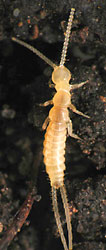

## Phylogeny 

-   « Ancestral Groups  
    -   [Arthropoda](Arthropoda)
    -   [Bilateria](Bilateria)
    -   [Animals](Animals)
    -   [Eukaryotes](Eukaryotes)
    -   [Tree of Life](../../../../Tree_of_Life.md)

-   ◊ Sibling Groups of  Arthropoda
    -   Hexapoda
    -   [Crustacea](Crustacea)
    -   [Pauropoda](Pauropoda)
    -   [Diplopoda](Diplopoda)
    -   [Chilopoda](Chilopoda)
    -   [Symphyla](Symphyla)
    -   [Arachnida](Arachnida)
    -   [[Sea_Scorpion](Chelicerata/Sea_Scorpion.md)    -   [Horseshoe_Crab](Chelicerata/Horseshoe_Crab.md)
    -   [Sea_Spider](Chelicerata/Sea_Spider.md)
    -   [Trilobites](Trilobites)

-   » Sub-Groups
    -   [Springtail](Hexapoda/Springtail.md)
    -   [Protura](Protura.md)
    -   [Diplura](Diplura.md)
    -   [Insecta](Insecta.md)

# [[Hexapoda]]

Insects, springtails, diplurans, and proturans 

     

[[../../../WikiData/WD~Hexapoda,105146|WD~Hexapoda,105146]] 

## #has_/text_of_/abstract 

> The subphylum **Hexapoda** (from Greek for 'six legs') or hexapods comprises the largest clade of arthropods and includes most of the extant arthropod species. It includes the crown group class Insecta (true insects), as well as the much smaller clade Entognatha, which includes three classes of wingless arthropods that were once considered insects: Collembola (springtails), Protura (coneheads) and Diplura (two-pronged bristletails). The insects and springtails are very abundant and are some of the most important pollinators, basal consumers, scavengers/detritivores and micropredators in terrestrial environments.
>
> Hexapods are named for their most distinctive feature: a three-part body plan with a consolidated thorax and three pairs of legs. Most other arthropods have more than three pairs of legs. Most recent studies have recovered Hexapoda as a subgroup of Pancrustacea.
>
> [Wikipedia](https://en.wikipedia.org/wiki/Hexapoda) 

### Information on the Internet

-   [Biodiversity Explorer:     Hexapoda](http://www.museums.org.za/bio/insects/)

## Introduction

While crustaceans are the dominant group of arthropods in marine
environments, hexapods, including insects, rule the land. Their
dominance among animals is evident in their numbers of species, with
over 750,000 described (Wilson, 1988), as well as biomass (e.g. Fittkau
and Klinge, 1973).

Hexapods include three orders of wingless arthropods (Collembola,
Protura, Diplura), as well as the insects. The former orders are soil or
litter dwellers. Collembola (springtails) are perhaps the most abundant
arthropods on earth. Proturans are very small, pale arthropods that are
rarely encountered. Diplurans include a few families of larger, pale
arthropods that are frequently found in moist soils. The majority of
hexapod species are insects, many of which are winged as adults.

### Characteristics

The most distinctive feature of the hexapods is the reduction in walking
appendages to six, with three body segments consolidating to form the
thorax, which provides much of the locomotory ability of the animals.
(This is in contrast to other arthropods, most of which have more than
three pairs of legs.)

### Discussion of Phylogenetic Relationships

The position of Diplura in the hexapods is unclear. Traditionally, it
has been placed with the Collembola and Protura in a group called
\"Entognatha\",

                         === Collembola
                      ===|
         ==Entognatha=|  === Protura
    =====|            |
         |            ====== Diplura
         |
         =================== Insecta

so named because members of these three orders all have the base of the
mouthparts internallized, so that the mandible and maxilla are partly
contained within the head capsule. In addition to this derived
similarity in mouth structure, these three orders share reduced
Malpighian tubules and compound eyes. However, there is some evidence
that diplurans may instead be the sister group of insects:

            === Collembola
         ===|
         |  === Protura
    =====|
         |  === Diplura
         ===|
            === Insecta

Derived characteristics linking diplurans with insects include the
presence of filiform cerci, and an extra set of nine single tubules in
the axoneme of the sperm. For a more detailed discussion of the
evidence, with additional references, see Kristensen (1991).

## Title Illustrations

------------------------------------------------------------------------

Scientific Name ::     Monobella grassei
Specimen Condition   Live Specimen
Copyright ::            © [Steve Hopkin](http://www.stevehopkin.co.uk/) 

---------------------------------------------------------------------------

Scientific Name ::     Campodeid (Diplura)
Location ::           San Francisco, California, USA.
Specimen Condition   Live Specimen
Copyright ::            © 2002 [David R. Maddison](http://david.bembidion.org/) 

------------------------------------------------------------------------------

Scientific Name ::     Mantis religiosa
Comments             Praying mantis
Creator              Photograph by Robert Potts
Specimen Condition   Live Specimen
Source Collection    [CalPhotos](http://calphotos.berkeley.edu/)
Copyright ::            © 2002 [California Academy of Sciences](http://www.calacademy.org/) 

