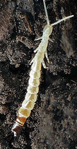
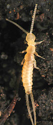

---
title: Diplura
---

## Phylogeny 

-   « Ancestral Groups  
    -   [Hexapoda](Hexapoda)
    -   [Arthropoda](Arthropoda)
    -   [Bilateria](Bilateria)
    -   [Animals](Animals)
    -   [Eukaryotes](Eukaryotes)
    -   [Tree of Life](../../../../../Tree_of_Life.md)

-   ◊ Sibling Groups of  Hexapoda
    -   [Springtail](Springtail.md)
    -   [Protura](Protura)
    -   Diplura
    -   [Insect](Insect)

-   » Sub-Groups 

# Diplura 

†
    [(Paleocene - Pliocene of Arizona, USA)][ (incertae
    sedis) ]
-   *Plioprojapyx primitivus* †
    [(Paleocene - Pliocene of Arizona, USA)][ (incertae
    sedis) ]

Containing group: [Hexapoda](Hexapoda.md)

### Information on the Internet

-   [The Diplurans (Diplura) of South     Africa](http://www.ru.ac.za/academic/departments/zooento/Martin/diplura.html).
    Compiled by Martin H. Villet, Rhodes University.
-   [Diplura](http://www.ento.csiro.au/Ecowatch/Hexapods/diplura.htm).
    CSIRO.
-   [Nomina -     Diplura](http://www.nearctica.com/nomina/oddbugs/diplura.htm).
    nearctica.
-   [Californica Academy of Sciences Diplura Type     Collection](http://www.calacademy.org/research/entomology/types/diplufam.htm).

## Introduction

Worldwide. Usually in soil. Some are herbivorous, others predaceous,
actively hunting small arthropods. 7-9 Families (5 in North America),
800 Species (70 in North America).

The fossil record of diplurans is sparse; there is an apparent Dipluran
from the Carboniferous.

Derivation of name: diploos - double, oura - tail, referring to the two
prominent cerci.

### Characteristics

Among the derived features of diplurans are:

-   eyeless
-   tentorium absent
-   unique muscles and pivots in legs

Other characteristics:

-   mostly white
-   two prominent cerci, either long and filiform or short and
    forcep-like
-   long, slender antennae

The lack of eyes, color, and long, slender antennae can be seen in the
following japygid from the Santa Catalina Mountains of Arizona:

### References

Bareth, C. and B. Condé. 1958. Campodéidés endogés de l\'ouest des
États-Unis (Washington, Oregon, Californie, Arizona). Bull. Soc. Linn.
Lyon 27:226-248,265-276,297-304.

Chandler, L. 1956. The orders Protura and Diplura in Indiana. Proc.
Indiana Acad. Sci. 66:112-114.

Condé, B. 1949. Campodéidés cavernicoles de la région Appalaches. Notes
Biospeol. 4:125-137.

Condé, B. 1956. Matériaux pour une monographie des Diploures
Campodéidés. Mem. Mus. Natl. Hist. Nat. (Paris) Ser. A Zool.
12(1955):1-202.

Condé, B. 1973. Campodéidés endogés de l\'Est des États-Unis. Bull. Soc.
Linn. Lyon 42(special):17-29.

Condé, B. and P. Geeraert. 1962. Campodéidés endogés du centre des
États-Unis. Arch. Zool. Exp. Gen. 101:73---160.

Condé, B. and J. Pagés. 1991. Diplura. Pages 269-271 in Insects of
Australia: A Textbook for Students and Research Workers. Volume I.
Second Edition. I. D. Naumann, P. B. Carne, J. F. Lawrence, E. S.
Nielsen, J. P. Spradberry, R. W. Taylor, M. J. Whitten and M. J.
Littlejohn eds. Carlton, Victoria, Melbourne University Press.

Condé, B. and J. Thomas. 1957. Contribution à la faune des Campodéidés
de Californie (Insectes Diploures). Bull. Soc. Linn. Lyon
26:81---96,118---127,142-155.

Ferguson, L. M. 1981. Cave Diplura of the United States, Proc. 8th Int.
Cong. Speleol. (Bowling Green, KY).1:11-12.

Ferguson, L. M. 1990. Insecta: Diplura. Pages 951-964 in Soil Biology
Guide. D. Dindal, ed. John Wiley & Sons, New York.

Gereben-Krenn, B.-A. and G. Pass. 1999. Circulatory organs of Diplura
(Hexapoda): the basic design in Hexapoda. International Journal of
Insect Morphology 17:60-68.

González, R. H. 1964. Japygoidea de Sud America. 6. Revisión de la
Familia Dinjapygidae (Womersley, 1939) (Insecta:Diplura). Acta Zool.
Lilloana 20:113---128.

Hilton, W. A. 1932. The Campodea of California. J. Entomol. Zool.
(Claremont) 24:47-51.

Hilton, W. A. 1936. Campodea from the United States. J. Entomol. Zool.
(Claremont) 28:5-10.

Ikeda, Y. and R. Machida. 1998. Embryogenesis of the dipluran
Lepidocampa weberi Oudemans (Hexapoda, diplura, Campodeidae): External
morphology. Journal of Morphology 237:101-115.

Ikeda, Y. and R. Machida. 2001. Embryogenesis of the Dipluran
Lepidocampa weberi Oudemans (Hexapoda : Diplura, Campodeidae): Formation
of dorsal organ and related phenomena. Journal of Morphology
249:242-251.

Koch, M. 1997. Monophyly and phylogenetic position of the Diplura
(Hexapoda). Pedobiologia 41:9-12.

Kosaroff, G. 1935. Beobachtungen über die Ernährung der Japygiden. Mitt.
Naturwiss. Inst. Sofia 8:181-185.

Lawrence, R. F. 1953. The Biology of the Cryptic Fauna of Forests. A. A.
Balkema. Cape Town, South Africa. 408 pp.

Luan, Y., R. Xie, and W. Yin. 2002. Preliminary study on phylogeny of
Diplura. Zoological Research 23(2): 149-155.

Marten, W. 1939. Zur Kenntnis von Campodea. Z. Morph. Oekol. Tiere
36:41-88.

Paclt, J. 1957. Diplura. Genera Insectorum de P. Wytsman, fasc. 212E.
123 pp.

Pagés, J. 1951. Contribution à la connaissance des diploures. Bull. Sci.
Bourgogne 13, Suppl. 9. 97 pp., 12 plates.

Pagés, J. 1959. Remarques sur la classification des diploures. Trav.
Lab. Zool. Fac. Sci. Dijon 26. 25 pp.

Pierce, W. D. 1951. Fossil arthropods from Onyx-Marble. Bulletin of the
Southern California Academy of Sciences 50:34-49.

Reddell, J. R. 1983. A checklist and bibliography of the Japygoidea
(Insecta: Diplura) of North America, Central America, and the West
Indies. Texas Mem. Mus., Pearce Sellards Ser. (37): 1-41.

Silvestri, F. 1932. Campodeidae (Thysanura) de España. Parte primera.
Eos 8:115-164.

Silvestri, F. 1933. Quàrto contribúto alla conoscènza dei Campodeidae
(Thysanura) del Nord Amèrica. Boll. Lab. Zool. Cen. Agrar. Portici
27:156---204.

Silvestri, F. 1947. On some Japygidae in the Museum of Comparative
Zoology (Dicellura). Psyche (Camb.) 54:209-229.

Silvestri, F. 1948. Japyginae (Japygidae:lnsecta Diplura) della fauna
Italiana finora note. Boll. Lab. Entomol. Agrar. Portici 8:236-296.

Smith, L. E. 1960. The family Projapygidae and Anajapygidae (Diplura) in
North America. Ann. Entomol. Soc. Am. 53:575-583.

Wilson, H. M. and D. M. Martill. 2001. A new japygid Dipluran from the
Lower Cretaceous of Brazil. Paleontology 44:1025-1031.

Wygodzinsky, P. 1941. Beiträge zur Kenntnis der Dipluren und Thysanuren
der Schweiz. Denkschr. Schweiz. Naturforsch. Ges. 74(2):113-227.

## Title Illustrations

  ---------------------------------------------------------------------------
  Scientific Name ::     Japygidae
  Location ::           Santa Catalina Mountains, Arizona
  Specimen Condition   Live Specimen
  Copyright ::            © 1995 [David R. Maddison](http://david.bembidion.org/) 
  ---------------------------------------------------------------------------

  ---------------------------------------------------------------------------
  Scientific Name ::     Campodeid (Diplura)
  Location ::           San Francisco, California, USA.
  Specimen Condition   Live Specimen
  Copyright ::            © 2002 [David R. Maddison](http://david.bembidion.org/) 
  ---------------------------------------------------------------------------

## Confidential Links & Embeds: 

### #is_/same_as :: [Diplura](/_Standards/bio/bio~Domain/Eukaryotes/Animals/Bilateria/Arthropoda/Hexapoda/Diplura.md) 

### #is_/same_as :: [Diplura.public](/_public/bio/bio~Domain/Eukaryotes/Animals/Bilateria/Arthropoda/Hexapoda/Diplura.public.md) 

### #is_/same_as :: [Diplura.internal](/_internal/bio/bio~Domain/Eukaryotes/Animals/Bilateria/Arthropoda/Hexapoda/Diplura.internal.md) 

### #is_/same_as :: [Diplura.protect](/_protect/bio/bio~Domain/Eukaryotes/Animals/Bilateria/Arthropoda/Hexapoda/Diplura.protect.md) 

### #is_/same_as :: [Diplura.private](/_private/bio/bio~Domain/Eukaryotes/Animals/Bilateria/Arthropoda/Hexapoda/Diplura.private.md) 

### #is_/same_as :: [Diplura.personal](/_personal/bio/bio~Domain/Eukaryotes/Animals/Bilateria/Arthropoda/Hexapoda/Diplura.personal.md) 

### #is_/same_as :: [Diplura.secret](/_secret/bio/bio~Domain/Eukaryotes/Animals/Bilateria/Arthropoda/Hexapoda/Diplura.secret.md)

