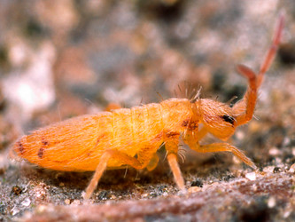
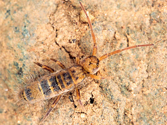

# [[Entomobryidae]] 

 

## Phylogeny 

-   « Ancestral Groups  
    -   [Springtail](../Springtail.md)
    -   [Hexapoda](Hexapoda)
    -   [Arthropoda](Arthropoda)
    -   [Bilateria](Bilateria)
    -   [Animals](Animals)
    -   [Eukaryotes](Eukaryotes)
    -   [Tree of Life](../../../../../../Tree_of_Life.md)

-   ◊ Sibling Groups of  Collembola
    -   [Poduromorpha](Poduromorpha.md)
    -   [Symphypleona](Symphypleona.md)
    -   [Neelidae](Neelidae)
    -   [Isotomidae](Isotomidae.md)
    -   Entomobryidae
    -   [Tomoceridae](Tomoceridae.md)

-   » Sub-Groups 
	-   *Orchesellinae*
	-   *Entomobryinae*
	-   *Lepidocyrtinae*
	-   *Seirinae*

## Title Illustrations

------------------------------------------------------------------------
 
Scientific Name ::     Entomobrya nicoleti
Specimen Condition   Live Specimen
Copyright ::            © [Steve Hopkin](http://www.stevehopkin.co.uk/) 

------------------------------------------------------------------------

Scientific Name ::     Orchesella alticola
Specimen Condition   Live Specimen
Copyright ::            © [Steve Hopkin](http://www.stevehopkin.co.uk/) 

## Confidential Links & Embeds: 

### #is_/same_as :: [Entomobryidae](/_Standards/bio/bio~Domain/Eukaryotes/Animals/Bilateria/Arthropoda/Hexapoda/Springtail/Entomobryidae.md) 

### #is_/same_as :: [Entomobryidae.public](/_public/bio/bio~Domain/Eukaryotes/Animals/Bilateria/Arthropoda/Hexapoda/Springtail/Entomobryidae.public.md) 

### #is_/same_as :: [Entomobryidae.internal](/_internal/bio/bio~Domain/Eukaryotes/Animals/Bilateria/Arthropoda/Hexapoda/Springtail/Entomobryidae.internal.md) 

### #is_/same_as :: [Entomobryidae.protect](/_protect/bio/bio~Domain/Eukaryotes/Animals/Bilateria/Arthropoda/Hexapoda/Springtail/Entomobryidae.protect.md) 

### #is_/same_as :: [Entomobryidae.private](/_private/bio/bio~Domain/Eukaryotes/Animals/Bilateria/Arthropoda/Hexapoda/Springtail/Entomobryidae.private.md) 

### #is_/same_as :: [Entomobryidae.personal](/_personal/bio/bio~Domain/Eukaryotes/Animals/Bilateria/Arthropoda/Hexapoda/Springtail/Entomobryidae.personal.md) 

### #is_/same_as :: [Entomobryidae.secret](/_secret/bio/bio~Domain/Eukaryotes/Animals/Bilateria/Arthropoda/Hexapoda/Springtail/Entomobryidae.secret.md)

