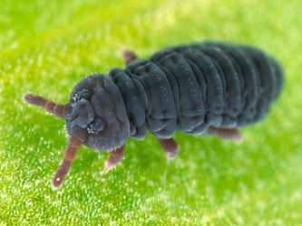
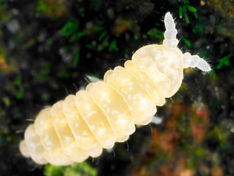

# [[Poduromorpha]] 

   

## #has_/text_of_/abstract 

> The order **Poduromorpha** is one of the three main groups of springtails (Collembola), tiny hexapods related to insects. This group was formerly treated as a superfamily Poduroidea.
>
> They can be best distinguished from the other springtail groups by their body shape. The Symphypleona are very round animals, almost spherical and the abdominal segments are not visible.  Both Entomobryomorpha and Poduromorpha are long springtails with six visible abdominal segments. While Entomobryomorpha have the first thorax segment reduced, Poduromorpha retain all three.  The Poduromorpha also tend to have short legs and a plump body, but more oval in shape than the Symphypleona. Their name means 'foot tail formed', deriving from their short, flat, furcula.
>
> [Wikipedia](https://en.wikipedia.org/wiki/Poduromorpha) 

## Phylogeny 

-   « Ancestral Groups  
    -   [Springtail](../Springtail.md)
    -   [Hexapoda](Hexapoda)
    -   [Arthropoda](Arthropoda)
    -   [Bilateria](Bilateria)
    -   [Animals](Animals)
    -   [Eukaryotes](Eukaryotes)
    -   [Tree of Life](../../../../../../Tree_of_Life.md)

-   ◊ Sibling Groups of  Collembola
    -   Poduromorpha
    -   [Symphypleona](Symphypleona.md)
    -   [Neelidae](Neelidae)
    -   [Isotomidae](Isotomidae.md)
    -   [Entomobryidae](Entomobryidae.md)
    -   [Tomoceridae](Tomoceridae.md)

-   » Sub-Groups
    -   [Onychiuridae](Poduromorpha/Onychiuridae.md)
    -   [Neanuridae](Poduromorpha/Neanuridae.md)

	-   *Podura*
	-   *[Onychiuridae](Poduromorpha/Onychiuridae.md "go to ToL page")*
	-   *Hypogastruridae*[ (non-monophyletic) ]
	-   *Brachystomellidae*
	-   *Odontellidae*
	-   *[Neanuridae](Poduromorpha/Neanuridae.md "go to ToL page")*

## Title Illustrations

------------------------------------------------------------------------

Scientific Name ::     Podura aquatica
Specimen Condition   Live Specimen
Copyright ::            © [Steve Hopkin](http://www.stevehopkin.co.uk/) 

------------------------------------------------------------------------

Scientific Name ::     Anurida granaria
Specimen Condition   Live Specimen
Copyright ::            © [Steve Hopkin](http://www.stevehopkin.co.uk/) 
