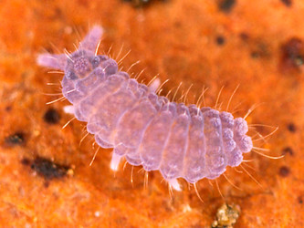
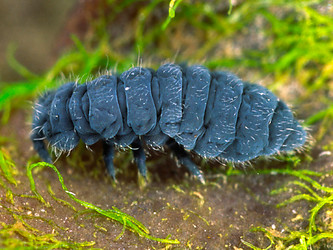

## Phylogeny 

-   « Ancestral Groups  
    -   [Poduromorpha](../Poduromorpha.md)
    -   [Springtail](../../Springtail.md)
    -   [Hexapoda](Hexapoda)
    -   [Arthropoda](Arthropoda)
    -   [Bilateria](Bilateria)
    -   [Animals](Animals)
    -   [Eukaryotes](Eukaryotes)
    -   [Tree of Life](../../../../../../../Tree_of_Life.md)

-   ◊ Sibling Groups of  Poduromorpha
    -   [Onychiuridae](Onychiuridae.md)
    -   Neanuridae

-   » Sub-Groups 

# Neanuridae 

-   *Caputanurininae*
-   *Frieseinae*
-   *Morulininae*
-   *Neanurinae*
-   *Pseudachorutinae*
-   *Uchidanurinae*

Containing group: [Poduromorpha](../Poduromorpha.md)

## Title Illustrations



  ------------------------------------------------------------------------
  Scientific Name ::     Neanura muscorum
  Specimen Condition   Live Specimen
  Copyright ::            © [Steve Hopkin](http://www.stevehopkin.co.uk/) 
  ------------------------------------------------------------------------


  ------------------------------------------------------------------------
  Scientific Name ::     Anurida maritima
  Specimen Condition   Live Specimen
  Copyright ::            © [Steve Hopkin](http://www.stevehopkin.co.uk/) 
  ------------------------------------------------------------------------

## Confidential Links & Embeds: 

### #is_/same_as :: [Neanuridae](/_Standards/bio/bio~Domain/Eukaryotes/Animals/Bilateria/Arthropoda/Hexapoda/Springtail/Poduromorpha/Neanuridae.md) 

### #is_/same_as :: [Neanuridae.public](/_public/bio/bio~Domain/Eukaryotes/Animals/Bilateria/Arthropoda/Hexapoda/Springtail/Poduromorpha/Neanuridae.public.md) 

### #is_/same_as :: [Neanuridae.internal](/_internal/bio/bio~Domain/Eukaryotes/Animals/Bilateria/Arthropoda/Hexapoda/Springtail/Poduromorpha/Neanuridae.internal.md) 

### #is_/same_as :: [Neanuridae.protect](/_protect/bio/bio~Domain/Eukaryotes/Animals/Bilateria/Arthropoda/Hexapoda/Springtail/Poduromorpha/Neanuridae.protect.md) 

### #is_/same_as :: [Neanuridae.private](/_private/bio/bio~Domain/Eukaryotes/Animals/Bilateria/Arthropoda/Hexapoda/Springtail/Poduromorpha/Neanuridae.private.md) 

### #is_/same_as :: [Neanuridae.personal](/_personal/bio/bio~Domain/Eukaryotes/Animals/Bilateria/Arthropoda/Hexapoda/Springtail/Poduromorpha/Neanuridae.personal.md) 

### #is_/same_as :: [Neanuridae.secret](/_secret/bio/bio~Domain/Eukaryotes/Animals/Bilateria/Arthropoda/Hexapoda/Springtail/Poduromorpha/Neanuridae.secret.md)

