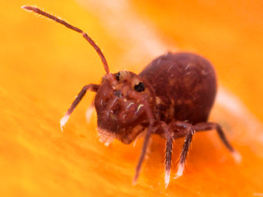
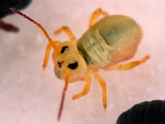

# [[Symphypleona]] 

 
 

## #has_/text_of_/abstract 

> The order **Symphypleona**, also known as the globular springtails, 
> is one of the three main groups of springtails (Collembola), tiny hexapods related to insects. 
> When the springtails were still believed to be an order of insects, 
> the Symphypleona were ranked as a suborder.
>
> They can be best distinguished from the other springtail groups by their body shape. 
> The Symphypleona are very round animals, almost spherical, and usually have long antennae. 
> The Poduromorpha, by contrast, always have short legs and a plump body, 
> but more oval in shape than the Symphypleona. 
> 
> The Entomobryomorpha are the slimmest springtails, 
> some with long and some with short legs and antennae, but always with a very slender body.
>
> [Wikipedia](https://en.wikipedia.org/wiki/Symphypleona) 

## Phylogeny 

-   « Ancestral Groups  
    -   [Springtail](../Springtail.md)
    -   [Hexapoda](Hexapoda)
    -   [Arthropoda](Arthropoda)
    -   [Bilateria](Bilateria)
    -   [Animals](Animals)
    -   [Eukaryotes](Eukaryotes)
    -   [Tree of Life](../../../../../../Tree_of_Life.md)

-   ◊ Sibling Groups of  Collembola
    -   [Poduromorpha](Poduromorpha.md)
    -   Symphypleona
    -   [Neelidae](Neelidae)
    -   [Isotomidae](Isotomidae.md)
    -   [Entomobryidae](Entomobryidae.md)
    -   [Tomoceridae](Tomoceridae.md)

-   » Sub-Groups
    -   [Dicyrtomidae](Symphypleona/Dicyrtomidae.md)
	-   *Katiannidae*
	-   *Spinothecidae*
	-   *Bourletiellidae*
	-   *Mackenziella psocoides*
	-   *[Dicyrtomidae](Symphypleona/Dicyrtomidae.md "go to ToL page")*
	-   *Sminthuridae*
	-   *Sminthurididae*
	-   *Sturmius*
	-   *Arrhopalitidae*

## Title Illustrations

------------------------------------------------------------------------

Scientific Name ::     Dicyrtoma fusca
Specimen Condition   Live Specimen
Copyright ::            © [Steve Hopkin](http://www.stevehopkin.co.uk/) 

------------------------------------------------------------------------

Scientific Name ::     Sminthurides aquaticus
Specimen Condition   Live Specimen
Copyright ::            © [Steve Hopkin](http://www.stevehopkin.co.uk/) 

## Confidential Links & Embeds: 

### #is_/same_as :: [Symphypleona](/_Standards/bio/bio~Domain/Eukaryotes/Animals/Bilateria/Arthropoda/Hexapoda/Springtail/Symphypleona.md) 

### #is_/same_as :: [Symphypleona.public](/_public/bio/bio~Domain/Eukaryotes/Animals/Bilateria/Arthropoda/Hexapoda/Springtail/Symphypleona.public.md) 

### #is_/same_as :: [Symphypleona.internal](/_internal/bio/bio~Domain/Eukaryotes/Animals/Bilateria/Arthropoda/Hexapoda/Springtail/Symphypleona.internal.md) 

### #is_/same_as :: [Symphypleona.protect](/_protect/bio/bio~Domain/Eukaryotes/Animals/Bilateria/Arthropoda/Hexapoda/Springtail/Symphypleona.protect.md) 

### #is_/same_as :: [Symphypleona.private](/_private/bio/bio~Domain/Eukaryotes/Animals/Bilateria/Arthropoda/Hexapoda/Springtail/Symphypleona.private.md) 

### #is_/same_as :: [Symphypleona.personal](/_personal/bio/bio~Domain/Eukaryotes/Animals/Bilateria/Arthropoda/Hexapoda/Springtail/Symphypleona.personal.md) 

### #is_/same_as :: [Symphypleona.secret](/_secret/bio/bio~Domain/Eukaryotes/Animals/Bilateria/Arthropoda/Hexapoda/Springtail/Symphypleona.secret.md)

