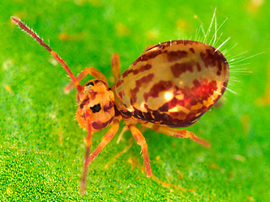

## Phylogeny 

-   « Ancestral Groups  
    -   [Symphypleona](../Symphypleona.md)
    -   [Springtail](../../Springtail.md)
    -   [Hexapoda](Hexapoda)
    -   [Arthropoda](Arthropoda)
    -   [Bilateria](Bilateria)
    -   [Animals](Animals)
    -   [Eukaryotes](Eukaryotes)
    -   [Tree of Life](../../../../../../../Tree_of_Life.md)

-   ◊ Sibling Groups of  Symphypleona
    -   Dicyrtomidae

-   » Sub-Groups 

# Dicyrtomidae 

-   *Bothriovulsus*
-   *Calvatomina*
-   *Dicyrtoma*
-   *Dicyrtomina*
-   *Gibberathrix*
-   *Jordanathrix*
-   *Papirioides*
-   *Ptenothrix*

Containing group: [Symphypleona](../Symphypleona.md)

### References

Snider, R. J. 1990. A contribution to the Dicyrtomidae (Collembola) of
Hawaii. Zoologica Scripta 19(1):73-99.

## Title Illustrations



  ------------------------------------------------------------------------
  Scientific Name ::     Dicyrtomina saundersi
  Specimen Condition   Live Specimen
  Copyright ::            © [Steve Hopkin](http://www.stevehopkin.co.uk/) 
  ------------------------------------------------------------------------


  ------------------------------------------------------------------------
  Scientific Name ::     Dicyrtoma fusca
  Specimen Condition   Live Specimen
  Copyright ::            © [Steve Hopkin](http://www.stevehopkin.co.uk/) 
  ------------------------------------------------------------------------
