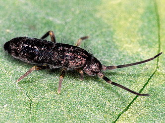

# [[Tomoceridae]] 

   

## #has_/text_of_/abstract 

> The Entomobryomorpha are one of the three main groups (order) of springtails (Collembola), tiny hexapods related to insects. This group was formerly treated as a superfamily, the Entomobryoidea.
>
> They can be best distinguished from the other springtail groups by their body shape. The Symphypleona are very round animals, almost spherical. The Poduromorpha are also very plump but have a more oval shape. The Entomobryomorpha, by contrast, contain the slimmest springtails. They either have short legs and antennae, but their long bodies set them apart, or long legs and antennae, as well as well-developed furculae; these are the most characteristic members of the order.
>
> [Wikipedia](https://en.wikipedia.org/wiki/Entomobryomorpha) 

## Phylogeny 

-   « Ancestral Groups  
    -   [Springtail](../Springtail.md)
    -   [Hexapoda](Hexapoda)
    -   [Arthropoda](Arthropoda)
    -   [Bilateria](Bilateria)
    -   [Animals](Animals)
    -   [Eukaryotes](Eukaryotes)
    -   [Tree of Life](../../../../../../Tree_of_Life.md)

-   ◊ Sibling Groups of  Collembola
    -   [Poduromorpha](Poduromorpha.md)
    -   [Symphypleona](Symphypleona.md)
    -   [Neelidae](Neelidae)
    -   [Isotomidae](Isotomidae.md)
    -   [Entomobryidae](Entomobryidae.md)
    -   Tomoceridae

-   » Sub-Groups 
	-   *Antennacyrtus*
	-   *Aphaenomurus*
	-   *Entomocerus*
	-   *Lasofinius*
	-   *Lepidophorella*
	-   *Lethemurus*
	-   *Monodontocerus*
	-   *Neophorella*
	-   *Novacerus*
	-   *Plutomurus*
	-   *Pogonognathellus*
	-   *Pseudolepidophorella*
	-   *Tomocerina*
	-   *Tomocerus*
	-   *Tomolonus*
	-   *Tritomurus*

## Title Illustrations

------------------------------------------------------------------------
 
Scientific Name ::     Tomocerus longicornis
Specimen Condition   Live Specimen
Copyright ::            © [Steve Hopkin](http://www.stevehopkin.co.uk/) 

------------------------------------------------------------------------
 
Scientific Name ::     Tomocerus minor
Specimen Condition   Live Specimen
Copyright ::            © [Steve Hopkin](http://www.stevehopkin.co.uk/) 
