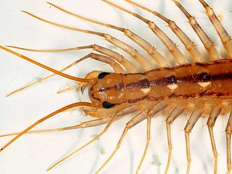

## Phylogeny 

-   « Ancestral Groups  
    -   [Chilopoda](Chilopoda)
    -   [Arthropoda](Arthropoda)
    -   [Bilateria](Bilateria)
    -   [Animals](Animals)
    -   [Eukaryotes](Eukaryotes)
    -   [Tree of Life](../../../../../../Tree_of_Life.md)

-   ◊ Sibling Groups of  Chilopoda
    -   Scutigeromorpha
    -   [Geophilomorpha](Geophilomorpha)
    -   [Scolopendromorpha](Scolopendromorpha)

-   » Sub-Groups 

## Notostigmophora 

# Scutigeromorpha 

Relationships after Edgecombe & Giribet 2004

Containing group: [Chilopoda](Chilopoda.md)

### References

Edgecombe, G. D. and G. Giribet. 2004. Adding mitochondrial sequence
data (16S rRNA and cytochrome c oxidase subunit I) to the phylogeny of
centipedes (Myriapoda: Chilopoda): an analysis of morphology and four
molecular loci. Journal of Zoological Systematics & Evolutionary
Research 42(2):89-134.

Lewis, J. G. E. 1981. The Biology of Centipedes. Cambridge University
Press, Cambridge.

Minelli, A. 1993. Chilopoda. Pages 57-114 in Microscopic Anatomy of
Invertebrates. Volume 12. Onychophora, Chilopoda and lesser
Protostomata. F. W. Harrison and M. E. Rice, eds. Wiley-Liss, New York,
Chichester, Weinheim, Brisbane, Singapore, Toronto.

Negrisolo, E., A. Minelli, and G. Valle. 2004. The mitochondrial genome
of the house centipede Scutigera and the monophyly versus paraphyly of
myriapods. Molecular Biology and Evolution 21:770-780.

Wilson, H. M. 2001. First Mesozoic scutigeromorph centipede, from the
Lower Cretaceous of Brazil. Palaeontology 44:489-495.

## Title Illustrations



  ----------------------------------------------------------------------------
  Scientific Name ::     Chilopoda Scutigeromorpha:Scutigeridae: Scutigera coleoptrata
  Location ::           Castel d'Aiano, Bologna Province, Emilia Romagna, Italy
  Specimen Condition   Live Specimen
  Image Use ::    [Attribution-NonCommercial 2.0 Creative Commons License](http://creativecommons.org/licenses/by-nc/2.0/).
  Copyright ::            © 2005 [Cesare Brizio](http://xoomer.virgilio.it/cebrizio/) 
  ----------------------------------------------------------------------------
