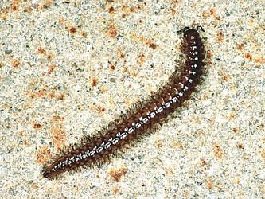

---
aliases:
- "sausage millipedes"
- Chordeumatida
title: Chordeumatida
---

# [[Chordeumatida]] 

## #has_/text_of_/abstract 

> **Chordeumatida** (from the Greek word for "sausage") 
> is a large order of millipedes containing more than 1,400 species.  
> 
> Also known as sausage millipedes, they are found nearly worldwide. 
> 
> Chordeumatida is the largest order in the superorder Nematophora, 
> a group also known as spinning millipedes 
> because their telsons feature spinnerets used to build nests of silk. 
> 
> These millipedes produce this silk to create chambers in which to molt or to lay their eggs.
>
> [Wikipedia](https://en.wikipedia.org/wiki/Chordeumatida) 

## Phylogeny 

-   « Ancestral Groups  
    -   [Diplopoda](Diplopoda)
    -   [Arthropoda](Arthropoda)
    -   [Bilateria](Bilateria)
    -   [Animals](Animals)
    -   [Eukaryotes](Eukaryotes)
    -   [Tree of Life](../../../../../../Tree_of_Life.md)

-   ◊ Sibling Groups of  Diplopoda
    -   [Polyxenida](Polyxenida)
    -   [Glomeridesmus](Glomeridesmus)
    -   [Sphaerotheriida](Sphaerotheriida)
    -   [Glomerida](Glomerida)
    -   [Siphoniulus neotropicus](Siphoniulus_neotropicus)
    -   [Platydesmida](Platydesmida)
    -   [Siphonophorida](Siphonophorida)
    -   [Polyzoniida](Polyzoniida)
    -   [Stemmiulida](Stemmiulida)
    -   [Callipodida](Callipodida)
    -   Chordeumatida
    -   [Julida](Julida)
    -   [Spirobolida](Spirobolida)
    -   [Spirostreptida](Spirostreptida)
    -   [Polydesmida](Polydesmida)

-   » Sub-Groups 

	-   *Adritylidae*
	-   *Altajellidae*
	-   *Anthroleucosomatidae*
	-   *Apterouridae*
	-   *Attemsiidae*
	-   *Biokoviellidae*
	-   *Brachychaeteumatidae*
	-   *Branneriidae*
	-   *Caseyidae*
	-   *Chaemosomatidae*
	-   *Chordeumatidae*
	-   *Cleidogonidae*
	-   *Conotylidae*
	-   *Craspedosomatidae*
	-   *Diplomaragnidae*
	-   *Entomobielziidae*
	-   *Eudigonidae*
	-   *Faginidae*
	-   *Golovatchiidae*
	-   *Haaseidae*
	-   *Haasiidae*
	-   *Haplobainosomatidae*
	-   *Heterochordeumatidae*
	-   *Heterolatzeliidae*
	-   *Hoffmaneumatidae*
	-   *Kashmireumatidae*
	-   *Lankasomatidae*
	-   *Lusitaniosomatidae*
	-   *Macrochaeteumatidae*
	-   *Mastigophorophyllidae*
	-   *Megalotylidae*
	-   *Metopidiotrichidae*
	-   *Neoatractosomatidae*
	-   *Niponiosomatidae*
	-   *Opisthocheiridae*
	-   *Origmatogonidae*
	-   *Peterjohionsiidae*
	-   *Pygmaeosomatidae*
	-   *Rhiscosomididae*
	-   *Speophilosomatidae*
	-   *Striariidae*
	-   *Tingupidae*
	-   *Trachygonidae*
	-   *Trichopetalidae*
	-   *Urochordeumatidae*
	-   *Vandeleumatidae*
	-   *Verhoeffiidae*

## Title Illustrations

----------------------------------------------------------------------------
 
Scientific Name ::     Diplopoda:Nematophora: Polymicrodon polydesmoides
Location ::           Castel d'Aiano, Bologna Province, Emilia Romagna, Italy
Specimen Condition   Live Specimen
Image Use ::    [Attribution-NonCommercial 2.0 Creative Commons License](http://creativecommons.org/licenses/by-nc/2.0/).
Copyright ::            © 2005 [Cesare Brizio](http://xoomer.virgilio.it/cebrizio/) 

## Confidential Links & Embeds: 

### #is_/same_as :: [Chordeumatida](/_Standards/bio/bio~Domain/Eukaryotes/Animals/Bilateria/Arthropoda/Myriapoda/Diplopoda/Chordeumatida.md) 

### #is_/same_as :: [Chordeumatida.public](/_public/bio/bio~Domain/Eukaryotes/Animals/Bilateria/Arthropoda/Myriapoda/Diplopoda/Chordeumatida.public.md) 

### #is_/same_as :: [Chordeumatida.internal](/_internal/bio/bio~Domain/Eukaryotes/Animals/Bilateria/Arthropoda/Myriapoda/Diplopoda/Chordeumatida.internal.md) 

### #is_/same_as :: [Chordeumatida.protect](/_protect/bio/bio~Domain/Eukaryotes/Animals/Bilateria/Arthropoda/Myriapoda/Diplopoda/Chordeumatida.protect.md) 

### #is_/same_as :: [Chordeumatida.private](/_private/bio/bio~Domain/Eukaryotes/Animals/Bilateria/Arthropoda/Myriapoda/Diplopoda/Chordeumatida.private.md) 

### #is_/same_as :: [Chordeumatida.personal](/_personal/bio/bio~Domain/Eukaryotes/Animals/Bilateria/Arthropoda/Myriapoda/Diplopoda/Chordeumatida.personal.md) 

### #is_/same_as :: [Chordeumatida.secret](/_secret/bio/bio~Domain/Eukaryotes/Animals/Bilateria/Arthropoda/Myriapoda/Diplopoda/Chordeumatida.secret.md)

