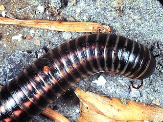

# [[Julida]]  

 

## #has_/text_of_/abstract 

> **Julida** is an order of millipedes. 
> 
> Members are mostly small and cylindrical, 
> typically ranging from 10–120 millimetres (0.39–4.72 in) in length. 
> 
> Eyes may be present or absent, and in mature males of many species, 
> the first pair of legs is modified into hook-like structures. 
> 
> Additionally, both pairs of legs on the 7th body segment of males 
> are modified into gonopods.
>
> [Wikipedia](https://en.wikipedia.org/wiki/Julida) 

## Phylogeny 

-   « Ancestral Groups  
    -   [Diplopoda](Diplopoda)
    -   [Arthropoda](Arthropoda)
    -   [Bilateria](Bilateria)
    -   [Animals](Animals)
    -   [Eukaryotes](Eukaryotes)
    -   [Tree of Life](../../../../../../Tree_of_Life.md)

-   ◊ Sibling Groups of  Diplopoda
    -   [Polyxenida](Polyxenida)
    -   [Glomeridesmus](Glomeridesmus)
    -   [Sphaerotheriida](Sphaerotheriida)
    -   [Glomerida](Glomerida)
    -   [Siphoniulus neotropicus](Siphoniulus_neotropicus)
    -   [Platydesmida](Platydesmida)
    -   [Siphonophorida](Siphonophorida)
    -   [Polyzoniida](Polyzoniida)
    -   [Stemmiulida](Stemmiulida)
    -   [Callipodida](Callipodida)
    -   [Chordeumatida](Chordeumatida)
    -   Julida
    -   [Spirobolida](Spirobolida)
    -   [Spirostreptida](Spirostreptida)
    -   [Polydesmida](Polydesmida)

-   » Sub-Groups 

	-   *Aprosphylosomatidae*
	-   *Blaniulidae*
	-   *Chelojulidae*
	-   *Galliobatidae*
	-   *Julidae*
	-   *Mongoliulidae*
	-   *Nemasomatidae*
	-   *Nematozoniidae*
	-   *Okeanobatidae*
	-   *Paeromopodidae*
	-   *Parajulidae*
	-   *Pseudonemasomatidae*
	-   *Rhopaloiulidae*
	-   *Telsonemasomatidae*
	-   *Trichoblaniulidae*
	-   *Trichonemasomatidae*
	-   *Zosteractinidae*

## Title Illustrations

----------------------------------------------------------------------------

Scientific Name ::     Diplopoda:Juliformia:Julidae: Schizophyllum sabulosum
Location ::           "Corno alle Scale" Park, Bologna Province, Emilia Romagna, Italy
Specimen Condition   Live Specimen
Image Use ::    [Attribution-NonCommercial 2.0 Creative Commons License](http://creativecommons.org/licenses/by-nc/2.0/).
Copyright ::            © 2005 [Cesare Brizio](http://xoomer.virgilio.it/cebrizio/) 

## Confidential Links & Embeds: 

### #is_/same_as :: [Julida](/_Standards/bio/bio~Domain/Eukaryotes/Animals/Bilateria/Arthropoda/Myriapoda/Diplopoda/Julida.md) 

### #is_/same_as :: [Julida.public](/_public/bio/bio~Domain/Eukaryotes/Animals/Bilateria/Arthropoda/Myriapoda/Diplopoda/Julida.public.md) 

### #is_/same_as :: [Julida.internal](/_internal/bio/bio~Domain/Eukaryotes/Animals/Bilateria/Arthropoda/Myriapoda/Diplopoda/Julida.internal.md) 

### #is_/same_as :: [Julida.protect](/_protect/bio/bio~Domain/Eukaryotes/Animals/Bilateria/Arthropoda/Myriapoda/Diplopoda/Julida.protect.md) 

### #is_/same_as :: [Julida.private](/_private/bio/bio~Domain/Eukaryotes/Animals/Bilateria/Arthropoda/Myriapoda/Diplopoda/Julida.private.md) 

### #is_/same_as :: [Julida.personal](/_personal/bio/bio~Domain/Eukaryotes/Animals/Bilateria/Arthropoda/Myriapoda/Diplopoda/Julida.personal.md) 

### #is_/same_as :: [Julida.secret](/_secret/bio/bio~Domain/Eukaryotes/Animals/Bilateria/Arthropoda/Myriapoda/Diplopoda/Julida.secret.md)

