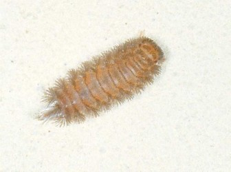

## [[Penicillata]] 

Polyxenida 

 

## #has_/text_of_/abstract 

> Polyxenida is an order of millipedes readily 
> distinguished by a unique body plan consisting of a soft, non-calcified body 
> ornamented with tufts of bristles. 
> 
> These features have inspired the common names bristly millipedes or pincushion millipedes. 
> This order includes about 148 species in four families worldwide, 
> which represent the only living members of the subclass **Penicillata**.
>
> [Wikipedia](https://en.wikipedia.org/wiki/Polyxenida) 

## Phylogeny 

-   « Ancestral Groups  
    -   [Diplopoda](Diplopoda)
    -   [Arthropoda](Arthropoda)
    -   [Bilateria](Bilateria)
    -   [Animals](Animals)
    -   [Eukaryotes](Eukaryotes)
    -   [Tree of Life](../../../../../../Tree_of_Life.md)

-   ◊ Sibling Groups of  Diplopoda
    -   Polyxenida
    -   [Glomeridesmus](Glomeridesmus)
    -   [Sphaerotheriida](Sphaerotheriida)
    -   [Glomerida](Glomerida)
    -   [Siphoniulus neotropicus](Siphoniulus_neotropicus)
    -   [Platydesmida](Platydesmida)
    -   [Siphonophorida](Siphonophorida)
    -   [Polyzoniida](Polyzoniida)
    -   [Stemmiulida](Stemmiulida)
    -   [Callipodida](Callipodida)
    -   [Chordeumatida](Chordeumatida)
    -   [Julida](Julida)
    -   [Spirobolida](Spirobolida)
    -   [Spirostreptida](Spirostreptida)
    -   [Polydesmida](Polydesmida)

-   » Sub-Groups 

	-   *Hypogexenidae*
	-   *Lophoproctidae*
	-   *Polyxenidae*
	-   *Synxenidae*

## Title Illustrations

----------------------------------------------------------------------------

Scientific Name ::     Diplopoda:Schizocephala:Polyxenidae: Polyxenus sp.
Location ::           Marina di Pietrasanta, Lucca Province, Tuscany, Italy
Specimen Condition   Live Specimen
Image Use ::    [Attribution-NonCommercial 2.0 Creative Commons License](http://creativecommons.org/licenses/by-nc/2.0/).
Copyright ::            © 2005 [Cesare Brizio](http://xoomer.virgilio.it/cebrizio/) 
