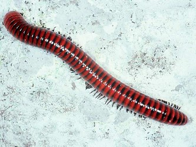

# [[Spirobolida]] 

 

## #has_/text_of_/abstract 

> **Spirobolida** is an order of "round-backed" millipedes containing approximately 500 species in 12 families. Its members are distinguished by the presence of a "pronounced suture that runs "vertically down the front of the head". Most of the species live in the tropics, and many are brightly coloured. Mature males have two pairs of modified legs, the gonopods, consisting of the 8th and 9th leg pair: the posterior gonopods are used in sperm-transfer while the anterior gonopods are fused into a single plate-like structure.
> 
> The families are divided into two suborders:
> Suborder Spirobolidea
> - Allopocockiidae
> - Atopetholidae
> - Floridobolidae
> - Hoffmanobolidae
> - Messicobolidae
> - Pseudospirobolellidae
> - Rhinocricidae
> - Spirobolellidae
> - Spirobolidae
> - Typhlobolellidae
> 
> Suborder Trigoniulidea
> - Pachybolidae
> - Trigoniulidae
>
> [Wikipedia](https://en.wikipedia.org/wiki/Spirobolida) 

## Phylogeny 

-   « Ancestral Groups  
    -   [Diplopoda](Diplopoda)
    -   [Arthropoda](Arthropoda)
    -   [Bilateria](Bilateria)
    -   [Animals](Animals)
    -   [Eukaryotes](Eukaryotes)
    -   [Tree of Life](../../../../../../Tree_of_Life.md)

-   ◊ Sibling Groups of  Diplopoda
    -   [Polyxenida](Polyxenida)
    -   [Glomeridesmus](Glomeridesmus)
    -   [Sphaerotheriida](Sphaerotheriida)
    -   [Glomerida](Glomerida)
    -   [Siphoniulus neotropicus](Siphoniulus_neotropicus)
    -   [Platydesmida](Platydesmida)
    -   [Siphonophorida](Siphonophorida)
    -   [Polyzoniida](Polyzoniida)
    -   [Stemmiulida](Stemmiulida)
    -   [Callipodida](Callipodida)
    -   [Chordeumatida](Chordeumatida)
    -   [Julida](Julida)
    -   Spirobolida
    -   [Spirostreptida](Spirostreptida)
    -   [Polydesmida](Polydesmida)

-   » Sub-Groups 

	-   *Allopocockiidae*
	-   *Atopetholidae*
	-   *Floridobolidae*
	-   *Messicobolidae*
	-   *Pachybolidae*
	-   *Pseudospirobolellidae*
	-   *Rhinocricidae*
	-   *Spirobolellidae*
	-   *Spirobolidae*
	-   *Trigoniulidae*
	-   *Typhlobolellidae*

## Title Illustrations

----------------------------------------------------------------------------

Scientific Name ::     Diplopoda:Spirobolida:Pachybolidae: Centrobolus annulatus
Location ::           Umhlanga, Durban, Kwazulu-Natal, South Africa
Specimen Condition   Live Specimen
Image Use ::    [Attribution-NonCommercial 2.0 Creative Commons License](http://creativecommons.org/licenses/by-nc/2.0/).
Copyright ::            © 2005 [Cesare Brizio](http://xoomer.virgilio.it/cebrizio/) 
