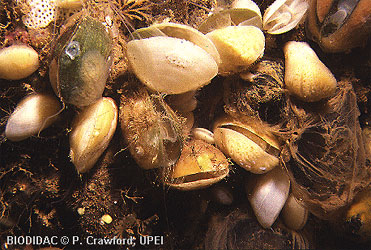
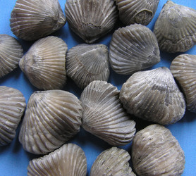

# Brachiopoda

## Lamp shells 

 
 

## Phylogeny 

-   « Ancestral Groups  
    -   [Bilateria](Bilateria)
    -   [Animals](Animals)
    -   [Eukaryotes](Eukaryotes)
    -   [Tree of Life](../../../Tree_of_Life.md)

-   ◊ Sibling Groups of  Bilateria
    -   [Deuterostomia](Deutero.md)
    -   [Arthropoda](Arthropoda)
    -   [Onychophora](Onychophora)
    -   [Tardigrade](Tardigrade.md)
    -   [Nematoda](Nematoda)
    -   [Nematomorpha](Nematomorpha)
    -   [Kinorhyncha](Kinorhyncha)
    -   [Loricifera](Loricifera)
    -   [Priapulida](Priapulida)
    -   [Arrow_Worm](Arrow_Worm.md)
    -   [Gastrotricha](Gastrotricha)
    -   [Rotifera](Rotifera)
    -   [Gnathostomulida](Gnathostomulida)
    -   [Limnognathia maerski](Limnognathia_maerski)
    -   [Cycliophora](Cycliophora)
    -   [Mesozoa](Mesozoa)
    -   [Platyhelminthes](Platyhelminthes)
    -   [Annelida](Annelida)
    -   [Bryozoa](Bryozoa)
    -   [Sipuncula](Sipuncula)
    -   [Mollusca](Mollusca)
    -   [Nemertea](Nemertea)
    -   [Entoprocta](Entoprocta)
    -   [Phoronida](Phoronida)
    -   Brachiopoda

-   » Sub-Groups 
	-   *Rhynchonelliformea*
	-   *Linguliformea*
	-   *Craniiformea*

## Title Illustrations

---------------------------------------------------------------------------

Scientific Name ::     Brachiopoda
Creator              Photograph by P. Crawford, UPEI
Specimen Condition   Live Specimen
Copyright ::            © [BIODIDAC](http://biodidac.bio.uottawa.ca/index.htm) 

-----------------------------------------------------------

Scientific Name ::     Brachiopoda
Location ::           Upper Fullers Earth Clays, West Bay, Dorset UK
Acknowledgements     The copyright owner has released this image under the [Attribution-NonCommercial-NoDerivs 2.0 Creative Commons License](http://creativecommons.org/licenses/by-nc-nd/2.0/).
Specimen Condition   Fossil
Copyright ::            © 2006 [Steve Makin](http://flickr.com/people/stevemakin/)

