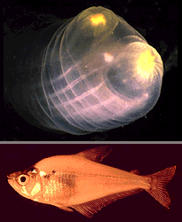
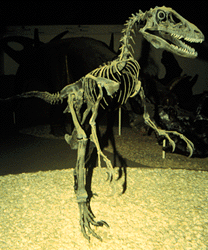

# [[Chordata]] 

#is_/same_as :: [[../../../WikiData/WD~Chordata,10915|WD~Chordata,10915]] 
#is_/instance_of :: [[../../bio~Domain/Eukaryotes/Animals/bio~Phylum|Phylum]]  

Chordata is a phylum of animals characterized by several key anatomical features, 
including a [[notochord]], a dorsal hollow nerve cord, pharyngeal slits, and a post-anal tail, 
at some point in their development. 
The parent group of Chordata likely includes primitive marine organisms 
without these chordate characteristics. 

### Notochord: 
One of the defining features of Chordata is the presence of a notochord, 
a flexible rod-like structure located along the dorsal side of the body. 
The notochord provides support and rigidity to the body, 
serving as a precursor to the vertebral column in vertebrates. 
In contrast, the parent group likely lacked a notochord 
or possessed a less developed axial support structure.

### Dorsal Hollow Nerve Cord 
Chordates have a dorsal hollow nerve cord that runs along the length of the body. 
This structure develops from a dorsal invagination of the ectoderm 
and serves as the primary component of the central nervous system. 
In contrast, the nervous system of the parent group may have been less organized 
or lacked a distinct dorsal nerve cord.

### Pharyngeal Slits: 
Chordates typically have pharyngeal slits, which are openings in the pharynx 
that connect the inside of the throat to the outside environment. 
These slits may function in filter feeding, respiration, or other roles depending on the species. 
The presence of pharyngeal slits distinguishes chordates from their parent group.

### Post-Anal Tail: 
Chordates exhibit a post-anal tail, an extension of the body past the anus. 
This tail may be present only during embryonic development 
or persist into adulthood in some species. 
The presence of a post-anal tail is a characteristic feature of chordates 
that sets them apart from their parent group.

### Endostyle or Thyroid Gland: 
Many chordates have an endostyle or thyroid gland, which is located in the pharyngeal region 
and plays a role in iodine metabolism and hormone production. 
While not present in all chordates, the presence of an endostyle or thyroid gland is another characteristic feature that distinguishes chordates from their parent group.

Overall, the presence of a notochord, dorsal hollow nerve cord, pharyngeal slits, post-anal tail, 
and endostyle or thyroid gland are key characteristics that define Chordata 
and differentiate them from their parent group within the broader context of animal evolution.

## Introduction

[John G. Lundberg]()

The Phylum Chordata includes the well-known vertebrates (fishes,
amphibians, reptiles, birds, mammals). The vertebrates and hagfishes
together comprise the taxon Craniata. The remaining chordates are the
tunicates (Urochordata), lancelets (Cephalochordata), and, possibly,
some odd extinct groups. With few exceptions, chordates are active
animals with bilaterally symmetric bodies that are longitudinally
differentiated into head, trunk and tail. The most distinctive
morphological features of chordates are the notochord, nerve cord, and
visceral clefts and arches.

Chordates are well represented in marine, freshwater and terrestrial
habitats from the Equator to the high northern and southern latitudes.
The oldest fossil chordates are of Cambrian age. The earliest is
Yunnanozoon lividum from the Early Cambrian, 525 Ma (= million years
ago), of China. This was just recently described and placed with the
cephalochordates (Chen et al., 1995). Another possible cephalochordate
is Pikaia (Nelson, 1994) from the Middle Cambrian. These fossils are
highly significant because they imply the contemporary existence of the
tunicates and craniates in the Early Cambrian during the so-called
Cambrian Explosion of animal life. Two other extinct Cambrian taxa, the
calcichordates and conodonts, are uncertainly related to other Chordata
(Nelson, 1994). In the Tree of Life project, conodonts are placed as a
subgroup of
[vertebrates](tree?group=Vertebrata&contgroup=Craniata).

Chordates other than craniates include entirely aquatic forms. The
strictly marine Urochordata or Tunicata are commonly known as tunicates,
sea squirts, and salps. There are roughly 1,600 species of urochordates;
most are small solitary animals but some are colonial, organisms. Nearly
all are sessile as adults but they have free-swimming, active larval
forms. Urochordates are unknown as fossils. Cephalochordata are also
known as amphioxus and lancelets. The group contains only about 20
species of sand-burrowing marine creatures. The Cambrian fossils
Yunnanozoon and Pikaia are likely related to modern cephalochordates.

During the Ordovician Period (510 - 439 Ma) jawless or agnathan fishes
appeared and diversified. These are the earliest known members of
Vertebrata, the chordate subgroup that is most familiar to us. Fossils
representing most major lineages of fish-like vertebrates and the
earliest tetrapods (Amphibia) were in existence before the end of the
Devonian Period (363 Ma). Reptile-like tetrapods originated during the
Carboniferous (363 - 290 Ma), mammals differentiated before the end of
the Triassic (208 Ma) and birds before the end of the Jurassic (146 Ma).

The smallest chordates (e.g. some of the tunicates and gobioid fishes)
are mature at a length of about 1 cm, whereas the largest animals that
have ever existed are chordates: some sauropod dinosaurs reached more
than 20 m and living blue whales grow to about 30 m.

### Characteristics

The **notochord** is an elongate, rod-like, skeletal structure dorsal to
the gut tube and ventral to the nerve cord. The notochord should not be
confused with the backbone or vertebral column of most adult
vertebrates. The notochord appears early in embryogeny and plays an
important role in promoting or organizing the embryonic development of
nearby structures. In most adult chordates the notochord disappears or
becomes highly modified. In some non-vertebrate chordates and fishes the
notochord persists as a laterally flexible but incompressible skeletal
rod that prevents telescopic collapse of the body during swimming.

The **nerve cord** of chordates develops dorsally in the body as a
hollow tube above the notochord. In most species it differentiates in
embryogeny into the brain anteriorly and spinal cord that runs through
the trunk and tail. Together the brain and spinal cord are the central
nervous system to which peripheral sensory and motor nerves connect.

The **visceral (also called pharyngeal or gill) clefts and arches** are
located in the pharyngeal part of the digestive tract behind the oral
cavity and anterior to the esophagus. The visceral clefts appear as
several pairs of pouches that push outward from the lateral walls of the
pharynx eventually to reach the surface to form the clefts. Thus the
clefts are continuous, slit-like passages connecting the pharynx to the
exterior. The soft and skeletal tissues between adjacent clefts are the
visceral arches. The embryonic fate of the clefts and slits varies
greatly depending on the taxonomic subgroup. In many of the
non-vertebrate chordates, such as tunicates and cephalochordates, the
clefts and arches are elaborated as straining devices concerned with
capture of small food particles from water. In typical fish-like
vertebrates and juvenile amphibians the walls of the pharyngeal clefts
develop into gills that are organs of gas exchange between the water and
blood. In adult amphibians and the amniote tetrapods (= reptiles, birds
and mammals) the anteriormost cleft transforms into the auditory
(Eustachian) tube and middle ear chamber, whereas the other clefts
disappear after making some important contributions to glands and
lymphatic tissues in the throat region. The skeleton and muscles of the
visceral arches are the source of a great diversity of adult structures
in the vertebrates. For example, in humans (and other mammals) visceral
arch derivatives include the jaw and facial muscles, the embryonic
cartilaginous skeleton of the lower jaw, the alisphenoid bone in the
side wall of the braincase, the three middle ear ossicles (malleus,
incus and stapes), the skeleton and some musculature of the tongue, the
skeleton and muscles of the larynx, and the cartilaginous tracheal
rings.

### Discussion of Phylogenetic Relationships

As noted below, the relationships of some of the presumed fossil
chordates is based on scant evidence and there is debate about the
position of especially the calcichordates and conodonts (see references
cited below and Chen et al. 1995). There is strong morphological,
especially embryological, evidence for monophyly of the Urochordata,
Cephalochordata and Craniata, with the latter two being sister taxa.
Schaeffer (1987) details several embyological synapomorphies, in
addition to those noted here, that support these same relations among
and monophyly of the three living chordate groups.

1.  **Calcichordata.** Jeffries (1986) provides descriptions and
    comparisons and argues for the placement of calcichordates near the
    Chordata. Other workers believe that calcichordates are closer to
    echinoderms. Reconstructions of these fossil organisms include
    visceral (pharyngeal or gill) slits that would suggest chordate
    affinities, but the mineralized skeleton was composed of calcite,
    like echinoderms, not bone as in many chordates.
2.  **Urochordata.** Evidence that tunicates are chordates comes clearly
    from the larval \"tadpole\" stage which shows pharyngeal slits and
    arches, dorsal hollow nerve cord, notochord and post-anal muscular
    (unsegmented) tail. Adults of most members are sessile filter
    feeders with an expanded pharynx and, like cephalochordates and
    larval lampreys, with an endostyle, a mucous food trap in the
    pharyngeal floor that is homologous with the thyroid gland of
    vertebrates.
3.  **Cephalochordata.** Among the living chordates there is little
    doubt that lancelets are most closely related to the Craniates based
    on synapomorphies such as segmented axial muscles and metameric
    organization of the visceral (pharyngeal) arches. Uniquely, the
    notochord of cephalochordates extends to the tip of the snout, the
    gonads are segmentally organized, adults have a high number (50+)
    gill arches, and there is a hood-like atrium covering the pharyngeal
    region. The Early Cambrian fossil Yunnanozoon possesses the extended
    notochord and segmental gonads, but lack the atrium and increased
    number of gill arches.
4.  **Craniata.** Because hagfishes (Myxini) lack all traces of
    vertebrae, i.e. a backbone, Janvier (1981) groups the Myxini with
    all other vertebrates in the higher taxon Craniata (referring to the
    presence of a head skeleton). The taxon Vertebrata is, therefore, in
    a strict sense, applied to those animals known or believed to
    possess at least a simple backbone of neural arches. Synapomorphies
    of the Craniata include: presence of a cartilaginous (and often
    bony) head skeleton; relatively large brain plus a unique set of
    sensory and motor cranial nerves; nephrons as the functional
    excretory unit; neural crest embryonic tissue.

The traditional taxa Agnatha (jawless fishes), Ostracodermi (fossil
jawless fishes) and Cyclostomata (living lampreys and hagfishes) are
non-monophyletic assemblages that are no longer recommended. Details of
jawless fish relationships are introduced on the
[Craniata](tree?group=Craniata&contgroup=Chordata)
and
[Vertebrata](tree?group=Vertebrata&contgroup=Craniata)
pages.

## Phylogeny 

-   « Ancestral Groups  
    -   [Deuterostomia](../Deutero.md)
    -   [Bilateria](Bilateria)
    -   [Animals](Animals)
    -   [Eukaryotes](Eukaryotes)
    -   [Tree of Life](../../../../Tree_of_Life.md)

-   ◊ Sibling Groups of  Deuterostomia
    -   [Echinodermata](Echinodermata.md)
    -   [Hemichordata](Hemichordata.md)
    -   Chordata

-   » Sub-Groups
    -   [Craniata](Chordata/Craniata.md)

## Title Illustrations

--------------------------------------------------------------------------------
Chordates include familiar vertebrates like fishes and dinosaurs, 
as well as less familiar marine organisms like tunicates (*Ciona*).

Scientific Name ::   Ciona, Roeboides
Acknowledgements   Gray Museum Slide Collection (Ciona), © fish Antonio Machado.
Copyright ::          © 1995 [Marine Biological Laboratory, Woods Hole](http://www.mbl.edu/) 

----------

Scientific Name ::     Deinonychus
Specimen Condition   Fossil
Copyright ::            © 1995 Chris Brochu
