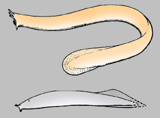

# Hyperotreti

Hagfishes 

 

## Introduction

[Philippe Janvier](http://www.tolweb.org/) 

Hagfishes are a group of marine, eel-shaped jawless fishes. There are
about 20 species of hagfish, referred to four genera: Myxine, Neomyxine,
Paramyxine, and Eptatretus. The former two possess a single pair of
common external gill openings, a character of the Myxinidae. The latter
two have minute, separate gill openings, which is regarded as the
primitive condition. In Paramyxine, however, the gill openings are more
closely-set than in Eptatretus, and this has been thought to represent
an intermediate condition between Eptatretus and Myxinidae. The eyes,
although devoid of lens and extrinsic musculature, are larger in
Eptatretus and Paramyxine than in Myxine and Neomyxine, where they are
partly covered by the trunk musculature.

Among craniates, hagfishes are unique in many respects, and this has
long been regarded as a consequence of degeneracy due to presumed
parasitic habits. However, if hagfishes may penetrate inside dead fishes
to eat the liver (their favourite dish!), they are in no way
endoparasites. On the contrary, they can be active predators and prey on
small invertebrates at night. There is now a broad consensus over the
idea that most of these unique anatomical and physiological features of
hagfishes are in fact primitive and approach the condition of the common
ancestor to all craniates. These features are for example their body
fluid content (more than 10%, whereas it is less than 10% in all other
craniates), the low oxygen affinity of their blood cells, their lack of
cardiac innervation, their multiple veinous hearts, their lack of
sensory-line neuromasts (although they have acoustico-lateral nerve
fibres), their comparatively simple pituitary gland, or their lack of
muscles in caudal fin web.

Hagfishes have an antitropical distribution, most species living in
relatively cold waters of the northern and southern hemispheres. They
have practically no osmoregulation and are very sensitive to drops in
water salinity. Having little culinary value (except in Japan), some
species of hagfishes are, however, now endangered by their exploitation
for their skin, which is extremely tough and soft, and is sold worldwide
as \"eel skin\".

### Characteristics

Hagfishes are characterized by:

-   Four pairs of tentacles surrounding the mouth and the opening for
    the nasopharyngeal duct.
-   A duct leading from the esophagus to the exterior
    (oesophagocutaneous duct), on the left side only, and opening behind
    the rearmost gill opening.
-   A ventrolateral series of very large glands which produce a slime
    made up by large thread cells.

There are several other characteristics by which hagfishes differ from
all other vertebrates, but these are either absences (lack of extrinsic
eye muscles, lack of eye lens, lack of cardiac innervation, lack of
radial muscles, etc.) or conditions which recalls that in
cephalochordates or tunicates (accessory venous hearts, disseminate
pancreas, etc.). In both cases, these apparently unique hagfish features
are likely to be primitive for all craniates.

The mouth of hagfishes is armed with a protractable and retractable
cartilaginous plate which bears two pairs of comb-shaped horny teeth
(the \"rasping tongue\"). These are used to grasp on the food and convey
it toward the pharynx. The mouth is not involved in the intake of the
respiratory water. Instead, the water is inhalated through the
nasopharyngeal duct, which opens at the anterior tip of the head. It
leads posteriorly to the median olfactory organ and then to the pharynx
and gill pouches.

The skeleton of hagfishes is made up by a complex assemblage of
cartilaginous bars (see figure on the
[Craniata](tree?group=Craniata&contgroup=Chordata)
page), which serve as antagonists to an equally complex head
musculature. Cartilages also strengthen the tentacles, nasopharyngeal
duct, velum, \"tongue\", but there are no branchial arches. Neither is
there any braincase proper, the brain being surrounded by a fibrous
sheath. Nevertheless, the olfactory organ and the labyrinth are enclosed
in cartilaginous capsules. In the body, the only skeleton is the
notochord and the cartilaginous rays of the caudal fin.

### Discussion of Phylogenetic Relationships

There is no detailed phylogeny of hagfishes. However, Myxine and
Neomyxine can reasonably be regarded as forming a clade, the Myxinidae,
because of their unique pair of external branchial openings. Whether the
Eptratretidae (Eptatretus and Paramyxine) are a clade or not is still
undecided, yet tooth morphology suggests monophyly. The only fossil
hagfishes known to date are Late Carboniferous in age (about 330 million
years). They are represented by Myxinikela, from the Pennsylvanian of
Illinois, which shares with extant hagfishes the tentacles and long
nasopharyngeal duct, but differs from them by its stout body shape and
larger caudal fin. Another fossil, Gilpichthys, from the same locality
and age, displays nearly the same morphology, except for the tentacles,
and is questionably referred to hagfishes.

Hagfishes have long been included in the clade Cyclostomi, together with
lampreys, because of their peculiar \"tongue\" apparatus, horny teeth
and pouch-shaped gills. The cyclostomes were regarded as the
sister-group of the Gnathostomata (jawed vertebrates). There is now
overwhelming evidence that the cyclostomes are paraphyletic, and that
hagfishes are the sister-group of lampreys and the gnathostomes; that
is, the Vertebrata in the current sense. Some zoologists, however still
consider the cyclostome characteristics are synapomorphies and reject
cyclostome paraphyly.

## Phylogeny 

-   « Ancestral Groups  
    -   [Craniata](../Craniata.md)
    -   [Chordata](../../Chordata.md)
    -   [Deuterostomia](../../../Deutero.md)
    -   [Bilateria](Bilateria)
    -   [Animals](Animals)
    -   [Eukaryotes](Eukaryotes)
    -   [Tree of Life](../../../../../../Tree_of_Life.md)

-   ◊ Sibling Groups of  Craniata
    -   Hyperotreti
    -   [Vertebrata](Vertebrata.md)

-   » Sub-Groups 

## Title Illustrations

A modern hagfish, the Pacific hagfish Eptatretus (top), shows some of
the diagnostic features of the group: the tentacles surrounding the
snout, the left oesophagocutaneous opening (in the rear of the gill
openings), and the series of large, ventrolateral slime glands. The
earliest known fossil hagfish, Myxinikela, from the Late Carboniferous
of Illinois, had a much stouter body shape but clearly shows the
tentacles (after Bardack 1991). Copyright © Philippe Janvier.

----------

Copyright ::   © 1997 Philippe Janvier

## Confidential Links & Embeds: 

### [Hyperotreti](/_Standards/bio/bio~Domain/Eukaryotes/Animals/Bilateria/Deutero/Chordata/Craniata/Hyperotreti.md) 

### [Hyperotreti.public](/_public/bio/bio~Domain/Eukaryotes/Animals/Bilateria/Deutero/Chordata/Craniata/Hyperotreti.public.md) 

### [Hyperotreti.internal](/_internal/bio/bio~Domain/Eukaryotes/Animals/Bilateria/Deutero/Chordata/Craniata/Hyperotreti.internal.md) 

### [Hyperotreti.protect](/_protect/bio/bio~Domain/Eukaryotes/Animals/Bilateria/Deutero/Chordata/Craniata/Hyperotreti.protect.md) 

### [Hyperotreti.private](/_private/bio/bio~Domain/Eukaryotes/Animals/Bilateria/Deutero/Chordata/Craniata/Hyperotreti.private.md) 

### [Hyperotreti.personal](/_personal/bio/bio~Domain/Eukaryotes/Animals/Bilateria/Deutero/Chordata/Craniata/Hyperotreti.personal.md) 

### [Hyperotreti.secret](/_secret/bio/bio~Domain/Eukaryotes/Animals/Bilateria/Deutero/Chordata/Craniata/Hyperotreti.secret.md)

