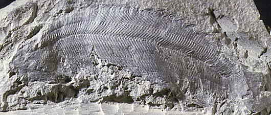
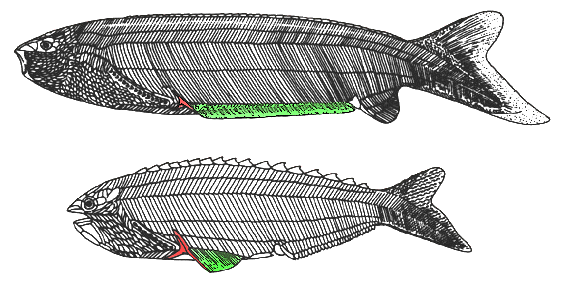

---
title: Anaspida
---

# [[Anaspida]] 

Interrelationships of the Anaspida:

The main characteristics supporting the nodes of this phylogeny are:

-   **Node 1**: Ten or less than ten external branchial openings
-   **Node 2**: Reduced anal fin, short-based paired fins, large median
    dorsal scutes
-   **Node 3**: Loss of anal fin, larger and hook-shaped median dorsal
    scutes

## #has_/text_of_/abstract 

> **Anaspida** ("shieldless ones") is an extinct group of jawless fish 
> that existed from the early Silurian period to the late Devonian period. 
> 
> They were classically regarded as the ancestors of lampreys, 
> but it is denied in recent phylogenetic analysis, 
> although some analysis show these group would be at least related. 
> 
> Anaspids were small marine fish that lacked a heavy bony shield and paired fins, but were distinctively hypocercal.
>
> [Wikipedia](https://en.wikipedia.org/wiki/Anaspida)

## Introduction

[Philippe Janvier]() 

The Anaspida, or anaspids, are a group of fossil, jawless vertebrates
which lived in the Silurian (-430 to -410 million years ago). Anaspids
differ from most other \"ostracoderms\" by their dermal skeleton not
forming a massive headshield, although their head is covered by both
large bony plates and minute scales. Also, contrary to most other
\"ostracoderms\", they have a rather slender and laterally compressed
body, with the gill openings extending behind the eyes in a slanting
row, as in lampreys. The tail of anaspids is strongly hypocercal (or
reverse heterocercal); that is, the part containing the notochord dips
posteroventrally. On the top of their head, there is a median hole in
the skull-roof, which is interpreted as a nasohypophysial opening
similar to that of lampreys, yet there is no information of their
internal anatomy. They differ, however, from lampreys in having paired
fins. All these characteristics make anaspids roughly look like lampreys
and they have long been regarded as their ancestors. Current
phylogenies, however, imply that anaspids, along with other
\"ostracoderms\", are more closely related to the gnathostomes than to
lampreys. Yet, their phylogenetic position fluctuates considerably.

Anaspids lived in marine, coastal environments. They are rarely found as
articulated fossils, since their skeleton was comparatively fragile. The
best preserved anaspids are from the Silurian of Norway and Scotland.

### Characteristics

The Anaspida are characterized by:

-   At least one large, tri-radiate spine behind the series of the gill
    openings.

------------------------

Anaspids are characterized by a large, tri-radiate spine (red)
posteriorly to the series of branchial openings. Typical anaspids are
restricted to the Silurian but some doubtful forms occur in the Late
Devonian. It is assumed that the most primitive anaspids, such as
Pharyngolepis (top), possessed a long, ribon-shaped, ventrolateral
fin-fold (green). More advanced forms, such as Rhyncholepis (bottom),
possessed a shorter paired fin-fold (green) and enlarged, spine-shaped,
median dorsal scutes. (After Ritchie 1964, 1980.)

------------------------

All typical anaspids are Silurian in age. Several forms of debated
affinities have also been included in this group: the Silurian
Jamoytius, and the Late Devonian Endeiolepis and Euphanerops. Although
the latter two genera share with the Anaspida a strongly hypocercal
tail, a characteristic which is unknown in other groups, they have no
mineralized exoskeleton and, therefore show no tri-radiate postbranchial
spine. Both Jamoytius and Euphanerops display a very long series of more
than twenty gill openings, and a circular structure around the mouth,
which may be an annular cartilage, and thus would suggest affinities
with lampreys (see
[Hyperoartia](tree?group=Hyperoartia&contgroup=Vertebrata)).

Anaspids have a laterally compressed body, a large dorsal web and a
hypocercal notochordal lobe in the caudal fin, and an anal fin. They
clearly possess thin, sometimes ribon-shaped paired fins, but it is
uncertain whether these contained musculature and radials. The body is
covered with rod-shaped scales arranged in chevrons, and the head is
covered with minute scales and platelets forming the skull-roof. The
gill opnings (8 to 15 in number) are minute and aligned in slanting row
behind the eye. The skull-roof displays a median pineal opening, between
the two orbits, and in front of it there is a peculiar keyhole-shaped
opening interpreted as a dorsal nasohypophysial opening. However, since
nothing is known of the internal anatomy of anaspids, there are still
debates as to whether it corresponds to a blind nasohypophysial complex
of lamprey type, or to an inhalent duct leading to the pharynx.

The exoskeleton of anaspids is made up of aspidine and contains no
dentine. Some anaspids (e.g. Lasanius), however, are almost naked and
retain only the postbranchial spines and the large median dorsal series
of hook-shaped scute. Their endoskeleton was probably cartilaginous and
is not preserved. However, some naked Silurian and Devonian forms often
referred to as anaspids (Jamoytius, Endeolepis, Euphanerops) show
imprints of a branchial skelton which may have been more or less similar
to the \"branchial basket\" of lampreys.

### Discussion of Phylogenetic Relationships

Anaspids are classically regarded as close relatives or ancestors of
lampreys. However, all the characteristics which were considered as
supporting this relationship (dorsal nasohypophysial opening, gill
opening in posteriorly slanting row, hypocercal tail) occur in some
other fossil \"ostracoderm\" taxa. Only their slender body shape is
somewhat suggestive of that of lampreys. Current character analyses show
anaspids in various phylogenetic positions (sister-group to all other
\"ostracoderms\" + gnathostomes or sister-group to galeaspids +
osteostracans + pituriaspids + gnathostomes). This is largely due to the
lack of information about their internal anatomy.

The most generalized anaspids are exemplified by Pharyngolepis. More
derived forms include the Rhyncholepididae and Birkeniidae, in which the
anal fin is reduced or lost and the median dorsal ridge scales
considerably enlarged. The birkeniid Lasanius has lost most scales, with
the exception of the tri-radiate postbranchial spines and the median
dorsal ridge scales.

## Phylogeny 

-   « Ancestral Groups  
    -   [Vertebrata](../Vertebrata.md)
    -   [Craniata](../../Craniata.md)
    -   [Chordata](../../../Chordata.md)
    -   [Deuterostomia](../../../../Deutero.md)
    -   [Bilateria](Bilateria)
    -   [Animals](Animals)
    -   [Eukaryotes](Eukaryotes)
    -   [Tree of Life](../../../../../../../Tree_of_Life.md)

-   ◊ Sibling Groups of  Vertebrata
    -   [Hyperoartia](Hyperoartia.md)
    -   [Euconodonta](Euconodonta.md)
    -   [Pteraspidomorphi](Pteraspidomorphi.md)
    -   [Thelodonti](Thelodonti.md)
    -   Anaspida
    -   [Galeaspida](Galeaspida.md)
    -   [Pituriaspida](Pituriaspida.md)
    -   [Osteostraci](Osteostraci.md)
    -   [Gnathostomata](Gnath.md)

-   » Sub-Groups 

## Title Illustrations

------------------------------------------------------------------------
The anaspid Pterygolepis nitidus, from the Lower Silurian of Norway.

Copyright ::   © 1997 [Philippe Janvier](mailto:janvier@cimrs1.mnhn.fr) 

## Confidential Links & Embeds: 

### #is_/same_as :: [Anaspida](/_Standards/bio/bio~Domain/Eukaryotes/Animals/Bilateria/Deutero/Chordata/Craniata/Vertebrata/Anaspida.md) 

### #is_/same_as :: [Anaspida.public](/_public/bio/bio~Domain/Eukaryotes/Animals/Bilateria/Deutero/Chordata/Craniata/Vertebrata/Anaspida.public.md) 

### #is_/same_as :: [Anaspida.internal](/_internal/bio/bio~Domain/Eukaryotes/Animals/Bilateria/Deutero/Chordata/Craniata/Vertebrata/Anaspida.internal.md) 

### #is_/same_as :: [Anaspida.protect](/_protect/bio/bio~Domain/Eukaryotes/Animals/Bilateria/Deutero/Chordata/Craniata/Vertebrata/Anaspida.protect.md) 

### #is_/same_as :: [Anaspida.private](/_private/bio/bio~Domain/Eukaryotes/Animals/Bilateria/Deutero/Chordata/Craniata/Vertebrata/Anaspida.private.md) 

### #is_/same_as :: [Anaspida.personal](/_personal/bio/bio~Domain/Eukaryotes/Animals/Bilateria/Deutero/Chordata/Craniata/Vertebrata/Anaspida.personal.md) 

### #is_/same_as :: [Anaspida.secret](/_secret/bio/bio~Domain/Eukaryotes/Animals/Bilateria/Deutero/Chordata/Craniata/Vertebrata/Anaspida.secret.md)

