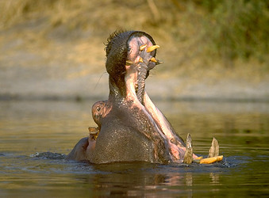
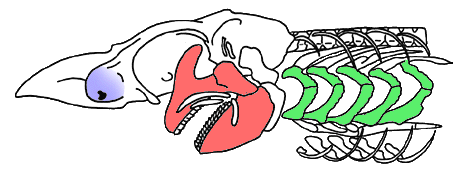

# Gnathostomata 

#is_/instance_of :: [[InfraPhylum]]  
#is_/same_as :: [[../../../../../../WikiData/WD~Gnathostomata,26214|WD~Gnathostomata,26214]] 

 

Gnathostomata, also known as jawed vertebrates, 
are distinguished from their parent group, the superclass [[Agnatha]], 
by several key anatomical and evolutionary features. Here are some of the main differences:

### Jaws: 
The most significant difference between Gnathostomata and Agnatha is the presence of jaws. 
Gnathostomes have hinged jaws derived from the first pair of gill arches, 
allowing for more efficient prey capture and feeding 
compared to the jawless condition seen in agnathans.

### Paired Appendages: 
Gnathostomes possess paired appendages, such as fins or limbs, 
that are supported by internal skeletal elements. 
These appendages provide greater control and maneuverability during locomotion 
compared to the unpaired, fin-like structures found in many agnathans.

### Vertebral Column: 
Gnathostomes typically have a vertebral column (backbone) composed of individual vertebrae, 
which provide support and protection for the spinal cord. 
In contrast, many agnathans lack true vertebrae 
and instead have a cartilaginous notochord as their primary axial support structure.

### Mineralized Skeleton: 
Gnathostomes often have a mineralized skeleton composed of bone or cartilage, 
providing structural support and protection for internal organs. 
While some agnathans possess cartilaginous skeletons, 
the development of mineralized tissues is more pronounced in gnathostomes.

### Complex Sensory Organs: 
Gnathostomes typically have more complex sensory organs compared to agnathans. 
This includes well-developed eyes with lenses for image formation, 
lateral line systems for detecting water movement and vibrations, 
and specialized mechanoreceptors in the skin for sensing touch and pressure.

### Advanced Circulatory System: 
Gnathostomes generally have a more advanced circulatory system compared to agnathans, 
including a two-chambered (fish) or four-chambered (tetrapods) heart 
with separate systemic and pulmonary circuits. 
This allows for more efficient oxygen transport and metabolic regulation.

### Increased Brain Complexity: 

Gnathostomes often have larger and more complex brains compared to agnathans, 
reflecting adaptations for enhanced sensory perception, motor control, and cognitive processing. 
This increased brain complexity is associated 
with the evolution of more sophisticated behaviors and ecological strategies.

Overall, the evolution of jaws, paired appendages, mineralized skeletons, complex sensory organs, 
advanced circulatory systems, and increased brain complexity 
represents major innovations that distinguish gnathostomes from their jawless ancestors 
and have contributed to their evolutionary success and diversity.

## Phylogeny 

-   « Ancestral Groups  
    -   [Vertebrata](../Vertebrata.md)
    -   [Craniata](../../Craniata.md)
    -   [Chordata](../../../Chordata.md)
    -   [Deuterostomia](../../../../Deutero.md)
    -   [Bilateria](Bilateria)
    -   [Animals](Animals)
    -   [Eukaryotes](Eukaryotes)
    -   [Tree of Life](../../../../../../../Tree_of_Life.md)

-   ◊ Sibling Groups of  Vertebrata
    -   [Hyperoartia](Hyperoartia.md)
    -   [Euconodonta](Euconodonta.md)
    -   [Pteraspidomorphi](Pteraspidomorphi.md)
    -   [Thelodonti](Thelodonti.md)
    -   [Anaspida](Anaspida.md)
    -   [Galeaspida](Galeaspida.md)
    -   [Pituriaspida](Pituriaspida.md)
    -   [Osteostraci](Osteostraci.md)
    -   Gnathostomata

-   » Sub-Groups
    -   [Sarcopterygii](Gnath/Sarc.md)
    -   [Actinopterygii](Gnath/Actinopterygii.md)

## Jawed Vertebrates 

[Philippe Janvier](http://www.tolweb.org/)

Interrelationships of the Gnathostomata:

The main characteristics supporting the nodes of this phylogeny are:

-   **Node 1**: Superior oblique muscle of eye attached anteriorly to
    eyeball. 
    Braincase including nasal capsules. 
    Jaw muscle external to mandibular arch.
-   **Teleostomi**: Mouth terminal in position, narrow-based braincase,
    three otoliths in ear.
-   **Osteichthyes**: Endochondral bone, lepidotrichs on fins, jaws
    lined by dentary, premaxillary and maxillary.

### Information on the Internet

[Deep homologies in the pharyngeal arches](http://pharyngula.org/index/weblog/comments/deep_homologies_in_the_pharyngeal_arches/).
Pharyngula.

## Introduction

The Gnathostomata, or gnathostomes, are the majority of the Middle
Devonian (-380 million years ago) to Recent vertebrates. They differ
from all other craniates or vertebrates in having a vertically biting
device, the jaws, which consist of an endoskeletal mandibular arch and a
variety of exoskeletal grasping, crushing, or shearing organs, i.e. the
teeth, and jaw bones. Among Recent vertebrates, the gnathostomes include
sharks, rays, chimaeras, ray-finned fishes, lobe-finned fishes and land
vertebrates.

Extant gnathostomes fall into two major clades, the Chondrichthyes and
Osteichthyes. In addition, there are two extinct major gnathostome
clades, the Placodermi (Early Silurian-Late Devonian) and the Acanthodii
(Latest Ordovician or Earliest Silurian - Early Permian). There may be
other fossil gnathostome taxa which fall outside of these four taxa.
This could be the case for the Mongolepida, only known from isolated
scales from the Early Silurian, and which are provisionally assigned to
the chondrichthyans, yet with great reservations.

The Chondrichthyes are characterized by a special type of hard tissue
lining the cartilages of the endoskeleton: the prismatic calcified
cartilage. Another chondrichthyan characteristic is the pelvic clasper,
as special copulatory organ derived from the metapterygium, i.e. the
posterior part of the pelvic fin. A pelvic clasper may, however, be
present in the fossil Placodermi. Chondrichthyans include two major
extant clades, the Elasmobranchii and the Holocephali, and a number of
fossil clades (Cladoselachidae, Symmoriida, Xenacanthiformes,
Iniopterygia, Eugeneodontida) which may fall outside these two clades.

The Osteichthyes are characterized by endochondral (\"spongy\") bone in
the endoskeleton, dermal fin rays made up by lepidotrichiae (modified,
tile-shaped scales), and three pairs of tooth-bearing dermal bones
lining the jaws (dentary, premaxillary and maxillary). The Osteichthyes
include two major clades, the Actinopterygii and the Sarcopterygii.

The Placodermi are characterized by a dermal armor consisting of a head
armor and a thoracic armor. In the thoracic armor, the foremost dermal
plates form a complete \"ring\" around the body and always include at
least one median dorsal plate.

The Acanthodii are characterized by dermal spines inserted in front of
all fins but the caudal one. They also possess minute, growing scales
which have a special onion-like structure, i.e. the crown consists of
overlying layers of dentine or mesodentine.

### Characteristics

Gnathostomes are characterized by:

-   A vertically biting device called jaws, and which is primitively
    made up by two endoskeletal elements, the palatoquadrate and
    Meckelian cartilage, and a number of dermal elements called teeth,
    sometimes attached to large dermal bones.

    ------------------------

    

    The skull of a gnathostome, or jawed vertebrates (here a shark), are
    characterized by vertically biting jaws (red) consisting of the
    palatoquadrate dorsally and the Meckelian cartilage ventrally. The
    gill arches (green) are situated internally to the gill filaments,
    and the nasal capsules (blue) open to the exterior by means of
    paired nostrils. (After Janvier 1996.)

    ------------------------

-   Pelvic fins. These are the paired fins or limbs situated just in
    front of the anus.

-   Interventrals and basiventrals in the backbone. These are the
    elements of the backbone which lie under the notochord, and match
    the basidorsals and interdorsals respectively.

-   Gill arches which lie internally to the gills and branchial blood
    vessels, contrary to the gill arches of all jawless craniates, which
    are external to the gills and blood vessels.

-   A horizontal semicircular canal in the inner ear

-   Paired nasal sacs which are independent from the hypophysial tube.
    In all extant and fossil jawless craniates, the nasal sacs, which
    contain the olfactory organs, open into a median duct, the
    nasohypophysial duct, which takes part to the formation of the
    pituitary gland and either leads postriorly to the pharynx (e.g. in
    hagfish and galeaspids) or ends as a blind pouch (e.g. in lampreys
    and osteostracans). In the gnathostomes, this pouch remains as a
    thin canal in the palate, the buccohypophysial canal, whereas the
    nasal sacs open separately to the exterior by external nostrils.

There are numerous other characteristics of the soft anatomy and
physiology (e.g. myelinated nerve fibres, sperms passing through urinary
ducts, etc.), which are unique to the gnathostomes among extant
craniates, but cannot by observed in fossils.

### Discussion of Phylogenetic Relationships

Gnathostomes have long been placed as the sister-group of the ensemble
of the Agnatha, or jawless vertebrates, regarded as a clade. Current
phylogenies, however, suggest that the Agnatha are not a clade, and
that, among Recent craniates, the gnathostomes are the sister-group of
the Hyperoartia (lampreys) only. Among fossil craniates, the Osteostraci
share the largest number of uniquely shared derived characteristics with
the gnathostomes.

The controversies about gnathostome interrelationships mainly bear on
the position of the two major fossil groups, the Placodermi and
Acanthodii. Placoderms have long been regarded as the sister-group of
chondrichthyans, with which they share an eye-stalk (a small cartilage
linking the eyeball to the braincase) and possibly a pelvic clasper. It
has also been suggested that they could be the sister-group of the
osteichthyans, because they share with them large dermal plates and a
median dermal bone in the palate, the parasphenoid. The current
consensus is that placoderms are the sister-group to all other known
gnathostomes. All other gnathostomes share a special arrangement of the
eye muscles (the superior oblique eye muscle being attached anteriorly
in the orbit), whereas that of placoderms is similar to that in the
Osteostraci (the superior oblique eye muscle being attached posteriorly
in the orbit). Also, the braincase of placoderms shows a separate
ossification containing the nasal capsules, whereas the latter are
always included in the braincase in all other gnathostomes.

The Acanthodii have long been regarded as closely related to either
chondrichthyans or placoderms, but they are now almost unanimously
regarded as the sister-group of the Osteichthyes. They share with them
otoliths in the inner ear, lepidotrich-like scales on fins, and a
narrow-based braincase with a transverse ventrale fissure. Acanthodians,
however, are rarely known from articulated specimens, and their internal
anatomy remains poorly known. It is possible that Acanthodii is
paraphyletic.

### References

Carroll, R. H. (1988). Vertebrate paleontology and evolution. W. H.
Freeman & Co. New York.

Forey, P. L. (1980). Latimeria: a paradoxical fish. Proceedings of the
Royal Society of London, B, 208, 369-384.

Gardiner, B. G. (1984). The relationships of placoderms. Journal of
Vertebrate Paleontology, 4, 379-395.

Goujet, D. (1984). Placoderm interrelationships: a new interpretation,
with a short review of placoderm classification. Proceedings of the
Linnean Society of New South Wales. 107, 211-241.

Jarvik, E. (1977).The systematic position of acanthodian fishes. In
Problems in vertebrate evolution (ed. S. M. Andrews, R. S. Miles and A.
D. Walker), pp. 199-225. Academic Press, London.

Mallatt, J. (1984). Early vertebrate evolution: pharyngeal structure and
the origin of gnathostomes. Journal of Zoology, 204, 169-183.

Miles, R. S. (1973). Relationships of acanthodians. In
Interrelationships of fishes (ed. P. H. Greenwood, R. S. Miles, and C.
Patterson). Zoological Journal of the Linnean Society, Supplement 1, 53,
63-103.

Schultze, H. P. (1993). Patterns of diversity in the skull of jawed
fishes. In The skull (ed. J. Hanken and B. K. Hall), Vol. 2, pp.
189-254. University of Chicago Press.

Young, G. C. (1986). The relationships of placoderm fishes. Zoological
Journal of the Linnean Society, 88, 1-57.

## Title Illustrations

------------------------------------------------------------------------------

Scientific Name ::  Hippopotamus amphibius
Location ::        Okavango Delta of Botswana
Sex ::             Male
Body Part         head
Copyright ::         © 1997 [Greg and Marybeth Dimijian](http://www.dimijianimages.com/) 

## Confidential Links & Embeds: 

### [Gnath](/_Standards/bio/bio~Domain/Eukaryotes/Animals/Bilateria/Deutero/Chordata/Craniata/Vertebrata/Gnath.md) 

### [Gnath.public](/_public/bio/bio~Domain/Eukaryotes/Animals/Bilateria/Deutero/Chordata/Craniata/Vertebrata/Gnath.public.md) 

### [Gnath.internal](/_internal/bio/bio~Domain/Eukaryotes/Animals/Bilateria/Deutero/Chordata/Craniata/Vertebrata/Gnath.internal.md) 

### [Gnath.protect](/_protect/bio/bio~Domain/Eukaryotes/Animals/Bilateria/Deutero/Chordata/Craniata/Vertebrata/Gnath.protect.md) 

### [Gnath.private](/_private/bio/bio~Domain/Eukaryotes/Animals/Bilateria/Deutero/Chordata/Craniata/Vertebrata/Gnath.private.md) 

### [Gnath.personal](/_personal/bio/bio~Domain/Eukaryotes/Animals/Bilateria/Deutero/Chordata/Craniata/Vertebrata/Gnath.personal.md) 

### [Gnath.secret](/_secret/bio/bio~Domain/Eukaryotes/Animals/Bilateria/Deutero/Chordata/Craniata/Vertebrata/Gnath.secret.md)

