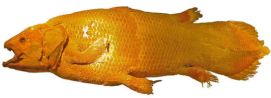

# [[Sarcopterygii]] 

#is_/instance_of :: [[Clade]]  
#is_/same_as :: [[../../../../../../../WikiData/WD~Sarcopterygii,160830|WD~Sarcopterygii,160830]]  

## #has_/text_of_/abstract 

> **Sarcopterygii** (; from Ancient Greek  σάρξ (sárx) 'flesh' and  πτέρυξ (ptérux) 'wing, fin')—
> sometimes considered synonymous with Crossopterygii (κροσσός, krossós, 'fringe')—
> is a clade (traditionally a class or subclass) of vertebrate animals which includes 
> a group of bony fish commonly referred to as lobe-finned fish. 
> 
> These vertebrates are characterised by prominent muscular limb buds (lobes) within their fins, 
> which are supported by articulated appendicular skeletons. 
> This is in contrast to the other clade of bony fish, the Actinopterygii, 
> which have only skin-covered bony spines supporting the fins.
>
> The tetrapods, a mostly terrestrial clade of vertebrates, are now recognized as having evolved from sarcopterygian ancestors and are most closely related to lungfishes. Their paired pectoral and pelvic fins evolved into limbs, and their foregut diverticulum eventually evolved into air-breathing lungs. Cladistically, this would make the tetrapods a subgroup within Sarcopterygii and thus sarcopterygians themselves. As a result, the phrase "lobe-finned fish" normally refers to not the entire clade but only aquatic members that are not tetrapods, i.e. a paraphyletic group.
>
> Non-tetrapod sarcopterygians were once the dominant predators of freshwater ecosystems during the Carboniferous and Permian periods, but suffered significant decline after the Great Dying. The only known extant non-tetrapod sarcopterygians are the two species of coelacanths and six species of lungfishes.
>
> [Wikipedia](https://en.wikipedia.org/wiki/Sarcopterygii) 
> 

## The lobe-finned fishes & terrestrial vertebrates 

Sarcopterygii, or lobe-finned fish, are distinguished 
from their parent group within the superclass [[Osteichthyes]] (bony fish) 
by several key anatomical and evolutionary features. Here are some of the main differences:

## Characteristics 
### Fleshy, Lobed Fins: 
Sarcopterygian fish have paired fins that are fleshy 
and supported by a series of bones, known as lobes. 
These lobed fins are more muscular and articulated 
than the ray-finned fins found in their parent group. 
The presence of lobed fins is considered a key evolutionary innovation 
that eventually led to the emergence of tetrapods (four-limbed vertebrates).

### Rhipidistians: 
The subclass Rhipidistia, which includes extinct lobe-finned fish 
such as Eusthenopteron and Tiktaalik, 
represents the evolutionary transition from fish to tetrapods. 
Rhipidistians possessed many characteristics intermediate between fish and tetrapods, 
including robust fins with bones homologous to those of tetrapod limbs.

### Lungfish and Coelacanths: 

Modern sarcopterygian fish include two extant groups: lungfish and coelacanths. 
Lungfish are known for their ability to breathe air using primitive lungs, in addition to gills, 
allowing them to survive in oxygen-poor water or even burrow into mud during dry periods. 

[[Coelacanth]]s are deep-sea fish that were thought to be extinct 
until living specimens were discovered in the 20th century. 
Both lungfish and coelacanths exhibit primitive characteristics 
reminiscent of early sarcopterygians.

### Internal Nostrils: 

Sarcopterygian fish typically have internal nostrils (choanae) 
that connect the nasal passages to the mouth cavity. 
This adaptation is associated with the ability to smell and taste underwater 
without inhaling water into the respiratory system.

### Axial Skeleton: 
Sarcopterygians often have a strong, ossified axial skeleton (vertebral column) 
that provides support and protection for internal organs. 
This axial skeleton is a characteristic feature of [[osteichthyans]] (bony fish) 
but may be more pronounced in sarcopterygians.

### Paired Fins with Muscular Strands: 

The paired fins of sarcopterygians have a unique structure, 
with muscular strands connecting the fin rays to the body. 
This musculature allows for greater control and flexibility of the fins, 
facilitating more precise movements 
and potentially contributing to the locomotor abilities of early tetrapods.

Overall, sarcopterygian fish represent an important evolutionary lineage 
within the superclass [[Osteichthyes]], 
characterized by the presence of lobed fins and other adaptations 
that played a crucial role in the transition from aquatic to terrestrial environments.

## Phylogeny 

## Phylogeny 

-   « Ancestral Groups  
    -   [Gnathostomata](../Gnath.md)
    -   [Vertebrata](../../Vertebrata.md)
    -   [Craniata](../../../Craniata.md)
    -   [Chordata](../../../../Chordata.md)
    -   [Deuterostomia](../../../../../Deutero.md)
    -   [Bilateria](Bilateria)
    -   [Animals](Animals)
    -   [Eukaryotes](Eukaryotes)
    -   [Tree of Life](../../../../../../../../Tree_of_Life.md)

-   ◊ Sibling Groups of  Gnathostomata
    -   Sarcopterygii
    -   [Actinopterygii](Actinopterygii.md)

-   » Sub-Groups
    -   [Terrestrial Vertebrates](Sarc/Terrestrial.md)

### Information on the Internet

-   [The Fish Out Of Time](http://www.dinofish.com/). Information about
    the Coelacanth. Coelacanth Rescue Mission.
-   [Coelacanth: Latimeria chalumnae Smith,     1939](http://www.austmus.gov.au/fishes/fishfacts/fish/coela.htm).
    Australian Museum Online.
-   [UC Berkeley Researchers Announce Discovery of Sulawesi     Coelacanths!](http://www.ucmp.berkeley.edu/vertebrates/coelacanth/coelacanths.html)
    UCMP Berkeley.
-   [On the Trail of the Coelacanth, a Living     Fossil](http://www.washingtonpost.com/wp-srv/national/horizon/nov98/fishstory.htm).
    Washington Post article by Susan L. Jewett.
-   [More about Lobe-Fin Fishes     (Sarcopterygii)](http://www.devoniantimes.org/who/pages/lobe-fins.html).
    Dennis C. Murphy. Devonian Times.
-   [*Tiktaalik roseae*](http://tiktaalik.uchicago.edu/). Newly
    discovered sarcopterygian from the late Devonian. University of
    Chicago.
-   [What has the head of a crocodile and the gills of a     fish?](http://evolution.berkeley.edu/evolibrary/news/060501_tiktaalik)
    Information about *Tiktaalik* from the [Understanding     Evolution](http://evolution.berkeley.edu/evolibrary/home.php) web
    site.
-   [Rhizodontida. Big Dead Fish     Homepage](http://www.donnasaxby.com/rhizodonts/). Jonathan Jeffery.

### Discussion of Phylogenetic Relationships

There is much debate on the interrelationships of sarcopterygian fishes
(for an introduction to the literature see Nelson, 1994, Carroll, 1988,
and Takezaki et al. 2004). Additional information on sarcopterygians
including tetrapods is being assembled for the Tree of Life project by
several contributors.

### References

Ahlberg, P.E. 1991. A re-examination of sarcopterygian
interrelationships, with special reference to the Porolepiformes.
Zoological Journal of the Linnean Society 103:241-287.

Ahlberg, P. E. and Z. Johanson. 1998. Osteolepiforms and the ancestry of
tetrapods. Nature 395:792-794.

Brinkmann, H., B. Venkatesh, S. Brenner, and A. Meyer. 2004. Nuclear
protein-coding genes support lungfish and not the coelacanth as the
closest living relatives of land vertebrates. Proceedings of the
National Academy of Sciences (USA) 101(14):4900-4905.

Cao, Y., P. J. Waddell, N. Okada, and M. Hasegawa. 1998. The complete
mitochondrial DNA sequence of the shark Mustelus manazo: evaluating
rooting contradictions to living bony vertebrates. Molecular Biology and
Evolution 15:1637-1646.

Carroll, R. H. 1988. Vertebrate paleontology and evolution. W. H.
Freeman & Co. New York.

Cloutier, R. and P. E. Ahlberg. 1995. Sarcopterygian interrelationships:
how far are we from a phylogenetic consensus? Geobios Manuscrit Spécial
19:241-248.

Cloutier, R. and P. E. Ahlberg. 1996. Morphology, characters, and the
interrelationships of basal sarcopterygians. Pages 445-479 in
Interrelationships of Fishes (M. L. J. Stiassny, L. R. Parenti, and G.
D. Johnson, eds.) Academic Press, San Diego, CA.

Daeschler, E. B., N. H. Shubin, and F. A. Jenkins, Jr. 2006. A Devonian
tetrapod-like fish and the evolution of the tetrapod body plan. Nature
440:757--763.

Gorr, T., T. Kleinschmidt, and H. Fricke. 1991. Close tetrapod
relationships of the coelacanth Latimeria indicated by hemoglobin
sequences. Nature 351:394-397.

Hedges, S. B., C. A. Hass, and L. R. Maxson. 1993. Relations of fish and
tetrapods. Nature 363:501-502.

Long, J.A.. 1989. A new rhizodontiform fish from the Early Carboniferous
of Victoria, Australia, with remarks on the phylogenetic position of the
group. Journal of Vertebrate Paleontology 9:1-17.

Marshall, C. and H. P. Schultze. 1992. Relative importance of molecular,
neontological, and paleontological data in understanding the biology of
the vertebrate invasion of land. Journal of Molecular Evolution
35:93-101.

Meyer, A. 1995. Molecular evidence on the origin of tetrapods and the
relationships of the coelacanth. Trends in Ecology & Evolution
10:111-116.

Meyer, A. and S. I. Dolven. 1992. Molecules, fossils, and the origin of
tetrapods. Journal of Molecular Evolution 35:102-113.

Meyer, A. and A. C. Wilson. 1990. Origin of tetrapods inferred from
their mitochondrial-DNA affiliation to lungfish. Journal of Molecular
Evolution 31:359-364.

Nelson, J. S. 1994. Fishes of the World. 3rd Ed. John Wiley & Sons, New
York, N.Y.

Schultze, H.-P. 1994. Comparison of hypotheses on the relationships of
sarcopterygians. Systematic Biology 43:155-173.

Schultze, H.-P. and E. I. Vorobyeva. 1991. Description and systematics
of panderichthyid fishes with comments on their relationship to
tetrapods. Pages 68-109 in Origins of the Higher Groups of Tetrapods
(H.-P. Schultze and L. Trueb, eds.) Comstock Publishing Associates,
Ithaca & London.

Shubin, N. H., E. B. Daeschler, and F. A. Jenkins, Jr. 2006. The
pectoral fin of Tiktaalik roseae and the origin of the tetrapod limb.
Nature 440:764--771.

Takezaki, N., F. Figueroa, Z. Zaleska-Rutczynska, N. Takahata, and J.
Klein. 2004. The Phylogenetic Relationship of tetrapod, coelacanth, and
lungfish revealed by the sequences of forty-four nuclear genes.
Molecular Biology and Evolution 21(8):1512-1524.

Tohyama, Y., H. Kasama-Yoshida, M. Sakuma, Y. Kobayashi, Y. Cao, M.
Hasegawa, H. Kojima, Y. Tamai, M. Tanokura, and T. Kurihara. 1999. Gene
structure and amino acid sequence of Latimeria chalumnae (Coelacanth)
myelin DM20: Phylogenetic relation of the fish. Neurochemical Research
24: 867-873.

Venkatesh, B., M. V. Erdmann, and S. Brenner. 2001. Molecular
synapomorphies resolve evolutionary relationships of extant jawed
vertebrates. Proceedings of the National Academy of Sciences (USA)
98:11382-11387.

Yokobori, S., M. Hasegawa, T. Ueda, N. Okada, K. Nishikawa, and K.
Watanabe. 1994. Relationship among coelacanths, lungfishes, and
tetrapods - a phylogenetic analysis based on mitochondrial
cytochrome-oxidase-I gene-sequences. Journal of Molecular Evolution
38:602-609.

Zardoya, R., Y. Cao, M. Hasegawa, and A. Meyer. 1998. Searching for the
closest living relative(s) of tetrapods through evolutionary analyses of
mitochondrial and nuclear data. Molecular Biology And Evolution
15:506-517 .

Zardoya, R. and A. Meyer. 1996. Evolutionary relationships of the
coelacanth, lungfishes, and tetrapods based on the 28S ribosomal RNA
gene. Proceedings of the National Academy of Sciences (USA)
93:5449-5454.

Zardoya, R. and A. Meyer. 1996. The complete nucleotide sequence of the
mitochondrial genome of the lungfish (Protopterus dolloi) supports its
phylogenetic position as a close relative of land vertebrates. Genetics
142:1249-1263.

Zardoya, R. and A. Meyer. 1997. The complete DNA sequence of the
mitochondrial genome of a \'living fossil,\' the coelacanth (Latimeria
chalumnae). Genetics 146:995-1010.

Zardoya, R. and A. Meyer. 1997. Molecular phylogenetic information on
the identity of the closest living relative(s) of land vertebrates.
Naturwissenschaften 84:389-397.

Zhu, M. and H.-P. Schultze. 1997. The oldest sarcopterygian fish.
Lethaia 30:293-304.

Zhu, M. and X. Yu. 2002. A primitive fish close to the common ancestor
of tetrapods and lungfish. Nature 418:767-770.

## Title Illustrations

  ----------------------------------------------------------------
  Scientific Name ::     Latimeria chalumnae
  Location ::           Vancouver Aquarium
  Comments             Preserved coelacanth
  Specimen Condition   Dead Specimen
  Source               [coelacanth](http://flickr.com/photos/matana/35531239/)
  Source Collection    [Flickr](http://flickr.com/)
  Image Use ::    [Attribution-NonCommercial-NoDerivs 2.0 Creative Commons License](http://creativecommons.org/licenses/by-nc-nd/2.0/).
  Copyright ::            © 2005 [Matana_and_Jes](http://flickr.com/people/matana/)
  ----------------------------------------------------------------
