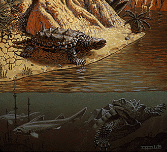
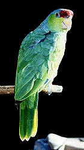
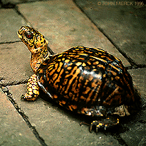

# [[Amniota]] 

Mammals, reptiles (turtles, lizards, Sphenodon, crocodiles, birds) and their extinct relatives 

Amniota is a group of tetrapods characterized by the presence of extraembryonic membranes, 
including the amnion, chorion, yolk sac, and allantois, 
which are adaptations for terrestrial reproduction. 
The parent group of Amniota is the superclass [[Tetrapoda]], 
which includes all vertebrates with four limbs or descended from such animals. 

## #has_/text_of_/abstract 

> Amniotes are tetrapod vertebrate animals belonging to the clade **Amniota**, 
> a large group that comprises the vast majority of living terrestrial and semiaquatic vertebrates. 
> 
> Amniotes evolved from amphibious stem tetrapod ancestors during the Carboniferous period. 
> Amniota is defined as the smallest crown clade 
> containing humans, the Greek tortoise, and the Nile crocodile. 
>
> Amniotes are distinguished from the other living tetrapod clade — the non-amniote lissamphibians (frogs/toads, salamanders/newts and caecilians) — by: the development of three extraembryonic membranes (amnion for embryonic protection, chorion for gas exchange, and allantois for metabolic waste disposal or storage); thicker and keratinized skin; costal respiration (breathing by expanding/constricting the rib cage);   the presence of adrenocortical and chromaffin tissues as a discrete pair of glands near their kidneys; more complex kidneys;  the presence of an astragalus for better extremity range of motion; the diminished role of skin breathing; and the complete loss of metamorphosis, gills, and lateral lines.: 600 : 552 : 694 
>
> The presence of an amniotic buffer, of a water-impermeable skin, and of a robust, air-breathing, respiratory system, allow amniotes to live on land as true terrestrial animals. Amniotes have the ability to procreate without water bodies. Because the amnion and the fluid it secretes shields the embryo from environmental fluctuations, amniotes can reproduce on dry land by either laying shelled eggs (reptiles, birds and monotremes) or nurturing fertilized eggs within the mother (marsupial and placental mammals). This distinguishes amniotes from  anamniotes (fish and amphibians) that have to spawn in aquatic environments. Most amniotes still require regular access to drinking water for rehydration, like the semiaquatic amphibians do.  
>
> They have better homeostasis in drier environments, and more efficient non-aquatic gas exchange to power terrestrial locomotion, which is facilitated by their astragalus.
>
> Basal amniotes resembled small lizards and evolved from semiaquatic reptiliomorphs, with fossil evidence suggesting they appeared no later than the earliest Carboniferous or late Devonian period. After the Carboniferous rainforest collapse, amniotes spread around Earth's land and became the dominant land vertebrates.
>
> Until 2025, it was assumed that amniotes originated during the mid-late Carboniferous, as the earliest body fossils of the group dated to this time. However, the discovery of clawed footprints made by a crown group-amniote (potentially a sauropsid) from the earliest Carboniferous-aged Snowy Plains Formation of Australia (358.9 to 354 million years ago) suggests that they likely originated even earlier, probably during the Devonian. After their origins, they almost immediately diverged into two groups, namely the sauropsids (including all reptiles and birds) and synapsids (including mammals and extinct ancestors like "pelycosaurs" and therapsids). Excluding the early fossil footprints, the earliest known crown group amniotes known from body fossils are the sauropsid Hylonomus and the synapsid Asaphestera, both of which are from Nova Scotia during the Bashkirian age of the Late Carboniferous around 318 million years ago. 
>
> This basal divergence within Amniota has also been dated by molecular studies at 310–329 Ma, or 312–330 Ma, and by a fossilized birth–death process study at 322–340 Ma. However, the Snowy Plains footprints suggest a minimum divergence of 358.9–354 Ma.
>
> [Wikipedia](https://en.wikipedia.org/wiki/Amniote)

## Characteristics 

Here are some key differences between Amniota and their parent group:

### Extraembryonic Membranes: 

One of the most significant differences between Amniota and their parent group 
is the presence of extraembryonic membranes. 
These membranes, including the amnion, chorion, yolk sac, and allantois, 
surround the developing embryo 
and provide protection, support, and nutrients during embryonic development. 
This adaptation allows for terrestrial reproduction 
by reducing the dependence on water for egg laying and development.

### Egg Adaptations: 

Amniotes produce eggs with shells that provide protection and prevent desiccation on land. 
The extraembryonic membranes within the egg 
provide a conducive environment for embryonic development, 
allowing amniotes to lay their eggs in a variety of terrestrial habitats. 
This adaptation frees amniotes from the need to return to water to reproduce, 
distinguishing them from their parent group, many of which rely on water for reproduction.

### Amniote Eggshell: 

The eggshell of amniotes is composed of calcium carbonate or other materials 
that provide mechanical support and protection for the developing embryo. 
This eggshell is a significant departure from the soft, gelatinous eggs 
laid by many amphibians and some non-amniote tetrapods.

### Terrestrial Adaptations: 

Amniotes exhibit a variety of adaptations for life on land, 
including limbs adapted for walking or running, skin modifications to prevent desiccation, 
and respiratory adaptations for efficient gas exchange in air. 
These terrestrial adaptations allowed amniotes to colonize diverse habitats, 
including deserts, forests, grasslands, and polar regions.

### Independence from Aquatic Habitats: 

Unlike many amphibians, which rely on water for reproduction and early development, 
amniotes are independent of aquatic habitats for their life cycle. 
The extraembryonic membranes and egg adaptations of amniotes 
allow for reproduction and embryonic development to occur entirely on land, 
reducing the need for a water-based environment.

Overall, the evolution of extraembryonic membranes and terrestrial adaptations 
represented a significant transition from aquatic to terrestrial life 
in the evolutionary history of vertebrates. 
These adaptations allowed amniotes to become highly successful and diverse, 
with mammals, reptiles, and birds representing major groups within the class Amniota.

## Phylogeny 

Phylogeny modified from Laurin & Reisz (1995) and Lee (1995); the
position of Mesosauridae follows Modesto (1999). Node names follow
Gauthier et al. (1988b) and Gauthier (1994). The position of **turtles**
(Testudines) is uncertain; some authors place them approximately in the
position shown above (Laurin & Reisz, 1995; Lee, 1993, 1995), while
others place them among Diapsida (deBraga & Rieppel, 1996, 1997; Rieppel
& Reisz, 1999; Hedges & Poling, 1999; Mannen & Li, 1999).

## Phylogeny 

-   « Ancestral Groups  
    -   [Terrestrial Vertebrates](../Terrestrial.md)
    -   [Sarcopterygii](../../Sarc.md)
    -   [Gnathostomata](../../../Gnath.md)
    -   [Vertebrata](../../../../Vertebrata.md)
    -   [Craniata](../../../../../Craniata.md)
    -   [Chordata](../../../../../../Chordata.md)
    -   [Deuterostomia](../../../../../../../Deutero.md)
    -   [Bilateria](Bilateria)
    -   [Animals](Animals)
    -   [Eukaryotes](Eukaryotes)
    -   [Tree of Life](../../../../../../../../../../Tree_of_Life.md)

-   ◊ Sibling Groups of  Terrestrial Vertebrates
    -   Amniota
    -   [Solenodonsaurus         janenschi](Solenodonsaurus_janenschi)
    -   [Living Amphibians](Living_Amphibians)
    -   [Seymouriamorpha](Seymouriamorpha.md)
    -   [Temnospondyli](Temnospondyli.md)
    -   [Baphetidae](Baphetidae.md)
    -   [Crassigyrinus scoticus](Crassigyrinus_scoticus)
    -   [Ichthyostega](Ichthyostega.md)
    -   [Acanthostega gunnari](Acanthostega_gunnari)

-   » Sub-Groups
    -   [Synapsida](Amniota/Synapsida.md)
    -   [Testudines](Amniota/Testudines.md)
    -   [Diapsida](Amniota/Diapsida.md)

[Michel Laurin and Jacques A. Gauthier]()
## Introduction

Amniotes include most of the land-dwelling vertebrates alive today,
namely, mammals, turtles, Sphenodon, lizards, crocodylians and birds. It
is a diverse clade with over 20000 living species. Amniotes include
nearly all of the large plant- and flesh-eating vertebrates on land
today, and they live all over the planet in virtually every habitat.
They also sport disparate shapes - chameleons, bats, walruses, Homo
sapiens, soft-shelled turtles, ostriches and snakes are but a few
examples - and they include some of the smallest (sphaerodactyline
geckoes) and largest (mysticete whales) vertebrates (Figs. 1 and 2).
Although fundamentally land dwellers, several clades such as
ichthyosaurs, plesiosaurs, pinnipeds and cetaceans have returned to the
sea. A few forms are gliders - the Flying Dragon lizards, Honey
Creepers, and Flying Squirrels - and powered aerial flight has
originated three separate times, first in pterosaurs, then in birds, and
later still in bats.

Figure 1. Two extant amniotes (diapsids). The rattlesnake can detect its
prey at night using an infrared-sensitive organ that allows it to detect
the warm body of small mammals. It then kills its prey with it poisonous
fangs. Parrots eat nuts and fruits. Pictures copyright © 1996 Michel
Laurin.

An extensive fossil record documents the origin and early evolution of
Amniota, and that record has played a key role in understanding
phylogenetic relationships among the living amniotes (Gauthier et al.,
1988b). The oldest amniotes currently known date from the Middle
Pennsylvanian locality known as Joggins, in Nova Scotia (Carroll, 1964).
The relationships of these fossils indicate that amniotes first diverged
into two lines, one line (Synapsida) that culminated in living mammals,
and another line (Sauropsida) that embraces all the living reptiles
(including birds). One Joggins fossil, the \"protorothyridid\"
Hylonomus, appears to be a very early member of the line leading to
Sauria (Crown-clade diapsids), the clade encompassing all living
diapsids. This suggests that the more inclusive clade of which turtles
(Testudines) are part (Anapsida) in most morphological phylogenies had
diverged as well, even though its current record extends back only to
the Lower Permian (Laurin & Reisz, 1995).

An older amniote (from the Lower Carboniferous) was reported (Smithson,
1989). However, more recent studies suggested that it was only a close
relative of amniotes (Smithson et al., 1994), and the latest study even
suggested that it was more likely to be a stem-tetrapod or an early
amphibian than a relative of amniotes (Laurin & Reisz, 1999).

Figure 2. More extant amniotes. The insectivorous elephant shrew (a
synapsid) resembles vaguely the earliest placental mammals. The
omnivorous terrestrial box turtle Terrapine (an extant anapsid) eats
mushrooms, fruits, insects, and worms. Like all turtles, it is not
affected by senescence but eventually succumbs to a disease, an
accident, or a predator. Pictures copyright © 1996 John Merck.

### Characteristics

Many amniote synapomorphies are widely interpreted as adaptations to the
rigors of life on land. Indeed, Amniota owes its name to what may be its
most distinctive attribute, a large \"amniotic\" egg. While most of us
are most familiar with the hard-shelled eggs found in birds, Stewart
(1997) showed that the first amniotic eggs probably had a flexible outer
membrane, and that a mineralized (but still flexible) outer membrane is
a synapomorphy of reptiles. The heavily mineralized, hard shell is a
synapomorphy of archosaurs (crocodiles and birds), and it also appeared
at least three times in turtles, and a few times in squamates. This
probably explains why the oldest known amniotic egg (Coyne, 1999) only
dates from the Lower Triassic (220 My), whereas the oldest amniote dates
from the Upper Carboniferous (310 My); the eggs of most (if not all)
Paleozoic amniotes must have had a flexible, poorly mineralized or
unmineralized outer membrane, and thus had a low fossilization potential
(Laurin, Reisz & Girondot, 2000).

The amniotic egg possesses a unique set of membranes: amnion, chorion,
and allantois (Fig. 3). The amnion surrounds the embryo and creates a
fluid-filled cavity in which the embryo develops. The chorion forms a
protective membrane around the egg. The allantois is closely applied
against the chorion, where it performs gas exchange and stores metabolic
wastes (and becomes the urinary bladder in the adult). As in other
vertebrates, nutrients for the developing embryo are stored in the yolk
sac, which is much larger in amniotes than in vertebrates generally.
Hatchling amniotes also possess an egg-tooth and horny caruncle on the
snout tip to facilitate exit from their hard-shelled eggs. The amniotic
egg, together with a penis for internal fertilization, loss of a
free-living larval stage in the life cycle, and the ability to bury
their eggs, enabled amniotes to escape the bonds that confined their
ancestors\' reproductive activities to aquatic environments. It has been
suggested that the original function of the extra-embryonic membranes of
the amniotic egg was to facilitate interactions between the mother and
the embryo (Lombardi, 1994), but this hypothesis is not supported by the
distribution of extended embryo retention in vertebrates, according to
most proposed phylogenies (Laurin & Girondot, 1999). Some components of
the amniotic egg have been variously modified within Amniota. Placental
mammals, for example, have suppressed the egg shell and yolk sac, and
elaborated the amniotic membranes to enable nutrients and wastes to pass
directly between mother and embryo.

Figure 3. Development of extraembryonic membranes in an amniote egg
(chick). In this early developmental stage, the yolk sac is expanding
over the yolk. The amnion and chorion are expanding over the embryo and
will eventually form the amniotic chamber. The allantois is expanding
toward the chorion, with which it will form a respiratory membrane, in
addition to storing metabolic wastes of the embryo. Redrawn from
Campbell (1993). Copyright © 1996 Michel Laurin.

The comparative aridity of the terrestrial environment affects all
aspects of amniote biology, and not just their reproductive systems.
Thus, amniotes have a relatively impervious skin that reduces water
loss. They also possess horny nails that, among other things, enable
them to use their forelimbs to dig burrows into which they can retreat
during the heat of the day. The imperative to reduce water loss is
equally evident in the density of renal tubules in the metanephric
kidney of amniotes, in the larger size of their water-resorbing large
intestines, and in the full differentiation of the Harderian and
lacrimal glands in the eye socket whose antibacterial secretions help to
moisten and, along with a third eyelid (the nictitans), to further
protect the eye from desiccation. The commitment of amniotes to a life
on land is also revealed by an extensive system of muscle stretch
receptors that enables finer coordination and greater agility during
locomotion, their enlarged lungs (which are the only remaining organs of
gas exchange owing to the loss of gills), and the complete loss of the
lateral line system other vertebrates use to detect motion in water.

Many of these features are rarely preserved in fossils, but there are
some novelties in the skeleton that are no less diagnostic of amniotes.
For example, amniotes have at least two pairs of sacral ribs, instead of
just one pair. They also have an astragalus bone in the ankle, instead
of separate tibiale, intermedium, and proximal centrale bones. Finally,
they have paired spinal accessory (11th) and hypoglossal (12th) cranial
nerves incorporated into the skull, in addition to the ten pairs of
cranial nerves present in amphibians.

### Discussion of Phylogenetic Relationships

Generations of systematists have studied amniote phylogeny at diverse
genealogical levels, and until a few years ago, its broad outlines were
thought to be reasonably well understood. Indeed, recognition of the
major living clades, such as mammals, turtles and birds, antedates the
Theory of Descent. Relations among these taxa, and especially the
connections of various fossils to them, have been contentious in
post-Darwinian times. Much of that controversy can, however, be
attributed to the fact that during the first two-thirds of this century,
there was little thought given to what constituted evidence for
phylogenetic relationships. The origins of the major extant lines of
Amniota have become clearer in the post-Hennigian era. Nevertheless, the
precise relations of a number of clades, most notably the turtles among
extant forms and the aquatic and highly divergent ichthyosaurs and
sauropterygians among extinct forms, remain contentious.

Early phylogenetic analyses placed turtles outside of the remaining
amniotes (only crown-clade names are listed to simplify the trees):

         ================= Testudines (extant turtles)
         |
         |  ============== Mammalia
    =====|  |
         ===|          === Lepidosauria
            ==Diapsida=|
                       === Archosauria *

\* Major living amniote clades after Gaffney (1980).

Gauthier et al. (1988a, b, and c) later placed turtles as the sister
clade to Sauria (crown-diapsids), and this topology has now gained wide
acceptance, at least among morphologists and paleontologists:

         ================= Mammalia
         |
         |  ============== Testudines
    =====|  |
         ===|          === Lepidosauria
            ==Diapsida=|
                       === Archosauria

However, Rieppel (1994, 1995), Rieppel & deBraga (1996) and deBraga &
Rieppel (1997) have suggested that turtles may be the sister clade to
lepidosaurs. This requires that turtles are saurians who have lost both
the upper and lower temporal fenestrae (holes in the skull associated
with jaw muscles) so diagnostic of diapsid reptiles:

         ================= Mammalia
         |
         |             === Lepidosauria
    =====|          ===|
         ===========|  === Testudines
                    |
                    ====== Archosauria

The three trees presented above include only extant taxa, and many
phylogenetic analyses of amniotes have ignored extinct taxa. However, it
is important to bear in mind that discovering the globally most
parsimonious tree requires the inclusion of extinct taxa in a
phylogenetic analysis (Gauthier et al., 1988b). Without fossils, the
best-supported tree for amniotes inferred from morphological data is the
following (although only one more step is required to switch the
positions of lepidosaurs and turtles):

         ========= Lepidosauria
         |
         |  ====== Testudines
    =====|  |
         ===|  === Mammalia
            ===|
               === Archosauria *

\* Tree based on living amniotes only (after Gauthier et al., 1988b).

Recent molecular evidence for amniote relationships conflicts with
paleontological and morphological evidence. Initially, some gene
sequences suggested a close relationship between birds and mammals,
although never with strong statistical support (e.g., Bishop & Friday,
1987; Goodman et al., 1987; Hedges et al., 1990). More recently, a study
of the molecular evidence for the origin of birds (15 genes; 5280
nucleotides, 1461 amino acids) discovered strong support (100% bootstrap
P value, BP) for a close relationship between birds and crocodilians
(Hedges, 1994). A smaller data set of 11 transfer RNA genes (686 sites)
also resulted in a bird-crocodilian grouping (Kumazawa & Nishida, 1995).
A basal position for mammals was supported (99% BP) by analysis of a 3
kilobase portion of the mitochondrial genome containing the two
ribosomal RNA genes (Hedges, 1994). In the same study, a
Sphenodon-squamate relationship also was found, but support for that
grouping and for the position of turtles was not very strong.

The most recent molecular phylogenies have generally placed turtles
among archosauromorphs, and often within archosaurs (Mannen et al.,
1997; Mannen & Li, 1999; Hedges & Poling, 1999). The latter placement is
the least compatible with the morphological evidence, and no convincing
explanation has been found so far to explain this discrepancy.

Many gene sequences of birds and mammals exist, but the relatively small
number of sequences from representatives of other amniote lineages,
especially tuataras (Sphenodon) and turtles, has hindered the estimation
of a robust molecular phylogeny for all major groups of living amniotes.
This is reflected by the low resolution of the molecular phylogeny
obtained by Hedges & Poling (1999) when Sphenodon (using only sequences
of genes available in sphenodon) was included:

         ============ Mammalia 
         |
    =====|  ========= Squamata 
         |  |
         ===|  ====== Sphenodon 
            |  |
            |  |===== Testudines 
            ===|
               |===== Crocodylia 
               |
               ====== Aves 

Without Sphenodon and using the greater number of sequences available
for other taxa, Hedges & Poling obtained the following fully resolved
phylogeny, in which turtles are the sister-group of crocodilans:

         ============ Mammalia 
         |
    =====|  ========= Squamata 
         |  |
         ===|     === Testudines
            |  ===|
            ===|  === Crocodylia 
               |
               ====== Aves 

If extinct amniotes are considered, the phylogeny is much more complex
and controversial. Formerly, captorhinids were believed to be closely
related to turtles (Gauthier et al., 1988b, c), but more recently,
procolophonids (Reisz & Laurin, 1991; Laurin & Reisz, 1995), pareiasaurs
(Lee, 1993, 1994, 1995, and 1996), and even sauropterygians (a group of
Mesozoic diapsids) have been suggested to represent early relatives of
turtles (Rieppel, 1994, 1995; Rieppel & deBraga, 1996; deBraga &
Rieppel, 1997). The linked page [Phylogeny and Classification of Amniotes](http://www.tolweb.org/accessory/Phylogeny_and_Classification_of_Amniotes?acc_id=462)
provides information about the phylogenies incorporating extinct amniote
taxa, and provides a detailed classification of the relevant groups. The
linked page [Temporal Fenestration and the Classification of Amniotes](http://www.tolweb.org/accessory/Temporal_Fenestration_of_Amniotes?acc_id=463)
discusses how temporal fenestration has been used to classify amniotes,
and how tempororal fenestration evolved.

### References

Bishop, M. J., & A. E. Friday. 1987. Tetrapod relationships: the
molecular evidence. In Patterson, C (ed.) Molecules and Morphology in
Evolution: Conflict or Compromise?: 123-139. Cambridge: Cambridge
University Press.

Campbell, N. A. 1993. Biology. 3rd edition. New York: The
Benjamin/Cummings Publishing.

Carroll, R. L. 1964. The earliest reptiles. Zoological Journal of the
Linnean Society 45: 61-83.

Coyne M. 1999. World\'s oldest reptile nest found. Marine Turtle
Newsletter 83: 21.

deBraga M. & O. Rieppel. 1997. Reptile phylogeny and the
interrelationships of turtles. Zoological Journal of the Linnean Society
120: 281-354.

Gaffney, E. S. 1980. Phylogenetic relationships of the major groups of
amniotes. In A. L. Panchen (ed.) The Terrestrial Environment and the
Origin of Land Vertebrates: 593-610. London: Academic Press.

Gauthier, J. A. 1994. The diversification of the amniotes. In D. R.
Prothero and R. M. Schoch (ed.) Major Features of Vertebrate Evolution:
129-159. Knoxville: The Paleontological Society.

Gauthier J., R. Estes, & K. de Queiroz. 1988a. A phylogenetic analysis
of Lepidosauromorpha. In: R. Estes and G. Pregill (eds.) Phylogenetic
relationships of the lizard families: 15-98. Stanford: Stanford
University Press.

Gauthier, J., A. G. Kluge, & T. Rowe. 1988b. Amniote phylogeny and the
importance of fossils. Cladistics 4: 105-209.

Gauthier, J., A. G. Kluge, & T. Rowe. 1988c. The early evolution of the
Amniota. In M. J. Benton (ed.) The phylogeny and classification of the
tetrapods, Volume 1: amphibians, reptiles, birds: 103-155. Oxford:
Clarendon Press.

Goodman, M., M. Miyamoto, & J. Czelusniak. 1987. Pattern and process in
vertebrate phylogeny revealed by coevolution of molecules and
morphologies. In C. Patterson (ed.) Molecules and Morphology in
Evolution: Conflict or Compromise?: 141-176. Cambridge: Cambridge
University Press.

Hedges, S. B. 1994. Molecular evidence for the origin of birds.
Proceedings of the National Academy of Sciences of the United States of
America 91:2621-2624.

Hedges, S. B., K. D. Moberg, & L. R. Maxson. 1990. Tetrapod phylogeny
inferred from 18S and 28S ribosomal RNA sequences and a review of the
evidence for amniote relationships. Molecular Biology and Evolution
7:607-633.

Hedges S. B. & L. L. Poling. 1999. A molecular phylogeny of reptiles.
Science 283: 998-1001.

Kumazawa, Y., & M. Nishida. 1995. Variations in mitochondrial tRNA gene
organization of reptiles as phylogenetic markers. Molecular Biology and
Evolution 12:759-772.

Laurin, M. & R. R. Reisz. 1995. A reevaluation of early amniote
phylogeny. Zoological Journal of the Linnean Society 113: 165-223.

Laurin M. & M. Girondot. 1999. Embryo retention in sarcopterygians, and
the origin of the extra-embryonic membranes of the amniotic egg. Annales
des Sciences Naturelles, Zoologie, Paris, 13e SÈrie 20: 99-104.

Laurin M. & R. R. Reisz. 1999. A new study of Solenodonsaurus janenschi,
and a reconsideration of amniote origins and stegocephalian evolution.
Canadian Journal of Earth Sciences 36: 1239-1255.

Laurin M., R. R. Reisz, & M. Girondot. 2000. Caecilian viviparity and
amniote origins: a reply to Wilkinson and Nussbaum. Journal of Natural
History 34: 311-315.

Lee, M., S. Y. 1993. The origin of the turtle body plan: bridging a
famous morphological gap. Science 261: 1716-1720.

Lee, M. The turtle\'s long-lost relatives. Natural History, April 1994,
63-65.

Lee, M. S. Y. 1995. Historical burden in systematics and the
interrelationships of \'Parareptiles\'. Biological Reviews of the
Cambridge Philosophical Society 70: 459-547.

Lee M. S. Y. 1996. Correlated progression and the origin of turtles.
Nature 379: 812-815.

Lombardi J. 1994. Embryo retention and evolution of the amniote
condition. Journal of Morphology 220: 368.

Mannen H., S. C.-M. Tsoi, J. S. Krushkal, W.-H. Li, & S. S.-L. Li. 1997.
The cDNA cloning and molecular evolution of reptile and pigeon lactate
dehydrogenase isozymes. Molecular Biology and Evolution 14: 1081-1087.

Mannen H. & S. S.-L. Li. 1999. Molecular evidence for a clade of
turtles. Molecular Phylogenetics and Evolution 13: 144-148.

Modesto S. P. 1999. Observations on the structure of the Early Permian
reptile Stereosternum temidum Cope. Palaeontologia Africana 35: 7-19.

Reisz, R. R., & M. Laurin. 1991. Owenetta and the origin of turtles.
Nature 349: 324-326.

Rieppel, O. 1994. Osteology of Simosaurus gaillardoti and the
relationships of stem-group sauropterygia. Fieldiana Geology 1462: 1-85.

Rieppel O. 1995. Studies on skeleton formation in reptiles: implications
for turtle relationships. Zoology-Analysis of Complex Systems 98:
298-308.

Rieppel O. & M. deBraga. 1996. Turtles as diapsid reptiles. Nature 384:
453-455.

Rieppel O. & R. R. Reisz. 1999. The origin and early evolution of
turtles. Annual Review of Ecology and Systematics 30: 1-22.

Smithson T. R. 1989. The earliest known reptile. Nature 342: 676-678.

Smithson T. R., R. L. Carroll, A. L. Panchen, & S. M. Andrews. 1994.
Westlothiana lizziae from the VisÈan of East Kirkton, West Lothian,
Scotland, and the amniote stem. Transactions of the Royal Society of
Edinburgh 84: 383-412.

Stewart J. R. 1997. Morphology and evolution of the egg of oviparous
amniotes. In: S. Sumida and K. Martin (ed.) Amniote Origins-Completing
the Transition to Land (1): 291-326. London: Academic Press.

## Title Illustrations

  ------------------------------------------------------
  Scientific Name ::     Proganochelys
  Location ::           Germany
  Comments             Restored environment of Proganochelys (the oldest known turtle) during the Late Triassic in Germany. Besides Proganochelys, small hybodont sharks are shown.
  Creator              Painting by Frank Ippolito
  Specimen Condition   Fossil \-- Period: Late Triassic
  Copyright ::            © 1987 [American Museum of Natural History](http://amnh.org/)
  ------------------------------------------------------

## Confidential Links & Embeds: 

### [Amniota](/_Standards/bio/bio~Domain/Eukaryotes/Animals/Bilateria/Deutero/Chordata/Craniata/Vertebrata/Gnath/Sarc/Tetrapods/Amniota.md) 

### [Amniota.public](/_public/bio/bio~Domain/Eukaryotes/Animals/Bilateria/Deutero/Chordata/Craniata/Vertebrata/Gnath/Sarc/Tetrapods/Amniota.public.md) 

### [Amniota.internal](/_internal/bio/bio~Domain/Eukaryotes/Animals/Bilateria/Deutero/Chordata/Craniata/Vertebrata/Gnath/Sarc/Tetrapods/Amniota.internal.md) 

### [Amniota.protect](/_protect/bio/bio~Domain/Eukaryotes/Animals/Bilateria/Deutero/Chordata/Craniata/Vertebrata/Gnath/Sarc/Tetrapods/Amniota.protect.md) 

### [Amniota.private](/_private/bio/bio~Domain/Eukaryotes/Animals/Bilateria/Deutero/Chordata/Craniata/Vertebrata/Gnath/Sarc/Tetrapods/Amniota.private.md) 

### [Amniota.personal](/_personal/bio/bio~Domain/Eukaryotes/Animals/Bilateria/Deutero/Chordata/Craniata/Vertebrata/Gnath/Sarc/Tetrapods/Amniota.personal.md) 

### [Amniota.secret](/_secret/bio/bio~Domain/Eukaryotes/Animals/Bilateria/Deutero/Chordata/Craniata/Vertebrata/Gnath/Sarc/Tetrapods/Amniota.secret.md)

