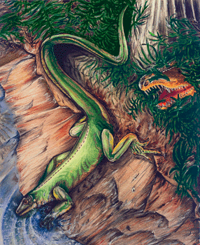
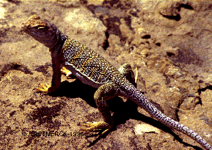
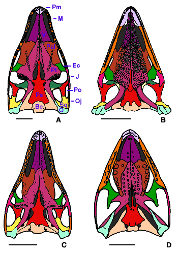
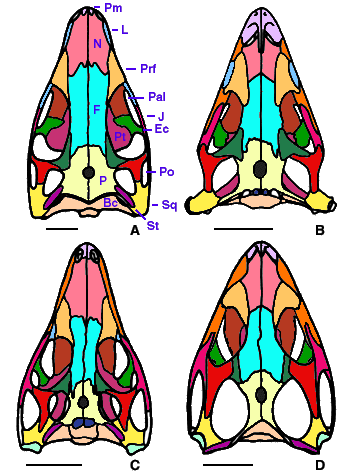

# [[Diapsida]]

Lizards, Sphenodon, crocodylians, birds, and their extinct relatives 

 

## #has_/text_of_/abstract 

> Diapsids ("two arches") are a clade of sauropsids, distinguished from more primitive eureptiles by the presence of two holes, known as temporal fenestrae, in each side of their skulls. The earliest traditionally identified diapsids, the araeoscelidians, appeared about three hundred million years ago during the late Carboniferous period. All diapsids other than the most primitive ones in the clade Araeoscelidia are often placed into the clade Neo**Diapsida**. The diapsids are extremely diverse, and include birds and all modern reptile groups, including turtles, which were historically thought to lie outside the group. All modern reptiles and birds are placed within the neodiapsid subclade Sauria. Although some diapsids have lost either one hole (lizards), or both holes (snakes and turtles), or have a heavily restructured skull (modern birds), they are still classified as diapsids based on their ancestry. At least 17,084 species of diapsid animals are extant: 9,159 birds, and 7,925 snakes, lizards, tuatara, turtles, and crocodiles.
>
> [Wikipedia](https://en.wikipedia.org/wiki/Diapsid) 

### Information on the Internet

-   [Those Diverse     Diapsids](http://www.ucmp.berkeley.edu/diapsids/diapsids.html). UCMP
    Berkeley.
-   [Mystery of the Oldest Flying     Vertebrate](http://www.rom.on.ca/news/flyvertebrate.html) .
    Information about Coelurosauravus. Royal Ontario Museum.
-   [Introduction to the     Ichthyosauria](http://www.ucmp.berkeley.edu/diapsids/ichthyosauria.html).
    UCMP Berkeley.
-   [Ichthyosaur     Page](http://www.ucmp.berkeley.edu/people/motani/ichthyo/index.html).
    Ryosuke Motani.
-   [The Plesiosaur Site](http://www.plesiosaur.com/). Richard Forrest.
-   [Plesiosaur     FAQ\'s](http://www.geocities.com/CapeCanaveral/Hangar/9020/plesiosaur/index.htm).
    Raymond Thaddeus C. Ancog.
-   [Something about     Plesiosaurs](http://www.oceansofkansas.com/plesio2.html). Mike
    Everhart.

## Introduction

[Michel Laurin and Jacques A. Gauthier](http://www.tolweb.org/)

Diapsids are by far the most speciose group of amniotes, with about 14
600 extant species (Goin et al., 1978). They have invaded all major
habitats, from the polar circles (many migratory birds) to deserts (many
lizards) and even the ocean (sea snakes, sauropterygians). Diapsids
include most flying vertebrates (birds) and most poisonous chordates
(snakes and the Gila Monster).

The early history of diapsids is poorly documented. Until the late
seventies, the oldest known diapsids were the Upper Permian (250 Myr
old) younginiforms from South Africa and Madagascar (Harris and Carroll,
1977; Currie, 1980, 1981, and 1982), and a few other contemporaneous
diapsids of uncertain affinities (Carroll, 1976a and b). However, recent
work (Reisz, 1977) has extended the fossil record of diapsids to the
Pennsylvanian (about 300 Myr ago), and greatly increased our knowledge
of the diversity of early diapsids (Brinkman et al., 1984; Reisz et al.,
1984; Laurin, 1991; deBraga and Reisz, 1995). The oldest known
crown-diapsids (saurians) date from the Late Upper Permian (Carroll,
1975; Evans, 1987).

Figure 1. The lepidosaur Crotaphytus, a terrestrial iguanid from western
and central North America. Photograph copyright © 2000 John Merck.

Extant diapsids are classified into either lepidosaurs (lizards and
Sphenodon) or archosaurs (birds and crocodiles). Both of these clades
are very successful and speciose (Fig. 1), and archosaurs include some
of the most fascinating vertebrates that ever lived, such as the
pterosaurs (flying reptiles of the Mesozoic) and the many extinct groups
of dinosaurs. Indeed, the present diversity of archosaurs, even though
it compares favourably with many other clades, is a mere shadow of what
it was in the mesozoic.

Diapsida was named after the two fenestrae (holes) found in the temporal
region of the skull of most early and some extant diapsids. The lower
temporal fenestra is between the jugal, postorbital, squamosal, and
quadratojugal. The upper temporal fenestra is between the postorbital,
parietal, and squamosal. Some diapsids have lost the lower fenestra
(lizards) or even both fenestrae (snakes, amphisbaenids), but their
early ancestors had both fenestrae.

### Characteristics

Only skeletal autapomorphies (unique derived characters) can be
confidently assigned to Diapsida because all the basal lineages of
diapsids are extinct. In addition to the presence of an upper and a
lower lateral temporal fenestra, these include:

-   A suborbital fenestra (Fig. 2). This is a relatively large hole in
    the palate that is located between the palatine, the ectopterygoid,
    and the maxilla. Other taxa may have a foramen (a small hole just
    large enough to allow passage for a nerve or a blood vessel) in this
    region, but there is usually no fenestra.
-   A long radius, measuring between 70% and 90% of the length of the
    humerus. This ratio is variable in extant diapsids, but early
    diapsids consistently had a longer radius than other taxa, in which
    it was typically less than 70% of the humeral length.

Figure 2. Diapsid skulls in palatal view. A, Petrolacosaurus, a
Pennsylvanian araeoscelidian; B, Claudiosaurus, an Upper Permian
neodiapsid; C, Youngina, an Upper Permian younginiform; D, Clevosaurus,
a Late Triassic sphenodontid (a saurian).\
Redrawn from A, Reisz, 1981; B and C, Carroll, 1981; D, Fraser, 1988.
Scale bar equals 1 cm. Copyright © 2000 Michel Laurin.

Skeletal autapomorphies can unambiguously be attributed to Sauria, and
other characters (soft anatomical, physiological, etc.) present in
saurians but not in other extant amniotes are also usually attributed to
Sauria, although they may have been present in other diapsids and even
in their close relatives (\"Protorothyridids\" and captorhinids).
Saurian autapomorphies include:

-   A low concentration of urea in the blood plasma resulting from a
    loss or suppression of the urea cycle. Lissamphibians, mammals, and
    turtles have a higher concentration of urea in their plasma.
-   The loss of the apposition between the kidney and the adrenal gland.
    These two organs are juxtaposed in lissamphibians, mammals, and
    turtles.
-   The presence of Huxley\'s foramen. This foramen is a hole in the
    distal end of the extracolumella (a cartilaginous extension of the
    stapes that contacts the tympanum). Huxley\'s foramen is absent in
    lissamphibians, mammals, and turtles.
-   Temporal muscles originating on the dorsolateral surface of the
    skull table. In araeoscelidians and younginiforms, the temporal
    muscles originate from a fascia attached to the lateral edge of the
    skull table and from the ventral surface of the skull table.
-   Prefrontal-nasal suture anterolaterally oriented (Fig. 3D). This
    suture is parasagittal in araeoscelidians, Claudiosaurus, and
    younginiforms (Fig. 3A-C).
-   Squamosal confined to the dorsal half of the skull, except for a
    narrow ventral process supporting the quadrate. The squamosal of
    younginiforms, Apsisaurus, and araeoscelidians is broad ventrally.
-   Strong, broad contact between the paroccipital process and the
    cheek. This contact is weak and often cartilaginous in younginiforms
    and araeoscelidians.
-   Quadrate deeply emarginated posteriorly. The quadrate of saurians
    supports a tympanum in its deep posterior emargination. The quadrate
    of younginiforms has a very shallow emargination that probably did
    not support a tympanum. The quadrate of Apsisaurus and
    araeoscelidians is not emarginated.
-   Slender stapes. The stapes of saurians is modified to function as a
    middle ear ossicle to transmit high-frequency air-borne sounds from
    the tympanum to the inner ear. The stapes of younginiforms and
    araeoscelidians is more massive and it is not specialized as a
    middle ear ossicle.
-   Dorsal process of stapes with ossified connection to paroccipital
    process of opisthotic. In other taxa, this connection is
    cartilaginous (or it may consist of a tendon), when it is present.
-   Large retroarticular process. This is the insertion point for the
    muscles that open the lower jaw. The retroarticular process of
    araeoscelidians, Coelurosauravus, and younginiforms is much smaller.
-   Cleithrum absent. The cleithrum is a dermal bone located on the
    anterior edge of the scapula, dorsal to the clavicle. It is present
    in araeoscelidians, Coelurosauravus, and younginiforms.
-   Lateral manual centrale (a bone in the wrist) small or absent. The
    lateral and medial centralia are approximately of equal size in
    araeoscelidians and in some younginiforms primitively (in
    Acerosodontosaurus).
-   Fifth distal tarsal absent (this is a small bone in the ankle,
    proximal to the fifth toe). Araeoscelidians, Coelurosauravus, and
    youngina have five distal tarsals.
-   Fifth metatarsal hooked (this bone supports the fifth toe). This
    bone is straight in other diapsids.

Figure 3. Diapsid skulls in dorsal view. A, Petrolacosaurus, a
Pennsylvanian araeoscelidian; B, Claudiosaurus, an Upper Permian
neodiapsid; C, Youngina, an Upper Permian younginiform; D, Clevosaurus,
a Late Triassic sphenodontid (a saurian).\
Redrawn from A, Reisz, 1981; B and C, Carroll, 1981; D, Fraser, 1988.
Scale bar equals 1 cm. Copyright © 2000 Michel Laurin.

[The linked page] [Autapomorphies of diapsid clades](http://www.tolweb.org/accessory/Autapomorphies_of_Diapsid_Clades?acc_id=465)
provides a list of autapomorphies of Neodiapsida and other clades
smaller than Diapsida but more inclusive than Sauria.

### Discussion of Phylogenetic Relationships

Diapsid phylogeny has been intensively studied in the last decade, but
the affinities of many groups are still controversial. For instance, the
affinities of the Upper Permian diapsids Galesphyrus (Carroll, 1976a),
Heleosaurus (Carroll, 1976b), and Heleosuchus (Carroll, 1987) from South
Africa are uncertain because these taxa are represented by fragmentary
remains. However, the relationships of the other major groups of
stem-diapsids are now reasonably well understood. The affinities of
araeoscelidians were initially debated (Peabody, 1952; Vaughn, 1955;
Reisz, 1977), but they are now universally believed to be the earliest
known group of diapsids (Laurin, 1991; deBraga and Reisz, 1995).
Younginiforms were previously believed to represent early
lepidosauromorphs (Benton, 1985; Evans, 1988; Gauthier et al., 1988a),
but they are now considered to be close relatives of Sauria (Laurin,
1991; Gauthier, 1994). Some diapsid taxa like Ichthyosauria, Sauropterygia, Placodontia, and
Choristodera remain problematic. Placodontia and Choristodera do not
appear on the main tree because recent work suggests that they are
either lepidosauromorphs or archosauromorphs (Rieppel, 1993, 1994;
Rieppel and deBraga, 1996; deBraga and Rieppel, 1997; Merck, 1997). Only
ichthyosaurs and sauropterygians appear because they may be either
stem-diapsids, archosauromorphs, or lepidosauromorphs (Caldwell, 1996;
Mercki, 1997; Motani et al., 1998). Turtles may also be saurians, either
lepidosauromorphs or archosauromorphs, but for a discussion of this
topic, please refer to the page on
[Amniota](tree?group=Amniota&contgroup=Terrestrial_Vertebrates).
For more information, see the linked page on [Diapsid phylogeny.](http://www.tolweb.org/accessory/Diapsid_Phylogeny?acc_id=464)

### Classification of diapsids

Despite numerous studies on diapsid phylogeny and classification,
diapsids taxonomy still suffers from a lack of consensus. However,
according to the principles of priority suggested by de Queiroz and
Gauthier (1990, 1992, 1994), several diapsid taxa have been formally
defined phylogenetically, and these definitions should be respected if
diapsid taxonomy is ever to be standardized. These taxa include:

-   **Diapsida**: The most recent common ancestor of araeoscelidians,
    lepidosaurs, and archosaurs, and all its descendants (Laurin, 1991).
-   **Araeoscelidia**: The most recent common ancestor of Araeoscelis
    and Petrolacosaurus, and all its descendants (Laurin, 1991).
-   **Neodiapsida**: Sauria plus all other diapsids that are closer to
    saurians than they are to araeoscelidians (Gauthier et al., 1988b).
-   **Eosuchia**: The most recent common ancestor of Coelurosauravus,
    Apsisaurus, younginiforms, lepidosaurs, and archosaurs and all its
    descendants (Laurin, 1991).
-   **Younginiformes**: The most recent common ancestor of Youngina,
    Acerosodontosaurus, and Hovasaurus and all its descendants (Laurin,
    1991).
-   **Sauria**: All the descendants of the most recent common ancestor
    of birds, crocodiles, squamates, and Sphenodon (Gauthier, 1984;
    Gauthier et al., 1988b).
-   **Lepidosauromorpha**: Extant lepidosaurs and all extinct saurians
    that are closer to them than they are to extant archosaurs
    (Gauthier, 1984; Gauthier et al., 1988a).
-   **Archosauromorpha**: Extant archosaurs and all extinct saurians
    that are closer to them than they are to extant lepidosaurs
    (Gauthier, 1984, 1994).

Some of these taxa have been given multiple definitions, and some of
these definitions have been applied to more than one taxon, but the
definitions of taxa given above appear to have priority (de Queiroz and
Gauthier, 1990, 1992, and 1994).

This classification, as well as most recent classifications of diapsids,
does not recognize Lacertilia as a formal taxon (Lacertilia included
lizards but not snakes and amphisbaenids) because this group is not
monophyletic (it does not include all the descendants of a common
ancestor). Indeed, snakes (Estes et al., 1988; Rieppel, 1988) and
amphisbaenids (Wu et al., 1993) are the direct descendants of some
lizards, so in this page, the word \"lizards\" includes these taxa as
well.

### Hearing in diapsids

The earliest diapsids (and indeed, all known stem diapsids) lacked a
tympanum and could not hear high-frequency air-borne sounds, as shown by
the lack of a quadrate emargination (the structure that supports the
tympanum in most extant diapsids) and the robust shape of their stapes.
This indicates that the tympanum present in most saurians developed
independently from the tympanum of turtles and mammals (except if
turtles are saurians, as recently suggested by Rieppel and deBraga
(1996).

A few saurians have lost their tympanum and their ability to hear
high-frequency air-borne sounds. These include snakes and many other
lepidosaurs, such as Sphenodon, amphisbaenids, Tympanocryptis,
Aphaniotes (Barry, 1963). These saurians can only hear low-frequency
seismic vibrations (sounds transmitted through the ground).

Early phylogenies of diapsids suggested that the tympanum and the
ability to hear high-frequency air-borne sounds had appeared separately
in lepidosauromorphs and in archosauromorphs because younginiforms,
formerly believed to be the oldest known lepidosauromorphs, apparently
lacked a tympanum (Benton, 1985; Evans, 1988). However, the
reinterpretation of younginiforms as stem diapsids implies that the
tympanum appeared only once in diapsids, probably soon before the
divergence between lepidosauromorphs and archosauromorphs (Laurin,
1991).

## Phylogeny 

-   « Ancestral Groups  
    -   [Amniota](../Amniota.md)
    -   [Terrestrial Vertebrates](../../Terrestrial.md)
    -   [Sarcopterygii](../../../Sarc.md)
    -   [Gnathostomata](../../../../Gnath.md)
    -   [Vertebrata](../../../../../Vertebrata.md)
    -   [Craniata](../../../../../../Craniata.md)
    -   [Chordata](../../../../../../../Chordata.md)
    -   [Deuterostomia](../../../../../../../../Deutero.md)
    -   [Bilateria](Bilateria)
    -   [Animals](Animals)
    -   [Eukaryotes](Eukaryotes)
    -   [Tree of Life](../../../../../../../../../../../Tree_of_Life.md)

-   ◊ Sibling Groups of  Amniota
    -   [Synapsida](Synapsida.md)
    -   [Testudines](Testudines.md)
    -   Diapsida

-   » Sub-Groups
    -   [Archosauromorpha](Diapsida/Archosauromorpha.md)
    -   [Lepidosauromorpha](Diapsida/Lepidosauromorpha.md)

## Title Illustrations

------------------------------------------------------------------

Scientific Name ::  Spinoaequalis schultzei, Haptodus garnettensis, Sigillaria
Comments          The Pennsylvanian diapsid Spinoaequalis schultzei jumps into the water to escape a hungry Haptodus garnettensis (a synapsid). The base of a Sigillaria trunk is visible in the upper right corner.
Creator           Michael deBraga
Copyright ::         © 2000 Michael deBraga

## Confidential Links & Embeds: 

### [Diapsida](/_Standards/bio/bio~Domain/Eukaryotes/Animals/Bilateria/Deutero/Chordata/Craniata/Vertebrata/Gnath/Sarc/Tetrapods/Amniota/Diapsida.md) 

### [Diapsida.public](/_public/bio/bio~Domain/Eukaryotes/Animals/Bilateria/Deutero/Chordata/Craniata/Vertebrata/Gnath/Sarc/Tetrapods/Amniota/Diapsida.public.md) 

### [Diapsida.internal](/_internal/bio/bio~Domain/Eukaryotes/Animals/Bilateria/Deutero/Chordata/Craniata/Vertebrata/Gnath/Sarc/Tetrapods/Amniota/Diapsida.internal.md) 

### [Diapsida.protect](/_protect/bio/bio~Domain/Eukaryotes/Animals/Bilateria/Deutero/Chordata/Craniata/Vertebrata/Gnath/Sarc/Tetrapods/Amniota/Diapsida.protect.md) 

### [Diapsida.private](/_private/bio/bio~Domain/Eukaryotes/Animals/Bilateria/Deutero/Chordata/Craniata/Vertebrata/Gnath/Sarc/Tetrapods/Amniota/Diapsida.private.md) 

### [Diapsida.personal](/_personal/bio/bio~Domain/Eukaryotes/Animals/Bilateria/Deutero/Chordata/Craniata/Vertebrata/Gnath/Sarc/Tetrapods/Amniota/Diapsida.personal.md) 

### [Diapsida.secret](/_secret/bio/bio~Domain/Eukaryotes/Animals/Bilateria/Deutero/Chordata/Craniata/Vertebrata/Gnath/Sarc/Tetrapods/Amniota/Diapsida.secret.md)

