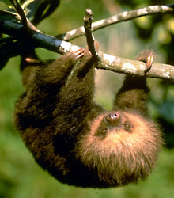

# [[Eutheria]]

## Placental Mammals 

   

## #has_/text_of_/abstract 

> **Eutheria** (from Greek εὐ-, eú- 'good, right' and θηρίον, thēríon 'beast'; lit. 'true beasts'), also called Pan-Placentalia, is the clade consisting of placental mammals and all therian mammals that are more closely related to placentals than to marsupials.
>
> Eutherians are distinguished from non-eutherians by various phenotypic traits of the feet, ankles, jaws and teeth. All extant eutherians lack epipubic bones, which are present in all other living mammals (marsupials and monotremes). This allows for expansion of the abdomen during pregnancy, though epipubic bones are present in many primitive eutherians. Eutheria was named in 1872 by Theodore Gill; in 1880, Thomas Henry Huxley defined it to encompass a more broadly defined group than Placentalia.
>
> The earliest unambiguous eutherians are known from the Early Cretaceous Yixian Formation of China, dating around 120 million years ago. Two tribosphenic mammals, Durlstodon and Durlstotherium from the Berriasian age (~145–140 million years ago) of the Early Cretaceous in southern England have also been suggested to represent early eutherians. Another possible eutherian species Juramaia sinensis has been dated at 161 million years ago from the early Late Jurassic (Oxfordian) of China. However some authors have considered Juramaia as a stem therian instead, and some sources have doubted the dating of the specimen.
>
> [Wikipedia](https://en.wikipedia.org/wiki/Eutheria) 

## Characteristics 

Eutheria, also known as placental mammals, are distinguished from their parent group 
within the class Mammalia by several key characteristics:

### Placenta: 
Eutherian mammals are named after their defining reproductive feature, the placenta. 
Unlike their parent group, which includes 
monotremes (egg-laying mammals) and 
marsupials (pouched mammals), eutherians have a well-developed placenta 
that allows for prolonged intrauterine development of the embryo. 
The placenta facilitates nutrient and gas exchange 
between the maternal bloodstream and the developing fetus, 
providing a more efficient means of nourishment and waste removal.

### Extended Gestation:
Eutherian mammals typically undergo longer gestation periods 
compared to monotremes and marsupials due to the presence of the placenta. 
The extended gestation allows for 
more advanced development of the fetus within the mother's uterus before birth.

### Complete Development at Birth: 
Unlike monotremes, which lay eggs, and marsupials, 
which give birth to relatively undeveloped young that continue their development in a pouch, 
eutherian mammals give birth to fully developed offspring. 
Eutherian newborns are relatively well-developed 
and undergo minimal postnatal development compared to marsupials.

### Diverse Adaptations: 
Eutherian mammals exhibit a wide range of adaptations 
to various ecological niches, lifestyles, and habitats. 
They include terrestrial, arboreal, and aquatic species 
with diverse diets, locomotion strategies, and social behaviors. 
Eutherians have successfully colonized nearly every terrestrial habitat on Earth 
and display remarkable diversity in size, shape, and physiology.

### Cranial and Dental Features: 
Eutherian mammals often have more complex cranial and dental structures 
compared to monotremes and marsupials. 
This includes a more specialized dentition adapted to their specific dietary preferences, 
such as the presence of distinct molars for grinding plant material 
or sharp carnassial teeth for slicing meat.

### Mammary Glands: 
Eutherian mammals possess mammary glands that produce milk to nourish their offspring. 
While monotremes and marsupials also produce milk, 
the structure and function of eutherian mammary glands 
may exhibit greater complexity and specialization.

### Brain Complexity: 
Eutherian mammals generally have larger and more complex brains 
compared to monotremes and marsupials, 
reflecting their advanced sensory, cognitive, and social abilities. 
This enhanced brain complexity has contributed 
to the ecological success and adaptability of eutherian mammals in diverse environments.

These differences distinguish eutherian mammals from their parent group [[Mammal]] 
and reflect their unique reproductive, developmental, and ecological adaptations.

## Phylogeny 

## Phylogeny 

-   « Ancestral Groups  
    -   [Mammal](Mammal.md)
    -   [Therapsida](../../Therapsida.md)
    -   [Synapsida](../../../Synapsida.md)
    -   [Amniota](../../../../Amniota.md)
    -   [Terrestrial Vertebrates](../../../../../Terrestrial.md)
    -   [Sarcopterygii](../../../../../../Sarc.md)
    -   [Gnathostomata](../../../../../../../Gnath.md)
    -   [Vertebrata](../../../../../../../../Vertebrata.md)
    -   [Craniata](../../../../../../../../../Craniata.md)
    -   [Chordata](../../../../../../../../../../Chordata.md)
    -   [Deuterostomia](../../../../../../../../../../../Deutero.md)
    -   [Bilateria](Bilateria)
    -   [Animals](Animals)
    -   [Eukaryotes](Eukaryotes)
    -   [Tree of Life](../../../../../../../../../../../../../../Tree_of_Life.md)

-   ◊ Sibling Groups of  Mammalia
    -   [Monotremata](Monotremata.md)
    -   [Marsupialia](Marsupialia.md)
    -   Eutheria

-   » Sub-Groups
    -   [Edentata](Edentata.md)
    -   [Pholidota](Pholidota.md)
    -   [Lagomorpha](Lagomorpha.md)
    -   [Rodentia](Rodentia.md)
    -   [Macroscelididae](Macroscelididae.md)
    -   [Primates](Primates.md)
    -   [Scandentia](Scandentia.md)
    -   [Chiroptera](Chiroptera.md)
    -   [Dermoptera](Dermoptera.md)
    -   [Insectivora](Insectivora.md)
    -   [Carnivora](Carnivora.md)
    -   [Artiodactyla](Artiodactyla.md)
    -   [Whale](Eutheria/Whale.md)
    -   [Tubulidentata](Tubulidentata.md)
    -   [Perissodactyla](Perissodactyla.md)
    -   [Hyracoidea](Hyracoidea.md)
    -   [Sirenia](Sirenia.md)
    -   [Proboscidea](Eukaryotes/Animals/Bilateria/Deutero/Chordata/Craniata/Vertebrata/Gnath/Sarc/Terrestrial/Amniota/Synapsida/Therapsida/Mammal/Eutheria/Proboscidea.md)

### Information on the Internet

-   [African Mammals     Databank](http://www.gisbau.uniroma1.it/amd/index.htm). A GIS-based
    databank on the distribution and conservation of all the big and
    medium-sized mammals over the whole African continent.
-   [ZOO in the wild](http://www.naturalia.org/ZOO/indexing.html). A
    virtual zoo with information on African and European mammals.
-   [African Wildlife Foundation](http://www.awf.org/)
-   [Mammals of Africa](http://natureexplorer.com/MA/MA1.html).
    NatureExplorer.com.
-   [Les grands Mammifères du     Niokolo-Badiar](http://www.orstom.sn/act-rech/ur4/ipmo/gdm/index.shtml).
    A guide to West-African mammals, en français.
-   [Aubrey Manning Gallery Collection of ungulates, rodents, carnivores     and     primates](http://helios.bto.ed.ac.uk/icapb/collection/museum/html/gallery.htm).
-   [The Ultimate Ungulate Page](http://www.ultimateungulate.com/). Your
    Guide to the World\'s Hoofed Mammal Species.
-   [New Model May Resolve Paleontology Family     Feud](http://unisci.com/stories/19991/0301993.htm). Information
    about research on the origin of placental mammals. UniSci Science
    and Research News.

-   [Cretaceous Critters](http://www.amnh.org/enews/headl/e2_h14.html).
    Two 80 million-year-old fossil mammals, including a new species,
    shed light on early reproduction. Information about Ukhaatherium
    nessovi and a zalambdalestid. American Museum of Natural History.
-   [Introduction to the     Desmostylia](http://www.ucmp.berkeley.edu/mammal/mesaxonia/desmostylia.html).
    UCMP Berkeley.
-   [Introduction to the     Embrithopoda](http://www.ucmp.berkeley.edu/mammal/mesaxonia/embrithopoda.html).
    UCMP Berkeley.

### References

Adkins, R. M. and R. L. Honeycutt. 1991. Molecular phylogeny of the
superorder Archonta. Proceedings of the National Academy of Sciences
(USA) 88:10317-10321.

Allard, M. W., B. E. McNiff, M. M. Miyamoto. 1996. Support for
interordinal eutherian relationships with an emphasis on primates and
their Archontan relatives. Molecular Phylogenetics and Evolution
5:78-88.

Amrine-Madsen, H., K.-P. Koepfli, R. K. Wayne and M. S. Springer. 2003.
A new phylogenetic marker, apolipoprotein B, provides compelling
evidence for eutherian relationships. Molecular Phylogenetics and
Evolution 28(2):225-240.

Archibald, J. D. 1996. Fossil evidence for a Late Cretaceous origin of
\'hoofed\' mammals. Science 272:1150-1153.

Archibald, J. D., A. O. Averianov, and E. G. Ekdale. 2001. Late
Cretaceous relatives of rabbits, rodents, and other extant eutherian
mammals. Nature 414:62?65.

Arnason, U., A. Gullberg, S. Gretarsdottir, B. Ursing, and A. Janke.
2000. The mitochondrial genome of the sperm whale and a new molecular
reference for estimating eutherian divergence dates. Journal of
Molecular Evolution 50:569-578.

Arnason, U., A. Gullberg, and A. Janke. 1997. Phylogenetic analyses of
mitochondrial DNA suggest a sister group relationship between Xenarthra
(Edentata) and Ferungulates. Molecular Biology and Evolution 14:762-768.

Arnason, U., A. Gullberg, and A. Janke. 1999. The mitochondrial DNA
molecule of the aardvark, Orycteropus afer, and the position of the
Tubulidentata in the eutherian tree. Proceedings of the Royal Society of
London Series B 266: 339-345.

Asher, R. J., J. Meng, J. R. Wible, M. C. McKenna, G. W. Rougier, D.
Dashzeveg, and M. J. Novacek. 2005. Stem Lagomorpha and the antiquity of
Glires. Science 307(5712):1091-1094.

Cao, Y., J. Adachi, A. Janke, S. Pääbo, and M. Hasegawa. 1994.
Phylogenetic relationships among eutherian orders estimated from
inferred sequences of mitochondrial proteins - instability of a tree
based on a single gene. Journal of Molecular Evolution 39:519-527.

Cao, Y., A. Janke, P. J. Waddell, M. Westerman, O. Takenaka, S. Murata,
N. Okada, S. Pääbo, and M. Hasegawa. 1998. Conflict among individual
mitochondrial proteins in resolving the phylogeny of eutherian orders.
Journal of Molecular Evolution 47:307-322.

Cao, Y., N. Okada, and M. Hasegawa. 1997. Phylogenetic position of
guinea pigs revisited. Molecular Biology and Evolution 14:461-464.

Carter, A. M. 2001. Evolution of the placenta and fetal membranes seen
in the light of molecular phylogenetics. Placenta 22:800-807.

Corbet,G.B. and J. E. Hill. 1992. The Mammals of the Indomalayan Region
: A Systematic Review. Oxford University Press, Oxford.

Corneli, P. S. and R. H. Ward. 2000. Mitochondrial genes and mammalian
phylogenies: Increasing the reliability of branch length estimation.
Molecular Biology and Evolution 17:224-234.

Corneli, P. S. 2002. Complete mitochondrial genomes and eutherian
evolution. Journal of Mammalian Evolution 9:281-305.

Estes, R. D. 1991. The Behavior Guide to African Mammals. University of
California Press, Berkeley.

Debry, R. W. 1999. Maximum likelihood analysis of gene-based and
structure-based process partitions, using mammalian mitochondrial
genomes. Systematic Biology 48:286-299.

de Jong, W. W., M. A. M. van Dijka, C. Pouxa, G. Kappéa, T. van Rheedea,
and O. Madsen. 2003. Indels in protein-coding sequences of
Euarchontoglires constrain the rooting of the eutherian tree. Molecular
Phylogenetics and Evolution 28(2):328-340.

D\'Erchia, A. M., C. Gissi, G. Pesole, C. Saccone, and U. Arnason. 1996.
The guinea-pig is not a rodent. Nature 381:597-600.

Douzery, E. and F. M. Cazeflis. 1995. Molecular evolution of the
mitochondrial 12S rRNA in Ungulata (Mammalia). Journal of Molecular
Evolution 41:622-636.

Easteal, S. 1999. Molecular evidence far the early divergence of
placental mammals. BioEssays 21:1052-1058.

Emerson, G. L., C. W. Kilpatrick, B. E. McNiff, J. Ottenwalder, and M.
W. Allard. 1999. Phylogenetic relationships of the order insectivora
based on complete 12S rRNA sequences from mitochondria. Cladistics
15:221-230.

Foote, M., J. P. Hunter, C. M. Janis, and J. J. Sepkoski. 1999.
Evolutionary and preservational constraints on origins of biologic
groups: Divergence times of eutherian mammals. Science 283:1310-1314.

Frye, M. S. and S. B. Hedges. 1995. Monophyly of the order Rodentia
inferred from mitochondrial DNA sequences of the genes for 12S ribosomal
RNA, 16S ribosomal RNA, and transfer RNA valine. Molecular Biology and
Evolution 12:168-176.

Gatesy, J. 1997. More DNA support for a Cetacea/Hippopotamidae clade:
the blood-clotting protein gene gamma-fibrinogen. Molecular Biology and
Evolution 14:537-543.

Gatesy, J., M. Milinkovitch, V. Waddell, and M. Stanhope. 1999.
Stability of cladistic relationships between Cetacea and higher-level
Artiodactyl taxa. Systematic Biology 48:6-20.

Gatesy, J., P. O\'Grady, and R. H. Baker. 1999. Corroboration among data
sets in simultaneous analysis: Hidden support for phylogenetic
relationships among higher level artiodactyl taxa. Cladistics
15:271-313.

Gatesy, J. and M. A. O\'Leary. 2001. Deciphering whale origins with
molecules and fossils. Trends in Ecology and Evolution 16:562-570.

Geisler, J.H. and M.D. Uhen. 2003. Morphological support for a close
relationship between hippos and whales. Journal of Vertebrate
Paleontology 23:991?996.

Graur, D. 1993. Toward a molecular resolution of the ordinal phylogeny
of the eutherian mammals. FEBS Letters 325:152-159.

Graur, D., L. Duret, and M. Gouy. 1996. Phylogenetic position of the
order Lagomorpha (rabbits, hares and allies). Nature 379:333-335.

Graur, D., M. Gouy, and L. Duret. 1997. Evolutionary affinities of the
order Perissodactyla and the phylogenetic status of the superordinal
taxa Ungulata and Altungulata. Molecular Phylogenetics and Evolution
7:195-200.

Graur, D., W. A. Hide, and W.-H. Li. 1991. Is the guinea pig a rodent?
Nature 351:649-652.

Graur, D. and D. Higgins. 1994. Molecular evidence for the inclusion of
cetaceans within the order Artiodactyla. Molecular Biology and Evolution
11:357-364.

Halanych, K. M. 1998. Lagomorphs misplaced by more characters and fewer
taxa. Systematic Biology 47:138-146.

Hasegawa, M., Y. Cao, J. Adachi, and T. Yano. 1992. Rodent polyphyly.
Nature 355:595.

Hauf, J., P. J. Waddell, N. Chalwatzis, U. Joger, and F. K. Zimmermann.
1999. The complete mitochondrial genome sequence of the African elephant
(Loxodonta africana), phylogenetic relationships of Proboscidea to other
mammals, and D-loop heteroplasmy. Zoology - Analysis of Complex Systems
102:184-195.

Honeycutt, R. L. and R. M. Adkins. 1993. Higher-level systematics of
eutherian mammals--an assessment of molecular characters and
phylogenetic hypotheses. Annual Review of Ecology and Systematics 24:
279-305.

Huchon D., O. Madsen, M.J.J.B. Sibbald, K. Ament, M. J. Stanhope, F.
Catzeflis, W. W. De Jong, and E. J. P. Douzery. 2002. Rodent phylogeny
and a timescale for the evolution of glires: Evidence from an extensive
taxon sampling using three nuclear genes. Molecular Biology and
Evolution 19(7):1053-1065.

Hudelot, C., V. Gowri-Shankar, H. Jow, M. Rattray, and P. G. Higgs.
2003. RNA-based phylogenetic methods: application to mammalian
mitochondrial RNA sequences. Molecular Phylogenetics and Evolution
28:241-252.

Irwin, D. M. and U. Arnason. 1994. Cytochrome b gene of marine mammals:
phylogeny and evolution. Journal of Mammalian Evolution 2:37-55.

Ji, Q., Z.-X. Luo, C.-X. Yuan, J. R. Wible, J.-P. Zhang, and J. A.
Georgi. 2002. The earliest known eutherian mammal. Nature 416:816-822.

Kingdon, J. 1997. The Kingdon Field Guide to African Mammals. Academic
Press, London.

Kleineidam, R. G., G. Pesole, H. J. Breukelman, J. J. Beintema, R. A.
Kastelein. 1999. Inclusion of cetaceans within the order Artiodactyla
based on phylogenetic analysis of pancreatic ribonuclease genes. Journal
of Molecular Evolution 48:360-368.

Kriegs, J. O., G. Churakov, M. Kiefmann, U. Jordan, J. Brosius, and J.
Schmitz. 2006. Retroposed elements as archives for the evolutionary
history of placental mammals. PLoS Biology 4:e91.

Kupfermann, H., Y. Satta, N. Takahata, H. Tich, and J. Klein. 1999.
Evolution of Mhc-DRB introns: Implications for the origin of primates.
Journal of Molecular Evolution 48:663-674.

Lavergne, A., E. Douzery, T. Stichler, F. M. Catzeflis, and M. S.
Springer. 1996. Interordinal mammalian relationships: Evidence for
paenungulate monophyly is provided by complete mitochondrial 125 rRNA
sequences. Molecular Phylogenetics and Evolution 6:245-258.

Li, W., M. Gouy, P. M. Sharp, C. O\'HUigin, and Y. Yang. 1990. Molecular
Phylogeny of Rodentia, Lagomorpha, Primates, Artiodactyla, and Carnivora
and Molecular Clocks. Proceedings of the National Academy of Sciences
(USA) 87:6703-6707.

Liu, F. G. R. and M. M. Miyamoto. 1999. Phylogenetic assessment of
molecular and morphological data for eutherian mammals. Systematic
Biology 48:54-64.

Liu, F. G. R., M. M. Miyamoto, N. P. Freire, P. Q. Ong, M. R. Tennant,
T. S. Young, and K. F. Gugel. 2001. Molecular and morphological
supertrees for eutherian (placental) mammals. Science 291:1786-1789.

Luckett, W. P. and J.-L. Hartenberger. 1993. Monophyly or polyphyly of
the order Rodentia: possible conflict between morphological and
molecular interpretations. Journal of Mammalian Evolution 1:127-147.

Luckett, W. P. and N. Hong. 1998. Phylogenetic relationships between the
orders Artiodactyla and Cetacea: a combined assessment of morphological
and molecular evidence. Journal of Mammalian Evolution 5:127-182.

Madsen, O., P. M. T. Deen, G. Pesole, C. Saccone, and W. W. deJong.
1997. Molecular evolution of mammalian aquaporin-2: Further evidence
that elephant shrew and aardvark join the paenungulate clade. Molecular
Biology and Evolution 14:363-371.

Madsen, O., M. Scally, C. J, Douady, D. J. Kao, R. W. Debry, R. Adkins,
H. M. Ambrine, M. J. Stanhope, W. W. DeJong, and M. S. Springer. 2001.
Parallel adaptive radiations in two major clades of placental mammals.
Nature 409 :610-614.

McNiff, B.E. and M. W. Allard. 1998. A test of Archonta monophyly and
the phylogenetic utility of the mitochondrial gene 12S rRNA. American
Journal of Physical Anthropology 107:225-241.

Milinkovitch, M. C. and J. G. M. Thewissen. 1997. Even-toed fingerprints
on whale ancestry. Nature 388:622-624.

Misawa, K. and A. Janke. 2003. Revisiting the Glires
concept---phylogenetic analysis of nuclear sequences. Molecular
Phylogenetics and Evolution 28(2):320-327.

Miyamoto, M. M. 1996. A congruence study of molecular and morphological
data for Eutherian mammals. Molecular Phylogenetics and Evolution
6:373-390.

Montgelard, C., F. M. Catzeflis, and E. Douzery. 1997. Phylogenetic
relationships of artiodactyls and cetaceans as deduced from the
comparison of cytochrome b and 12S rRNA mitochondrial sequences.
Molecular Biology and Evolution 14:550-559.

Mouchaty, S. K., A. Gullberg, A. Janke, and U. Arnason. 2000. The
phylogenetic position of the Talpidae within eutheria based on analysis
of complete mitochondrial sequences. Molecular Biology and Evolution
17:60-67.

Murata, Y., M. Nikaido, T. Sasaki, Y. Cao, Y. Fukumoto, M. Hasegawa and
N. Okada. 2003. Afrotherian phylogeny as inferred from complete
mitochondrial genomes. Molecular Phylogenetics and Evolution
28(2):253-260.

Murphy, W. J., E. Eizirik, S. J. O\'Brien, O. Madsen, M. Scally, C. J.
Douady, E. Teeling, O. A. Ryder, M. J. Stanhope, W. W. de Jong, and M.
S. Springer. 2001. Resolution of the early placental mammal radiation
using Bayesian phylogenetics. Science 294:2348-2351.

Murphy, W. J., E. Eizirik, W. E. Johnson, Y. P. Zhang, O. A. Ryder, and
S. J. O\'Brien. 2001. Molecular phylogenetics and the origins of
placental mammals. Nature 409:614-618.

Nikaido, M., A. P. Rooney, and N. Okada. 1999. Phylogenetic
relationships among cetartiodactyls based on insertions of short and
long interspersed elements: hippopotamuses are the closest extant
relatives of whales. Proceedings of the National Academy of Sciences
(USA) 96 :10261?10266.

Nishihara, H., M. Hasegawa, and N. Okada. 2006. Pegasoferae, an
unexpected mammalian clade revealed by tracking ancient retroposon
insertions. Proceedings of the National Academy of Sciences (USA)
103(26):9929-9934.

Nishihara, H., Y. Satta, M. Nikaido, J. G. M. Thewissen, M. J. Stanhope,
and N. Okada. 2005. A retroposon analysis of afrotherian phylogeny.
Molecular Biology and Evolution 22(9):1823-1833.

Novacek, M. J. 1992. Fossils, topologies, missing data, and the higher
level phylogeny of eutherian mammals. Systematic Biology 41:58-73.

Novacek, M. J. 1996. Where do rabbits and kin fit in? Nature
379:299-300.

Novacek, M. J., G. W. Rougier, J. R. Wible, M. C. McKenna, D. Dashzeveg,
and I. Horovitz. 1997. Epipubic bones in eutherian mammals from the late
Cretaceous of Mongolia. Nature 389:483-486.

O\'Leary, M. A. and J. H. Geisler. 1999. The position of Cetacea within
Mammalia: Phylogenetic analysis of morphological data from extinct and
extant taxa. Systematic Biology 48:455-490.

O\'Leary, M. A. 1999. Parsimony analysis of total evidence from extinct
and extant taxa and the cetacean-artiodactyl question (Mammalia,
Ungulata). Cladistics 15:315-330.

O\'Leary M. A. 2001. The phylogenetic position of cetaceans: Further
combined data analyses, comparisons with the stratigraphic record and a
discussion of character optimization. American Zoologist 41: 487-506.

Onuma, M., T. Kusakabe, and S. Kusakabe. 1998. Phylogenetic positions of
Insectivora in Eutheria inferred from mitochondrial cytochrome c oxidase
subunit II gene. Zoological Science 15:139-145.

Ozawa, T., S. Hayashi, and V. M. Mikhelson. 1997. Phylogenetic position
of Mammoth and Steller\'s sea cow within Tethytheria demonstrated by
mitochondrial DNA sequences. Journal of Molecular Evolution 44:406-413.

Philippe, H. 1997. Rodent monophyly: Pitfalls of molecular phylogenies.
Journal of Molecular Evolution 45:712-715.

Philippe, H. and E. Douzery. 1994. The pitfalls of molecular phylogeny
based on four species, as illustrated by the Cetacea/Artiodactyla
relationships. Journal of Mammalian Evolution 2:133-152.

Porter, C. A., M. Goodman, M. J. Stanhope. 1996. Evidence on mammalian
phylogeny from sequences of exon 28 of the von Willebrand factor gene.
Molecular Phylogenetics and Evolution 5:89-101.

Prothero, D.R and R.M. Schoch. 1993. Horns, Tusks, Hooves, and Flippers:
The Evolution of Hoofed Mammals and Their Relatives. Princeton
University Press, Princeton, New Jersey.

Pumo, D. E., P. S. Finamore, W. R. Franek, C. J. Phillips, S. Tarzami,
and D. Balzarano. 1998. Complete mitochondrial genome of a neotropical
fruit bat, Artibeus jamaicensis, and a new hypothesis of the
relationships of bats to other eutherian mammals. Journal of Molecular
Evolution 47:709-717.

Reynolds, J. E. and S. A. Rommel. 1999. Biology of Marine Mammals.
Smithsonian Institution Press, Wahington, D.C.

Reyes, A., C. Gissi, G. Pesole, F. M. Catzeflis, and C. Saccone. 2000.
Where do rodents fit? Evidence from the complete mitochondrial genome of
Sciurus vulgaris. Molecular Biology and Evolution 17:979-983.

Reyes, A., G. Pesole, and C. Saccone. 1998. Complete mitochondrial DNA
sequence of the fat dormouse, Glis glis: Further evidence of rodent
paraphyly. Molecular Biology and Evolution 15:499-505.

Rose, K. D. 1996. On the origin of the order Artiodactyla. Proceedings
of the National Academy of Sciences (USA) 93:1705-1709.

Rose, K. D. and J. D. Archibald, eds. 2005. The Rise of Placental
Mammals. Origins and Relationships of the Major Clades. Johns Hopkins
University Press.

Schmitz, J. and H. Zischler. 2003. A novel family of tRNA-derived SINEs
in the colugo and two new retrotransposable markers separating
dermopterans from primates. Molecular Phylogenetics and Evolution
28:341-349.

Shimamura, M., H. Yasue, K. Ohshima, H. Abe, H. Kato, T. Kishiro, M.
Goto, I. Munechika, and N. Okada. 1997. Molecular evidence from
retroposons that whales form a clade within even-toed ungulates. Nature
388:666-670.

Springer, M. S. , H. M. Amrine, A. Burk, and M. J. Stanhope. 1999.
Additional support for Afrotheria and Paenungulata, the performance of
mitochondrial versus nuclear genes, and the impact of data partitions
with heterogeneous base composition. Systematic Biology 48:65-75.

Springer, M. S. , G. C. Cleven, O. Madsen, W. W. deJong, V. G. Waddell,
H. M. Amrine, and M. J. Stanhope. 1997. Endemic African mammals shake
the phylogenetic tree. Nature 388:61-64.

Springer, M. S. and W. W. deJong. 2001. Which mammalian supertree to
bark up? Science 291:1709-1711.

Stanhope, M.J., O. Madsen, V. G. Waddell, G. C. Cleven, W. W. de Jong,
and M. S. Springer. 1998. Highly congruent molecular support for a
diverse superordinal clade of endemic African mammals. Molecular
Phylogenetics and Evolution 9:501-508.

Stanhope, M. J., M. R. Smith, V. G. Waddell, C. A. Porter, M. S. Shivji,
and M. Goodman. 1996. Mammalian evolution and the interphotoreceptor
retinoid binding protein (IRBP) gene: Convincing evidence for several
superordinal clades. Journal of Molecular Evolution 43:83-92.

Stanhope, M. J., V. G. Waddell, O. Madsen, W. de Jong, S. B. Hedges, G.
C. Cleven, D. Kao, and M. S. Springer. 1998. Molecular evidence for
multiple origins of Insectivora and for a new order of endemic African
insectivore mammals. Proceedings of the National Academy of Sciences
(USA) 95:9967-9972.

Sullivan, J. and D. L. Swofford. 1997. Are guinea pigs rodents? The
importance of adequate models in molecular phylogenetics. Journal of
Mammalian Evolution 4:77-86.

Szalay, F. S., M. J. Novacek, and M. C. McKenna (eds.) 1993. Mammal
Phylogeny. Volume 2. Placentals. Springer Verlag, New York.

Thewissen, J.G.M. and S.I. Madar. 1999. Ankle morphology of the earliest
Cetaceans and its implications for the phylogenetic relations among
Ungulates. Systematic Biology 48:21-30.

van Dijk, M. A. M., E. Paradis, F. Catzeflis, and W. W. De Jong. 1999.
The virtues of gaps: Xenarthran (Edentate) monophyly supported by a
unique deletion in alphaA-crystallin. Systematic Biology 48: 94-106.

van Dijk, M. A. M., O. Madsen, F. Catzeflis, M. J. Stanhope, W. W. de
Jong, and M. Pagel. 2001. Protein sequence signatures support the
African clade of mammals. Proceedings of the National Academy of
Sciences (USA) 98:188-193.

Waddell, P.J., Y. Cao, J. Hauf, and M. Hasegawa. 1999. Using novel
phylogenetic methods to evaluate mammalian mtDNA, including amino
acid-invariant sites-LogDet plus site stripping, to detect internal
conflicts in the data, with special reference to the positions of
hedgehog, armadillo, and elephant. Systematic Biology 48:31-53.

Waddell, P.J., Y. Cao, M. Hasegawam and D. P. Mindell. 1999. Assessing
the Cretaceous superordinal divergence times within birds and placental
mammals by using whole mitochondrial protein sequences and an extended
statistical framework. Systematic Biology 48:119-137.

Waddell, P.J., N. Okada, and M. Hasegawa. 1999. Towards resolving the
interordinal relationships of placental mammals. Systematic Biology
48:1-5.

Waddell, P. J. and S. Shelley. 2003. Evaluating placental inter-ordinal
phylogenies with novel sequences including RAG1, -fibrinogen, ND6, and
mt-tRNA, plus MCMC-driven nucleotide, amino acid, and codon models.
Molecular Phylogenetics and Evolution 28(2):197-224.

Xu, X. F., A. Janke, and U. Arnason. 1996. The complete mitochondrial
DNA sequence of the greater Indian rhinoceros, Rhinoceros unicornis, and
the phylogenetic relationship among Carnivora, Perissodactyla, and
Artiodactyla (plus Cetacea). Molecular Biology and Evolution
13:1167-1173.

## Title Illustrations

  ------------------------------------------------------------------------------
  Scientific Name ::     Loxodonta africana
  Comments             African elephant
  Specimen Condition   Live Specimen
  Copyright ::            © 2000 [Greg and Marybeth Dimijian](http://www.dimijianimages.com/) 
  ------------------------------------------------------------------------------

  ------------------------------------------------------------------------------
  Scientific Name ::   Choloepus hoffmani
  Comments           Two-toed sloth
  Life Cycle Stage ::   juvenile
  Copyright ::          © 2000 [Greg and Marybeth Dimijian](http://www.dimijianimages.com/) 
  ------------------------------------------------------------------------------

  ----------
  Scientific Name ::     Orcinus orca
  Comments             Killer whale
  Specimen Condition   Live Specimen
  Copyright ::            © 1999 Brian Scott
  ----------

## Confidential Links & Embeds: 

### [Eutheria](/_Standards/bio/bio~Domain/Eukaryotes/Animals/Bilateria/Deutero/Chordata/Craniata/Vertebrata/Gnath/Sarc/Tetrapods/Amniota/Synapsida/Therapsida/Mammal/Eutheria.md) 

### [Eutheria.public](/_public/bio/bio~Domain/Eukaryotes/Animals/Bilateria/Deutero/Chordata/Craniata/Vertebrata/Gnath/Sarc/Tetrapods/Amniota/Synapsida/Therapsida/Mammal/Eutheria.public.md) 

### [Eutheria.internal](/_internal/bio/bio~Domain/Eukaryotes/Animals/Bilateria/Deutero/Chordata/Craniata/Vertebrata/Gnath/Sarc/Tetrapods/Amniota/Synapsida/Therapsida/Mammal/Eutheria.internal.md) 

### [Eutheria.protect](/_protect/bio/bio~Domain/Eukaryotes/Animals/Bilateria/Deutero/Chordata/Craniata/Vertebrata/Gnath/Sarc/Tetrapods/Amniota/Synapsida/Therapsida/Mammal/Eutheria.protect.md) 

### [Eutheria.private](/_private/bio/bio~Domain/Eukaryotes/Animals/Bilateria/Deutero/Chordata/Craniata/Vertebrata/Gnath/Sarc/Tetrapods/Amniota/Synapsida/Therapsida/Mammal/Eutheria.private.md) 

### [Eutheria.personal](/_personal/bio/bio~Domain/Eukaryotes/Animals/Bilateria/Deutero/Chordata/Craniata/Vertebrata/Gnath/Sarc/Tetrapods/Amniota/Synapsida/Therapsida/Mammal/Eutheria.personal.md) 

### [Eutheria.secret](/_secret/bio/bio~Domain/Eukaryotes/Animals/Bilateria/Deutero/Chordata/Craniata/Vertebrata/Gnath/Sarc/Tetrapods/Amniota/Synapsida/Therapsida/Mammal/Eutheria.secret.md)

