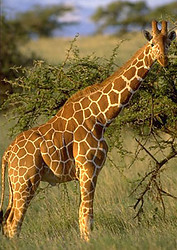
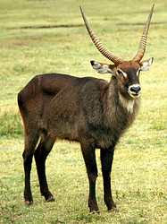
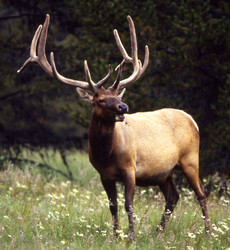

# [[Ruminants]] 

      

## #has_/text_of_/abstract 

> Ruminants are herbivorous grazing or browsing artiodactyls 
> belonging to the suborder **Ruminantia** that are able to acquire nutrients from plant-based food 
> by fermenting it in a specialized stomach prior to digestion, principally through microbial actions. 
> The process, which takes place in the front part of the digestive system 
> and therefore is called foregut fermentation, 
> typically requires the fermented ingesta (known as cud) to be regurgitated and chewed again. 
> 
> The process of rechewing the cud to further break down plant matter 
> and stimulate digestion is called rumination. 
> The word "ruminant" comes from the Latin ruminare, which means "to chew over again".
>
> The roughly 200 species of ruminants include both domestic and wild species. Ruminating mammals include cattle, all domesticated and wild bovines, goats, sheep, giraffes, deer, gazelles, and antelopes. It has also been suggested that notoungulates also relied on rumination, as opposed to other atlantogenatans that rely on the more typical hindgut fermentation, though this is not entirely certain.
>
> Ruminants represent the most diverse group of living ungulates. The suborder Ruminantia includes six different families: Tragulidae, Giraffidae, Antilocapridae, Cervidae, Moschidae, and Bovidae.
>
> [Wikipedia](https://en.wikipedia.org/wiki/Ruminant) 

## Phylogeny 

-   « Ancestral Groups  
    -   [Artiodactyla](Artiodactyla.md)
    -   [Eutheria](Eutheria.md)
    -   [Mammal](Mammal.md)
    -   [Therapsida](../../../../Therapsida.md)
    -   [Synapsida](../../../../../Synapsida.md)
    -   [Amniota](../../../../../../Amniota.md)
    -   [Terrestrial Vertebrates](../../../../../../../Terrestrial.md)
    -   [Sarcopterygii](../../../../../../../../Sarc.md)
    -   [Gnathostomata](../../../../../../../../../Gnath.md)
    -   [Vertebrata](../../../../../../../../../../Vertebrata.md)
    -   [Craniata](../../../../../../../../../../../Craniata.md)
    -   [Chordata](../../../../../../../../../../../../Chordata.md)
    -   [Deuterostomia](../../../../../../../../../../../../../Deutero.md)
    -   [Bilateria](Bilateria)
    -   [Animals](Animals)
    -   [Eukaryotes](Eukaryotes)
    -   [Tree of Life](../../../../../../../../../../../../../../../../Tree_of_Life.md)

-   ◊ Sibling Groups of  Artiodactyla
    -   [Suidae](Suidae.md)
    -   [Tayassuidae](Tayassuidae.md)
    -   [Hippopotamidae](Hippopotamidae.md)
    -   [Tylopoda](Tylopoda.md)
    -   Ruminantia
    -   [Miscellaneous fossil         artiodactyls](Miscellaneous_fossil_artiodactyls)

-   » Sub-Groups
    -   [Bovidae](Ruminants/Bovidae.md)
    -   [Moschidae](Ruminants/Moschidae.md)
    -   [Giraffoidea](Ruminants/Giraffoidea.md)
    -   [Antilocapridae](Ruminants/Antilocapridae.md)
    -   [Miscellaneous fossil         pecorans](Miscellaneous_fossil_pecorans)
    -   [Tragulidae](Ruminants/Tragulidae.md)

## Title Illustrations

----------------------------------

Scientific Name ::     Giraffa camelopardalis reticulata
Location ::           Samburu National Park (Kenya)
Creator              Gerald and Buff Corsi
Specimen Condition   Live Specimen
Source Collection    [CalPhotos](http://calphotos.berkeley.edu/)
Copyright ::            © 1999 [California Academy of Sciences](http://www.calacademy.org/) 

------------------------------------------------------------------------------

Scientific Name ::     Kobus ellipsiprymnus
Location ::           East Africa
Comments             waterbuck
Acknowledgements     Photograph courtesy [InsectImages.org](http://www.insectimages.org/) (#4321001)
Specimen Condition   Live Specimen
Sex ::                Male
Life Cycle Stage ::     adult
Source Collection    [InsectImages.org](http://www.insectimages.org/)
Copyright ::            © Kenneth M. Gale

------------------------------

Scientific Name ::     Cervus elaphus
Reference            Photograph courtesy [Yellowstone Digital Slide](http://www.nps.gov/yell/slidefile/index.htm)
Creator              Ed Austin/Herb Jones
Specimen Condition   Live Specimen
Sex ::                Male

## Confidential Links & Embeds: 

### [Ruminants](/_Standards/bio/bio~Domain/Eukaryotes/Animals/Bilateria/Deutero/Chordata/Craniata/Vertebrata/Gnath/Sarc/Tetrapods/Amniota/Synapsida/Therapsida/Mammal/Eutheria/Artiodactyla/Ruminants.md) 

### [Ruminants.public](/_public/bio/bio~Domain/Eukaryotes/Animals/Bilateria/Deutero/Chordata/Craniata/Vertebrata/Gnath/Sarc/Tetrapods/Amniota/Synapsida/Therapsida/Mammal/Eutheria/Artiodactyla/Ruminants.public.md) 

### [Ruminants.internal](/_internal/bio/bio~Domain/Eukaryotes/Animals/Bilateria/Deutero/Chordata/Craniata/Vertebrata/Gnath/Sarc/Tetrapods/Amniota/Synapsida/Therapsida/Mammal/Eutheria/Artiodactyla/Ruminants.internal.md) 

### [Ruminants.protect](/_protect/bio/bio~Domain/Eukaryotes/Animals/Bilateria/Deutero/Chordata/Craniata/Vertebrata/Gnath/Sarc/Tetrapods/Amniota/Synapsida/Therapsida/Mammal/Eutheria/Artiodactyla/Ruminants.protect.md) 

### [Ruminants.private](/_private/bio/bio~Domain/Eukaryotes/Animals/Bilateria/Deutero/Chordata/Craniata/Vertebrata/Gnath/Sarc/Tetrapods/Amniota/Synapsida/Therapsida/Mammal/Eutheria/Artiodactyla/Ruminants.private.md) 

### [Ruminants.personal](/_personal/bio/bio~Domain/Eukaryotes/Animals/Bilateria/Deutero/Chordata/Craniata/Vertebrata/Gnath/Sarc/Tetrapods/Amniota/Synapsida/Therapsida/Mammal/Eutheria/Artiodactyla/Ruminants.personal.md) 

### [Ruminants.secret](/_secret/bio/bio~Domain/Eukaryotes/Animals/Bilateria/Deutero/Chordata/Craniata/Vertebrata/Gnath/Sarc/Tetrapods/Amniota/Synapsida/Therapsida/Mammal/Eutheria/Artiodactyla/Ruminants.secret.md)

