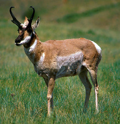

---
title: Antilocapridae
---

# [[Antilocapridae]] 

## #has_/text_of_/abstract 

> The **Antilocapridae** are a family of ruminant artiodactyls endemic to North America. 
> Their closest extant relatives are the giraffids. 
> 
> Only one species, the pronghorn (Antilocapra americana), is living today; 
> all other members of the family are extinct. 
> The living pronghorn is a small ruminant mammal resembling an antelope.
>
> [Wikipedia](https://en.wikipedia.org/wiki/Antilocapridae) 

## Phylogeny 

-   « Ancestral Groups  
    -   [Ruminants](../Ruminants.md)
    -   [Artiodactyla](Artiodactyla.md)
    -   [Eutheria](Eutheria.md)
    -   [Mammal](Mammal.md)
    -   [Therapsida](../../../../../Therapsida.md)
    -   [Synapsida](../../../../../../Synapsida.md)
    -   [Amniota](../../../../../../../Amniota.md)
    -   [Terrestrial Vertebrates](../../../../../../../../Terrestrial.md)
    -   [Sarcopterygii](../../../../../../../../../Sarc.md)
    -   [Gnathostomata](../../../../../../../../../../Gnath.md)
    -   [Vertebrata](../../../../../../../../../../../Vertebrata.md)
    -   [Craniata](../../../../../../../../../../../../Craniata.md)
    -   [Chordata](../../../../../../../../../../../../../Chordata.md)
    -   [Deuterostomia](../../../../../../../../../../../../../../Deutero.md)
    -   [Bilateria](Bilateria)
    -   [Animals](Animals)
    -   [Eukaryotes](Eukaryotes)
    -   [Tree of Life](../../../../../../../../../../../../../../../../../Tree_of_Life.md)

-   ◊ Sibling Groups of  Ruminantia
    -   [Bovidae](Bovidae.md)
    -   [Moschidae](Moschidae.md)
    -   [Giraffoidea](Giraffoidea.md)
    -   Antilocapridae
    -   [Miscellaneous fossil         pecorans](Miscellaneous_fossil_pecorans)
    -   [Tragulidae](Tragulidae.md)

-   » Sub-Groups
    -   [Antilocapra americana](Antilocapra)
	-   *Ceratomeryx* †
	-   *Cosoryx* †
	-   *Hayoceros* †
	-   *Hexameryx* †
	-   *Hexobelomeryx* †
	-   *Ilingoceros* †
	-   *Merriamoceros* †
	-   *Merycodus* †
	-   *Osbornoceros* †
	-   *Ottoceros* †
	-   *Paracosoryx* †
	-   *Plioceros* †
	-   *Proantilocapra* †
	-   *Ramoceros* †
	-   *Sphenophalos* †
	-   *Stockoceros* †
	-   *Subantilocapra* †
	-   *Tetrameryx* †
	-   *Texoceros* †

### Information on the Internet

-   [Hagerman: Where the Deer and the Antilocaprids     Played](http://www.nps.gov/hafo/crittercorner/antiloc.htm). Hagerman
    Fossil Beds\' CRITTER CORNER by Dr. Greg McDonald.

## Title Illustrations

----------------------------------------------------------------------------

Scientific Name ::     Capromeryx mexicana
Location ::           near Tequixquiac, Mexico
Reference            Furlong, E. L. 1925. Notes on the occurrence of mammalian remains in the Pleistocene of Mexico, with a description of a new species Capromeryx mexicana. University of California Publications in Geological Science 15(5):137-152.
Specimen Condition   Fossil
Body Part            skull
View                 lateral
Type                 holotype

----------------------------------------------------------------------------

Scientific Name ::     Merycodus necatus
Location ::           Barstow, San Bernardino County, California, USA
Reference            Furlong, E. L. 1927. The occurrence and phylogenetic status of Merycodus from the Mohave Desert Tertiary. University of California Publications. Bulletin of the Department of Geological Sciences 17(4):145-186.
Specimen Condition   Fossil
Body Part            skull
View                 lateral

-----------------------------------------------------------------------
 
Scientific Name ::     Antilocapra americana
Comments             pronghorn
Creator              Photograph by James C. Leupold
Acknowledgements     Photograph courtesy of the U.S. Fish and Wildlife Service
Specimen Condition   Live Specimen
Sex ::                Male

## Confidential Links & Embeds: 

### #is_/same_as :: [Antilocapridae](/_Standards/bio/bio~Domain/Eukaryotes/Animals/Bilateria/Deutero/Chordata/Craniata/Vertebrata/Gnath/Sarc/Tetrapods/Amniota/Synapsida/Therapsida/Mammal/Eutheria/Artiodactyla/Ruminants/Antilocapridae.md) 

### #is_/same_as :: [Antilocapridae.public](/_public/bio/bio~Domain/Eukaryotes/Animals/Bilateria/Deutero/Chordata/Craniata/Vertebrata/Gnath/Sarc/Tetrapods/Amniota/Synapsida/Therapsida/Mammal/Eutheria/Artiodactyla/Ruminants/Antilocapridae.public.md) 

### #is_/same_as :: [Antilocapridae.internal](/_internal/bio/bio~Domain/Eukaryotes/Animals/Bilateria/Deutero/Chordata/Craniata/Vertebrata/Gnath/Sarc/Tetrapods/Amniota/Synapsida/Therapsida/Mammal/Eutheria/Artiodactyla/Ruminants/Antilocapridae.internal.md) 

### #is_/same_as :: [Antilocapridae.protect](/_protect/bio/bio~Domain/Eukaryotes/Animals/Bilateria/Deutero/Chordata/Craniata/Vertebrata/Gnath/Sarc/Tetrapods/Amniota/Synapsida/Therapsida/Mammal/Eutheria/Artiodactyla/Ruminants/Antilocapridae.protect.md) 

### #is_/same_as :: [Antilocapridae.private](/_private/bio/bio~Domain/Eukaryotes/Animals/Bilateria/Deutero/Chordata/Craniata/Vertebrata/Gnath/Sarc/Tetrapods/Amniota/Synapsida/Therapsida/Mammal/Eutheria/Artiodactyla/Ruminants/Antilocapridae.private.md) 

### #is_/same_as :: [Antilocapridae.personal](/_personal/bio/bio~Domain/Eukaryotes/Animals/Bilateria/Deutero/Chordata/Craniata/Vertebrata/Gnath/Sarc/Tetrapods/Amniota/Synapsida/Therapsida/Mammal/Eutheria/Artiodactyla/Ruminants/Antilocapridae.personal.md) 

### #is_/same_as :: [Antilocapridae.secret](/_secret/bio/bio~Domain/Eukaryotes/Animals/Bilateria/Deutero/Chordata/Craniata/Vertebrata/Gnath/Sarc/Tetrapods/Amniota/Synapsida/Therapsida/Mammal/Eutheria/Artiodactyla/Ruminants/Antilocapridae.secret.md)

