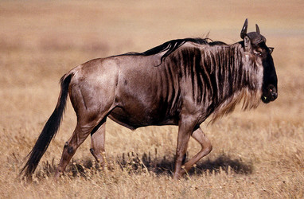

# [[Wildebeast]] 

## #has_/text_of_/abstract 

> The blue wildebeest (**Connochaetes taurinus**), 
> also called the common wildebeest, white-bearded gnu or brindled gnu, 
> is a large antelope and one of the two species of wildebeest. 
> 
> It is placed in the genus Connochaetes and family Bovidae, 
> and has a close taxonomic relationship with the black wildebeest. 
> The blue wildebeest is known to have five subspecies. This broad-shouldered antelope has a muscular, front-heavy appearance, with a distinctive, robust muzzle. Young blue wildebeest are born tawny brown, and begin to take on their adult coloration at the age of 2 months. The adults' hues range from a deep slate or bluish-gray to light gray or even grayish-brown. Both sexes possess a pair of large curved horns.
>
> The blue wildebeest is an herbivore, feeding primarily on short grasses. It forms herds which move about in loose aggregations, the animals being fast runners and extremely wary. The mating season begins at the end of the rainy season and a single calf is usually born after a gestational period of about 8.5 months. The calf remains with its mother for 8 months, after which it joins a juvenile herd. Blue wildebeest are found in short-grass plains bordering bush-covered acacia savannas in southern and eastern Africa, thriving in areas that are neither too wet nor too arid. Three African populations of blue wildebeest take part in a long-distance migration, timed to coincide with the annual pattern of rainfall and grass growth on the short-grass plains where they can find the nutrient-rich forage necessary for lactation and calf growth.
>
> The blue wildebeest is native to Angola, Botswana, Eswatini, Kenya, Mozambique, South Africa, Tanzania, Zambia, and Zimbabwe. Today, it is extinct in Malawi, but has been successfully reintroduced in Namibia. The southern limit of the blue wildebeest range is the Orange River, while the western limit is bounded by Lake Victoria and Mount Kenya. The blue wildebeest is widespread and is being introduced into private game farms, reserves, and conservancies. The International Union for Conservation of Nature and Natural Resources  rates the blue wildebeest as being of least concern. The population has been estimated to be around 1.5 million, and the population trend is stable.
>
> [Wikipedia](https://en.wikipedia.org/wiki/Blue%20wildebeest) 

## Phylogeny 

-   « Ancestral Groups  
    -   [Alcelaphinae](../Alcelaphinae.md)
    -   [Bovidae](../../Bovidae.md)
    -   [Ruminants](../../../Ruminants.md)
    -   [Artiodactyla](Artiodactyla.md)
    -   [Eutheria](Eutheria.md)
    -   [Mammal](Mammal.md)
    -   [Therapsida](../../../../../../../Therapsida.md)
    -   [Synapsida](../../../../../../../../Synapsida.md)
    -   [Amniota](../../../../../../../../../Amniota.md)
    -   [Terrestrial Vertebrates](../../../../../../../../../../Terrestrial.md)
    -   [Sarcopterygii](../../../../../../../../../../../Sarc.md)
    -   [Gnathostomata](../../../../../../../../../../../../Gnath.md)
    -   [Vertebrata](../../../../../../../../../../../../../Vertebrata.md)
    -   [Craniata](../../../../../../../../../../../../../../Craniata.md)
    -   [Chordata](../../../../../../../../../../../../../../../Chordata.md)
    -   [Deuterostomia](../../../../../../../../../../../../../../../../Deutero.md)
    -   [Bilateria](Bilateria)
    -   [Animals](Animals)
    -   [Eukaryotes](Eukaryotes)
    -   [Tree of Life](../../../../../../../../../../../../../../../../../../../Tree_of_Life.md)

-   ◊ Sibling Groups of  Alcelaphinae
    -   Connochaetes taurinus
    -   [Damaliscus lunatus](Damaliscus_lunatus)
    -   [Damaliscus pygargus](Damaliscus_pygargus)
    -   [Alcelaphus buselaphus](Alcelaphus_buselaphus)

-   » Sub-Groups 

## Title Illustrations

------------------------------------------------------------------------------

Scientific Name ::  Connochaetes taurinus
Location ::        Seronera area of Serengeti National Park, Tanzania
Behavior          wildebeest drinking in shallow stream
Copyright ::         © 1989 [Greg and Marybeth Dimijian](http://www.dimijianimages.com/) 

## Confidential Links & Embeds: 

### [Wildebeast](/_Standards/bio/bio~Domain/Eukaryotes/Animals/Bilateria/Deutero/Chordata/Craniata/Vertebrata/Gnath/Sarc/Tetrapods/Amniota/Synapsida/Therapsida/Mammal/Eutheria/Artiodactyla/Ruminants/Bovidae/Alcelaphinae/Wildebeast.md) 

### [Wildebeast.public](/_public/bio/bio~Domain/Eukaryotes/Animals/Bilateria/Deutero/Chordata/Craniata/Vertebrata/Gnath/Sarc/Tetrapods/Amniota/Synapsida/Therapsida/Mammal/Eutheria/Artiodactyla/Ruminants/Bovidae/Alcelaphinae/Wildebeast.public.md) 

### [Wildebeast.internal](/_internal/bio/bio~Domain/Eukaryotes/Animals/Bilateria/Deutero/Chordata/Craniata/Vertebrata/Gnath/Sarc/Tetrapods/Amniota/Synapsida/Therapsida/Mammal/Eutheria/Artiodactyla/Ruminants/Bovidae/Alcelaphinae/Wildebeast.internal.md) 

### [Wildebeast.protect](/_protect/bio/bio~Domain/Eukaryotes/Animals/Bilateria/Deutero/Chordata/Craniata/Vertebrata/Gnath/Sarc/Tetrapods/Amniota/Synapsida/Therapsida/Mammal/Eutheria/Artiodactyla/Ruminants/Bovidae/Alcelaphinae/Wildebeast.protect.md) 

### [Wildebeast.private](/_private/bio/bio~Domain/Eukaryotes/Animals/Bilateria/Deutero/Chordata/Craniata/Vertebrata/Gnath/Sarc/Tetrapods/Amniota/Synapsida/Therapsida/Mammal/Eutheria/Artiodactyla/Ruminants/Bovidae/Alcelaphinae/Wildebeast.private.md) 

### [Wildebeast.personal](/_personal/bio/bio~Domain/Eukaryotes/Animals/Bilateria/Deutero/Chordata/Craniata/Vertebrata/Gnath/Sarc/Tetrapods/Amniota/Synapsida/Therapsida/Mammal/Eutheria/Artiodactyla/Ruminants/Bovidae/Alcelaphinae/Wildebeast.personal.md) 

### [Wildebeast.secret](/_secret/bio/bio~Domain/Eukaryotes/Animals/Bilateria/Deutero/Chordata/Craniata/Vertebrata/Gnath/Sarc/Tetrapods/Amniota/Synapsida/Therapsida/Mammal/Eutheria/Artiodactyla/Ruminants/Bovidae/Alcelaphinae/Wildebeast.secret.md)

