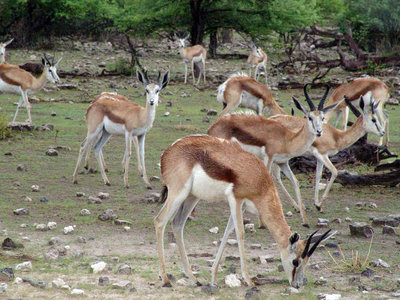
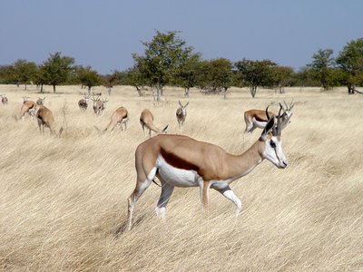

[Temporary Page](tree/home.pages/pagestatus.html)

# [[Springbok]] 

## #has_/text_of_/abstract 

> The springbok or springbuck (**Antidorcas marsupialis**) 
> is an antelope found mainly in south and southwest Africa. 
> 
> The sole member of the genus Antidorcas, 
> this bovid was first described by the German zoologist Eberhard August Wilhelm von Zimmermann in 1780. 
> Three subspecies are identified. A slender, long-legged antelope, the springbok reaches 71 to 86 cm (28 to 34 in) at the shoulder and weighs between 27 and 42 kg (60 and 93 lb). Both sexes have a pair of black, 35-to-50 cm (14-to-20 in) long horns that curve backwards. The springbok is characterised by a white face, a dark stripe running from the eyes to the mouth, a light brown coat marked by a reddish-brown stripe that runs from the upper foreleg to the buttocks across the flanks like the Thomson's gazelle, and a white rump flap.
>
> Active mainly at dawn and dusk, springbok form harems (mixed-sex herds). In earlier times, springbok of the Kalahari Desert and Karoo migrated in large numbers across the countryside, a practice known as trekbokking. A feature, peculiar but not unique, to the springbok is pronking, in which the springbok performs multiple leaps into the air, up to 2 m (6.6 ft) above the ground, in a stiff-legged posture, with the back bowed and the white flap lifted. Primarily a browser, the springbok feeds on shrubs and succulents; this antelope can live without drinking water for years, meeting its requirements through eating succulent vegetation. Breeding takes place year-round, and peaks in the rainy season, when forage is most abundant. A single calf is born after a five- to six-month-long pregnancy; weaning occurs at nearly six months of age, and the calf leaves its mother a few months later.
>
> Springbok inhabit the dry areas of south and southwestern Africa. The International Union for Conservation of Nature and Natural Resources classifies the springbok as a least concern species. No major threats to the long-term survival of the species are known; the springbok, in fact, is one of the few antelope species considered to have an expanding population. They are popular game animals, and are valued for their meat and skin. The springbok is the national animal of South Africa.
>
> [Wikipedia](https://en.wikipedia.org/wiki/Springbok)

## Phylogeny 

-   « Ancestral Groups  
    -   [Antilopinae](../Antilopinae.md)
    -   [Bovidae](../../Bovidae.md)
    -   [Ruminants](../../../Ruminants.md)
    -   [Artiodactyla](Artiodactyla.md)
    -   [Eutheria](Eutheria.md)
    -   [Mammal](Mammal.md)
    -   [Therapsida](../../../../../../../Therapsida.md)
    -   [Synapsida](../../../../../../../../Synapsida.md)
    -   [Amniota](../../../../../../../../../Amniota.md)
    -   [Terrestrial Vertebrates](../../../../../../../../../../Terrestrial.md)
    -   [Sarcopterygii](../../../../../../../../../../../Sarc.md)
    -   [Gnathostomata](../../../../../../../../../../../../Gnath.md)
    -   [Vertebrata](../../../../../../../../../../../../../Vertebrata.md)
    -   [Craniata](../../../../../../../../../../../../../../Craniata.md)
    -   [Chordata](../../../../../../../../../../../../../../../Chordata.md)
    -   [Deuterostomia](../../../../../../../../../../../../../../../../Deutero.md)
    -   [Bilateria](Bilateria)
    -   [Animals](Animals)
    -   [Eukaryotes](Eukaryotes)
    -   [Tree of Life](../../../../../../../../../../../../../../../../../../../Tree_of_Life.md)
-   []«
-   ◊ Sibling Groups of  Antilopinae
    -   [Gazelle](Gazelle.md)
    -   [Ourebia ourebi](Ourebia_ourebi)
    -   Antidorcas marsupialis
    -   [Antilope cervicapra](Antilope_cervicapra)
    -   [Litocranius walleri](Litocranius_walleri)
    -   [Dik-dik](Dik-dik.md)
    -   [Procapra](Procapra.md)
    -   [Raphicerus](Raphicerus.md)
-   []^
-   []v
-   » Sub-Groups 

## Title Illustrations

------------------------------------------------------------------

Scientific Name ::     Antidorcas marsupialis
Location ::           Etosha National Park, Namibia
Acknowledgements     This image is licensed under the [Attribution-NonCommercial-ShareAlike 2.0 Creative Commons License](http://creativecommons.org/licenses/by-nc-sa/2.0/).
Specimen Condition   Live Specimen
Image Use ::    [Attribution-NonCommercial-ShareAlike 2.0 Creative Commons License](http://creativecommons.org/licenses/by-nc-sa/2.0/).
Copyright ::            © 2005 [Charles Roffey](http://flickr.com/people/charlesfred/)

------------------------------------------------------------------
]( "view full image and data in a new window")
Scientific Name ::     Antidorcas marsupialis
Location ::           Etosha National Park, Namibia
Acknowledgements     This image is licensed under the [Attribution-NonCommercial-ShareAlike 2.0 Creative Commons License](http://creativecommons.org/licenses/by-nc-sa/2.0/).
Specimen Condition   Live Specimen
Image Use ::    [Attribution-NonCommercial-ShareAlike 2.0 Creative Commons License](http://creativecommons.org/licenses/by-nc-sa/2.0/).
Copyright ::            © 2006 [Damien du Toit](http://flickr.com/people/coda/)
