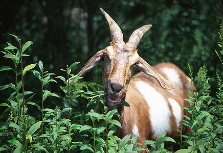

## Phylogeny 

-   « Ancestral Groups  
    -   [Caprinae](../Caprinae.md)
    -   [Bovidae](../../Bovidae.md)
    -   [Ruminants](../../../Ruminants.md)
    -   [Artiodactyla](Artiodactyla.md)
    -   [Eutheria](Eutheria.md)
    -   [Mammal](Mammal.md)
    -   [Therapsida](../../../../../../../Therapsida.md)
    -   [Synapsida](../../../../../../../../Synapsida.md)
    -   [Amniota](../../../../../../../../../Amniota.md)
    -   [Terrestrial Vertebrates](../../../../../../../../../../Terrestrial.md)
    -   [Sarcopterygii](../../../../../../../../../../../Sarc.md)
    -   [Gnathostomata](../../../../../../../../../../../../Gnath.md)
    -   [Vertebrata](../../../../../../../../../../../../../Vertebrata.md)
    -   [Craniata](../../../../../../../../../../../../../../Craniata.md)
    -   [Chordata](../../../../../../../../../../../../../../../Chordata.md)
    -   [Deuterostomia](../../../../../../../../../../../../../../../../Deutero.md)
    -   [Bilateria](Bilateria)
    -   [Animals](Animals)
    -   [Eukaryotes](Eukaryotes)
    -   [Tree of Life](../../../../../../../../../../../../../../../../../../../Tree_of_Life.md)

-   ◊ Sibling Groups of  Caprinae
    -   Capra
    -   [Ammotragus lervia](Ammotragus_lervia)
    -   [Ovibos moschatus](Ovibos_moschatus)
    -   [Budorcas taxicolor](Budorcas_taxicolor)
    -   [Hemitragus](Hemitragus.md)
    -   [Ovis](Ovis.md)
    -   [Pseudois](Pseudois.md)
    -   [Naemorhedus](Naemorhedus.md)
    -   [Oreamnos americanus](Oreamnos_americanus)
    -   [Rupicapra](Rupicapra.md)
    -   [Fossil Caprinae](Fossil_Caprinae)

-   » Sub-Groups 

# *Capra* 

-   *Capra caucasica* [(West Caucasian tur)]
-   *Capra cylindricornis* [(East Caucasian tur)]
-   *Capra falconeri* [(markhor)]
-   *Capra hircus* [(domestic goat, feral goat)]
-   *Capra ibex* [(ibex)]
-   *Capra nubiana* [(nubian ibex)]
-   *Capra pyrenaica* [(Iberian mountain goat or Spanish
    ibex)]
-   *Capra sibirica* [(Siberian ibex)]
-   *Capra walie* [(Walia ibex)]

Containing group: [Caprinae](../Caprinae.md)

### References

Ropiquet, A. and A. Hassanin. 2006. Hybrid origin of the Pliocene
ancestor of wild goats. Molecular Phylogenetics and Evolution
41(2):395-404.

Manceau, V., L. Despres, J. Bouvet, and P. Taberlet. 1999. Systematics
of the genus Capra inferred from mitochondrial DNA sequence data.
Molecular Phylogenetics and Evolution 13:504-510.

Pidancier, N., S. Jordan, G. Luikart and P. Taberlet. 2006. Evolutionary
history of the genus Capra (Mammalia, Artiodactyla): Discordance between
mitochondrial DNA and Y-chromosome phylogenies. Molecular Phylogenetics
and Evolution 40(3):739-749.

## Title Illustrations

  ---------------------------
  Scientific Name ::     Capra hircus
  Creator              Photograph by Scott Bauer
  Acknowledgements     courtesy [USDA Agricultural Research Service](http://www.ars.usda.gov/)
  Specimen Condition   Live Specimen
  ---------------------------
