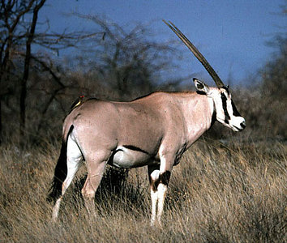

# [[Hippotraginae]] 

 

## #has_/text_of_/abstract 

> A grazing antelope is any of the species of antelope that make up the subfamily **Hippotraginae** or tribe Hippotragini of the family Bovidae. 
> They are grazers, rather than browsers.  Their name comes from Greek ἵππος (híppos), "horse", and τράγος (trágos), "he-goat".  
> 
> They have slightly horse-like characteristics of body size and proportions: 
> long legs and a solid body with a relatively thick muscular neck.
>
> [Wikipedia](https://en.wikipedia.org/wiki/Hippotraginae) 

## Phylogeny 

-   « Ancestral Groups  
    -   [Bovidae](../Bovidae.md)
    -   [Ruminants](../../Ruminants.md)
    -   [Artiodactyla](Artiodactyla.md)
    -   [Eutheria](Eutheria.md)
    -   [Mammal](Mammal.md)
    -   [Therapsida](../../../../../../Therapsida.md)
    -   [Synapsida](../../../../../../../Synapsida.md)
    -   [Amniota](../../../../../../../../Amniota.md)
    -   [Terrestrial Vertebrates](../../../../../../../../../Terrestrial.md)
    -   [Sarcopterygii](../../../../../../../../../../Sarc.md)
    -   [Gnathostomata](../../../../../../../../../../../Gnath.md)
    -   [Vertebrata](../../../../../../../../../../../../Vertebrata.md)
    -   [Craniata](../../../../../../../../../../../../../Craniata.md)
    -   [Chordata](../../../../../../../../../../../../../../Chordata.md)
    -   [Deuterostomia](../../../../../../../../../../../../../../../Deutero.md)
    -   [Bilateria](Bilateria)
    -   [Animals](Animals)
    -   [Eukaryotes](Eukaryotes)
    -   [Tree of Life](../../../../../../../../../../../../../../../../../../Tree_of_Life.md)

-   ◊ Sibling Groups of  Bovidae
    -   [Oreotragus oreotragus](Oreotragus_oreotragus)
    -   [Alcelaphinae](Alcelaphinae.md)
    -   Hippotraginae
    -   [Caprinae](Caprinae.md)
    -   [Aepyceros melampus](Impala.md)
    -   [Cephalophinae](Cephalophinae.md)
    -   [Reduncinae](Reduncinae.md)
    -   [Antilopinae](Antilopinae.md)
    -   [Neotragus](Neotragus.md)
    -   [Miscellaneous fossil         bovids](Miscellaneous_fossil_bovids)

-   » Sub-Groups 

### Information on the Internet

-   [The Extinct Blue     Antelope](http://www.museums.org.za/sam/resource/palaeo/bluebuck.htm).
    South African Museum.
## Title Illustrations

---------------------------------------------------------------------------------------------------------------------------------------

Scientific Name ::     Oryx gazella beisa
Location ::           Samburu Reserve, Kenya
Comments             The oryx is well adapted to life in dry areas. It is light-colored to reflect radiant heat, it can sustain prolonged high body temperature, it browses mainly at night to maximise water intake and it seldom needs to drink. Long straight horns are present in both sexes and are used in defense against predators. The red-billed oxpecker bird on the oryx\'s rump is specialised for eating ectoparasites such as ticks.
Specimen Condition   Live Specimen
Identified By        David Bygott
Life Cycle Stage ::     Adult
View                 Lateral
Copyright ::            © 2005 [David Bygott](mailto:davidbygott@yahoo.com) 
