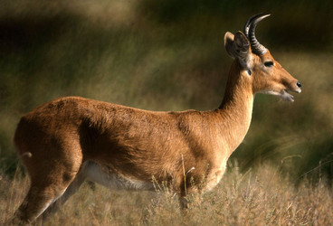
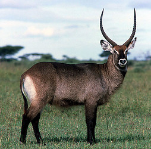

# Reduncinae 

    

## Phylogeny 

-   « Ancestral Groups  
    -   [Bovidae](../Bovidae.md)
    -   [Ruminants](../../Ruminants.md)
    -   [Artiodactyla](Artiodactyla.md)
    -   [Eutheria](Eutheria.md)
    -   [Mammal](Mammal.md)
    -   [Therapsida](../../../../../../Therapsida.md)
    -   [Synapsida](../../../../../../../Synapsida.md)
    -   [Amniota](../../../../../../../../Amniota.md)
    -   [Terrestrial Vertebrates](../../../../../../../../../Terrestrial.md)
    -   [Sarcopterygii](../../../../../../../../../../Sarc.md)
    -   [Gnathostomata](../../../../../../../../../../../Gnath.md)
    -   [Vertebrata](../../../../../../../../../../../../Vertebrata.md)
    -   [Craniata](../../../../../../../../../../../../../Craniata.md)
    -   [Chordata](../../../../../../../../../../../../../../Chordata.md)
    -   [Deuterostomia](../../../../../../../../../../../../../../../Deutero.md)
    -   [Bilateria](Bilateria)
    -   [Animals](Animals)
    -   [Eukaryotes](Eukaryotes)
    -   [Tree of Life](../../../../../../../../../../../../../../../../../../Tree_of_Life.md)

-   ◊ Sibling Groups of  Bovidae
    -   [Oreotragus oreotragus](Oreotragus_oreotragus)
    -   [Alcelaphinae](Alcelaphinae.md)
    -   [Hippotraginae](Hippotraginae.md)
    -   [Caprinae](Caprinae.md)
    -   [Aepyceros melampus](Impala.md)
    -   [Cephalophinae](Cephalophinae.md)
    -   Reduncinae
    -   [Antilopinae](Antilopinae.md)
    -   [Neotragus](Neotragus.md)
    -   [Miscellaneous fossil         bovids](Miscellaneous_fossil_bovids)

-   » Sub-Groups
    -   [Fossil Reduncinae](Fossil_Reduncinae)

## Title Illustrations

-------------------------------------------------------------------------

Scientific Name ::     Redunca redunca
Location ::           Tarangire NP, Tanzania
Specimen Condition   Live Specimen
Identified By        self
Sex ::                Male
Life Cycle Stage ::     adult
Body Part            whole
View                 side
Copyright ::            © 2006 [David Bygott](mailto:davidbygott@yahoo.com) 

-------------------------------------------------------------------------
 
Scientific Name ::     Kobus ellipsiprymnus defassa
Location ::           Serengeti National Park, Tanzania
Comments             Waterbucks prefer habitats with plenty of cover and will die if denied access to shade. This is a mature male; females are hornless.
Specimen Condition   Live Specimen
Identified By        David Bygott
Sex ::                Male
Life Cycle Stage ::     Adult
View                 Lateral
Copyright ::            © 2005 [David Bygott](mailto:davidbygott@yahoo.com) 

