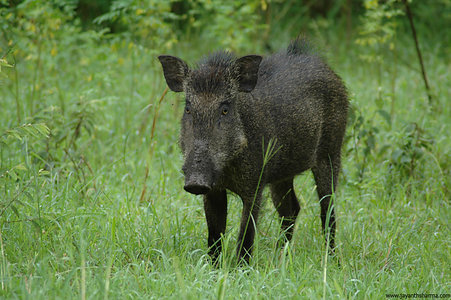

# [[Pig]] 

## Eurasian pigs 

## #has_/text_of_/abstract 

> Sus is the genus of domestic and wild pigs, 
> within the even-toed ungulate family Suidae. 
> 
> Sus includes domestic pigs (Sus domesticus) and their ancestor, 
> the common Eurasian wild boar (Sus scrofa), 
> along with various other species. 
> Sus species, like all suids, are native to the Eurasian and African continents, 
> ranging from Europe to the Pacific islands.
>
> Juvenile pigs are known as piglets. 
> Pigs live in complex social groups 
> and are considered one of the more intelligent mammals, 
> as reflected in their ability to learn.
>
> With around 1 billion of this species alive at any time, 
> the domestic pig is among the most populous large mammals in the world. 
> 
> Pigs are omnivores and can consume a wide range of food. 
> Pigs are biologically similar to humans 
> and are thus frequently used for human medical research.
>
> [Wikipedia](https://en.wikipedia.org/wiki/Sus%20(genus))

## Phylogeny 

-   « Ancestral Groups  
    -   [Suinae](Suinae.md)
    -   [Suidae](Suidae.md)
    -   [Artiodactyla](Artiodactyla.md)
    -   [Eutheria](Eutheria.md)
    -   [Mammal](Mammal.md)
    -   [Therapsida](../../../../../../Therapsida.md)
    -   [Synapsida](../../../../../../../Synapsida.md)
    -   [Amniota](../../../../../../../../Amniota.md)
    -   [Terrestrial Vertebrates](../../../../../../../../../Terrestrial.md)
    -   [Sarcopterygii](../../../../../../../../../../Sarc.md)
    -   [Gnathostomata](../../../../../../../../../../../Gnath.md)
    -   [Vertebrata](../../../../../../../../../../../../Vertebrata.md)
    -   [Craniata](../../../../../../../../../../../../../Craniata.md)
    -   [Chordata](../../../../../../../../../../../../../../Chordata.md)
    -   [Deuterostomia](../../../../../../../../../../../../../../../Deutero.md)
    -   [Bilateria](Bilateria)
    -   [Animals](Animals)
    -   [Eukaryotes](Eukaryotes)
    -   [Tree of Life](../../../../../../../../../../../../../../../../../../Tree_of_Life.md)

-   ◊ Sibling Groups of  Suinae
    -   Sus
    -   [Babyrousa babyrussa](Babyrousa_babyrussa.md)
    -   [Warthog](Warthog.md)
    -   [Potamochoerus](Potamochoerus.md)

-   » Sub-Groups
    -   [Sus scrofa](Pig/Sus_scrofa.md)

	-   *Sus barbatus* [(bearded pig)]
	-   *Sus salvanius* [(pygmy hog)]
	-   *[Sus scrofa](Pig/Sus_scrofa.md "go to ToL page")* [(wild
	    boar)]
	-   *Sus verrucosus* [(Javan pig)]
	-   *Sus bucculentus* [(Vietnam warty pig)]
	-   *Sus cebifrons* [(Visayan warty pig)]
	-   *Sus celebensis* [(Celebes wild boar)]
	-   *Sus heureni* [(Flores warty pig)]
	-   *Sus philippensis* [(Philippine warty pig)]
	-   *Sus timoriensis* [(Timor wild boar)]

## Title Illustrations

----------------------------------------------------------------
Scientific Name ::     Sus scrofa
Location ::           India
Specimen Condition   Live Specimen
Source               [Wild Boar](http://flickr.com/photos/jayanthsharma/54607385/)
Source Collection    [Flickr](http://flickr.com/)
Image Use ::    [Attribution-NonCommercial-NoDerivs 2.0 Creative Commons License](http://creativecommons.org/licenses/by-nc-nd/2.0/).
Copyright ::            © 2005 [Jayanth Sharma](http://flickr.com/people/jayanthsharma/)

## Confidential Links & Embeds: 

### #is_/same_as :: [Pig](/_Standards/bio/bio~Domain/Eukaryotes/Animals/Bilateria/Deutero/Chordata/Craniata/Vertebrata/Gnath/Sarc/Tetrapods/Amniota/Synapsida/Therapsida/Mammal/Eutheria/Artiodactyla/Suidae/Suinae/Pig.md) 

### #is_/same_as :: [Pig.public](/_public/bio/bio~Domain/Eukaryotes/Animals/Bilateria/Deutero/Chordata/Craniata/Vertebrata/Gnath/Sarc/Tetrapods/Amniota/Synapsida/Therapsida/Mammal/Eutheria/Artiodactyla/Suidae/Suinae/Pig.public.md) 

### #is_/same_as :: [Pig.internal](/_internal/bio/bio~Domain/Eukaryotes/Animals/Bilateria/Deutero/Chordata/Craniata/Vertebrata/Gnath/Sarc/Tetrapods/Amniota/Synapsida/Therapsida/Mammal/Eutheria/Artiodactyla/Suidae/Suinae/Pig.internal.md) 

### #is_/same_as :: [Pig.protect](/_protect/bio/bio~Domain/Eukaryotes/Animals/Bilateria/Deutero/Chordata/Craniata/Vertebrata/Gnath/Sarc/Tetrapods/Amniota/Synapsida/Therapsida/Mammal/Eutheria/Artiodactyla/Suidae/Suinae/Pig.protect.md) 

### #is_/same_as :: [Pig.private](/_private/bio/bio~Domain/Eukaryotes/Animals/Bilateria/Deutero/Chordata/Craniata/Vertebrata/Gnath/Sarc/Tetrapods/Amniota/Synapsida/Therapsida/Mammal/Eutheria/Artiodactyla/Suidae/Suinae/Pig.private.md) 

### #is_/same_as :: [Pig.personal](/_personal/bio/bio~Domain/Eukaryotes/Animals/Bilateria/Deutero/Chordata/Craniata/Vertebrata/Gnath/Sarc/Tetrapods/Amniota/Synapsida/Therapsida/Mammal/Eutheria/Artiodactyla/Suidae/Suinae/Pig.personal.md) 

### #is_/same_as :: [Pig.secret](/_secret/bio/bio~Domain/Eukaryotes/Animals/Bilateria/Deutero/Chordata/Craniata/Vertebrata/Gnath/Sarc/Tetrapods/Amniota/Synapsida/Therapsida/Mammal/Eutheria/Artiodactyla/Suidae/Suinae/Pig.secret.md)

