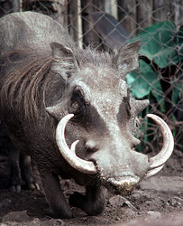

# Phacochoerus

## wart hogs 
 

## #has_/text_of_/abstract 

> **Phacochoerus** is a genus in the family Suidae, commonly known as warthogs (pronounced wart-hog). They are pigs who live in open and semi-open habitats, even in quite arid regions, in sub-Saharan Africa. The two species were formerly considered conspecific under the scientific name Phacochoerus aethiopicus, but today this is limited to the desert warthog, while the best-known and most widespread species, the common warthog (or simply warthog), is Phacochoerus africanus.
>
> [Wikipedia](https://en.wikipedia.org/wiki/Warthog)

## Phylogeny 

-   « Ancestral Groups  
    -   [Suinae](Suinae.md)
    -   [Suidae](Suidae.md)
    -   [Artiodactyla](Artiodactyla.md)
    -   [Eutheria](Eutheria.md)
    -   [Mammal](Mammal.md)
    -   [Therapsida](../../../../../../Therapsida.md)
    -   [Synapsida](../../../../../../../Synapsida.md)
    -   [Amniota](../../../../../../../../Amniota.md)
    -   [Terrestrial Vertebrates](../../../../../../../../../Terrestrial.md)
    -   [Sarcopterygii](../../../../../../../../../../Sarc.md)
    -   [Gnathostomata](../../../../../../../../../../../Gnath.md)
    -   [Vertebrata](../../../../../../../../../../../../Vertebrata.md)
    -   [Craniata](../../../../../../../../../../../../../Craniata.md)
    -   [Chordata](../../../../../../../../../../../../../../Chordata.md)
    -   [Deuterostomia](../../../../../../../../../../../../../../../Deutero.md)
    -   [Bilateria](Bilateria)
    -   [Animals](Animals)
    -   [Eukaryotes](Eukaryotes)
    -   [Tree of Life](../../../../../../../../../../../../../../../../../../Tree_of_Life.md)

-   ◊ Sibling Groups of  Suinae
    -   [Pig](Pig.md)
    -   [Babyrousa babyrussa](Babyrousa_babyrussa.md)
    -   Phacochoerus
    -   [Potamochoerus](Potamochoerus.md)

-   » Sub-Groups 

	† [(Cape warthog)]

## Title Illustrations

-------------------------------------------------------------------------
 
Scientific Name ::     Phacochoerus aethiopicus
Location ::           Mt Meru Game Sanctuary, Arusha, Tanzania
Comments             Captive with unusually large tusks. Probably from Arusha area.
Specimen Condition   Live Specimen
Identified By        David Bygott
Sex ::                Male
Life Cycle Stage ::     Adult
Body Part            Head
View                 Frontal
Copyright ::            © 2005 [David Bygott](mailto:davidbygott@yahoo.com) 

-------------------------------------------------------------------------

Scientific Name ::     Phacochoerus africanus
Location ::           outside of dining room of Kichwa Tembo camp in the Masai Mara Reserve, Kenya
Comments             Savanna warthog
Acknowledgements     Photograph courtesy [InsectImages.org](http://www.insectimages.org/) (#0009146)
Specimen Condition   Live Specimen
Source Collection    [InsectImages.org](http://www.insectimages.org/)
Copyright ::            © Chuck Bargeron, The University of Georgia
