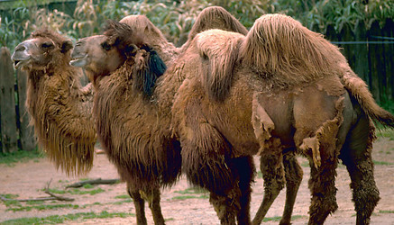
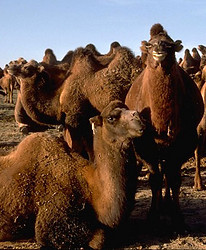

# [[Camelidae]] 

## #has_/text_of_/abstract 

> Camelids are members of the biological family **Camelidae**, 
> the only currently living family in the suborder Tylopoda. 
> 
> The seven extant members of this group are: 
> - dromedary camels, 
> - Bactrian camels, 
> - wild Bactrian camels, 
> - llamas, 
> - alpacas, 
> - vicuñas, and 
> - guanacos. 
> 
> Camelids are even-toed ungulates classified in the order Artiodactyla, 
> along with species including whales, pigs, deer, cattle, and antelopes.
>
> [Wikipedia](https://en.wikipedia.org/wiki/Camelidae)

## Phylogeny 

-   « Ancestral Groups  
    -   [Tylopoda](Tylopoda.md)
    -   [Artiodactyla](Artiodactyla.md)
    -   [Eutheria](Eutheria.md)
    -   [Mammal](Mammal.md)
    -   [Therapsida](../../../../../Therapsida.md)
    -   [Synapsida](../../../../../../Synapsida.md)
    -   [Amniota](../../../../../../../Amniota.md)
    -   [Terrestrial Vertebrates](../../../../../../../../Terrestrial.md)
    -   [Sarcopterygii](../../../../../../../../../Sarc.md)
    -   [Gnathostomata](../../../../../../../../../../Gnath.md)
    -   [Vertebrata](../../../../../../../../../../../Vertebrata.md)
    -   [Craniata](../../../../../../../../../../../../Craniata.md)
    -   [Chordata](../../../../../../../../../../../../../Chordata.md)
    -   [Deuterostomia](../../../../../../../../../../../../../../Deutero.md)
    -   [Bilateria](Bilateria)
    -   [Animals](Animals)
    -   [Eukaryotes](Eukaryotes)
    -   [Tree of Life](../../../../../../../../../../../../../../../../../Tree_of_Life.md)

-   ◊ Sibling Groups of  Tylopoda
    -   Camelidae

-   » Sub-Groups
    -   [Camel](Camelidae/Camel.md)
	-   *[Camel](Camelidae/Camel.md "go to ToL page")* [(camels,
	    llamas, and their relatives)]
	-   *Floridatragulinae* †
	    -   *Floridatragulus* †
	    -   *Aguascalientia* †
	-   *Miolabinae* †
	    -   *Paramiolabis* †
	    -   *Miolabis* †
	    -   *Cuyamacamelus* †
	    -   *Nothotylopus* †
	    -   *Capricamelus* †
	-   *Protolabinae* †
	    -   *Tanymykter* †
	    -   *Protolabis* †
	    -   *Michenia* †
	-   *Stenomylinae* †
	    -   *Stenomylus* †
	    -   *Blickomylus* †
	    -   *Rakomylus* †
	    -   *Pseudolabis* †
	    -   *Miotylopus* †
	-   *Poebrodon* †
	-   *Hidrosotherium* †
	-   *Poebrotherium* †
	-   *Paralabis* †
	-   *Paratylopus* †
	-   *Oxydactylus* †[ (incertae
	    sedis) ]
	-   *Australocamelus* †[
	    (incertae sedis) ]
	-   *Priscocamelus* †[ (incertae
	    sedis) ]
	-   *Nothokemas* †[ (incertae
	    sedis) ]
	-   *Gentilicamelus* †[ (incertae
	    sedis) ]

## Title Illustrations

-----------------------

Scientific Name ::     Camelus bactrianus
Creator              Photograph by Gary M. Stolz
Acknowledgements     Photograph courtesy of the U.S. Fish and Wildlife Service
Specimen Condition   Live Specimen
