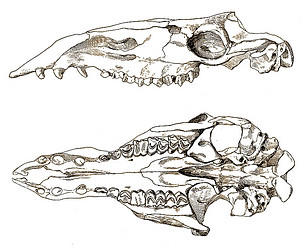

# [[Camel]] 

#is_/same_as :: [[../../../../../../../../../../../../../../../../../WikiData/WD~Camelus,7375|WD~Camelus,7375]] 

> A **Camel** (from Latin: camelus and Ancient Greek: κάμηλος (kamēlos) from Ancient Semitic: gāmāl) 
> is an even-toed ungulate in the genus Camelus that bears distinctive fatty deposits known as "humps" on its back. Camels have long been domesticated and, as livestock, they provide food (camel milk and meat) and textiles (fiber and felt from camel hair). Camels are working animals especially suited to their desert habitat and are a vital means of transport for passengers and cargo. There are three surviving species of camel. The one-humped dromedary makes up 94% of the world's camel population, and the two-humped Bactrian camel makes up 6%. The wild Bactrian camel is a distinct species that is not ancestral to the domestic Bactrian camel, and is now critically endangered, with fewer than 1,000 individuals.
>
> The word camel is also used informally in a wider sense, where the more correct term is "camelid", to include all seven species of the family Camelidae: the true camels (the above three species), along with the "New World" camelids: the llama, the alpaca, the guanaco, and the vicuña, which belong to the separate tribe Lamini. Camelids originated in North America during the Eocene, with the ancestor of modern camels, Paracamelus, migrating across the Bering land bridge into Asia during the late Miocene, around 6 million years ago.
>
> [Wikipedia](https://en.wikipedia.org/wiki/Camel)
### Information on the Internet

-   [The A-Z of Camels](http://www.arab.net/camels/welcome.html).
    ArabNet.

## Phylogeny 

-   « Ancestral Groups  
    -   [Camelidae](Camelidae.md)
    -   [Tylopoda](Tylopoda.md)
    -   [Artiodactyla](Artiodactyla.md)
    -   [Eutheria](Eutheria.md)
    -   [Mammal](Mammal.md)
    -   [Therapsida](../../../../../../Therapsida.md)
    -   [Synapsida](../../../../../../../Synapsida.md)
    -   [Amniota](../../../../../../../../Amniota.md)
    -   [Terrestrial Vertebrates](../../../../../../../../../Terrestrial.md)
    -   [Sarcopterygii](../../../../../../../../../../Sarc.md)
    -   [Gnathostomata](../../../../../../../../../../../Gnath.md)
    -   [Vertebrata](../../../../../../../../../../../../Vertebrata.md)
    -   [Craniata](../../../../../../../../../../../../../Craniata.md)
    -   [Chordata](../../../../../../../../../../../../../../Chordata.md)
    -   [Deuterostomia](../../../../../../../../../../../../../../../Deutero.md)
    -   [Bilateria](Bilateria)
    -   [Animals](Animals)
    -   [Eukaryotes](Eukaryotes)
    -   [Tree of Life](../../../../../../../../../../../../../../../../../../Tree_of_Life.md)

-   ◊ Sibling Groups of  Camelidae
    -   Camelinae

-   » Sub-Groups
    -   [Lama pacos](Camel/Lamini/Alpaca.md)
    -   [Camelus bactrianus](Camelus_bactrianus)
    -   [Lama guanicoe](Camel/Lamini/Guanaco.md)
    -   [Vicugna vicugna](Vicugna_vicugna)

	    -   *Megatylopus* †
	    -   *Titanotylopus* †
	    -   *Megacamelus* †
	    -   *Gigantocamelus* †
	-   *Lamini*
	    -   *[Lama guanicoe](Camel/Lamini/Guanaco.md)*
	        [(guanaco)]
	    -   *Lama glama* [(llama)]
	    -   *[Lama pacos](Camel/Lamini/Alpaca.md)*
	        [(alpaca)]
	    -   *[Vicugna         vicugna](Vicugna_vicugna)*
	        [(vicugna)]
	    -   *Hemiauchenia* †
	    -   *Pliauchenia* †
	    -   *Alforjas* †
	    -   *Blancocamelus* †
	    -   *Camelops* †
	    -   *Palaeolama* †
	    -   *Eulamaops* †
	    -   *Aepycamelus* †
	-   *Dyseotylopus* †
	-   *Delahomeryx* †
	-   *Hesperocamelus* †

## Title Illustrations

---------------------------------------------------------------

Scientific Name ::     Pliauchenia merriami
Location ::           Eden beds, California, USA
Reference            Frick, C. 1921. Extinct vertebrate faunas of the badlands of Bautista Creek and San Timoteo Canon, Southern California. University of California Publications in Geology 12(5):277-424.
Specimen Condition   Fossil
Body Part            Anterior portion of upper and lower jaws
View                 lateral

---------------------------------------------------------------

Scientific Name ::     Aepycamelus alexandrae
Location ::           Barstow, San Bernardino County, California, USA
Reference            Davidson, P. 1923. Alticamelus alexandrae, a new camel from the Barstow Upper Miocene of the Mohave Desert. University of California Publications in Geological Science 14(12):397-408.
Specimen Condition   Fossil
Body Part            skull
View                 ventral, lateral

## Confidential Links & Embeds: 

### [Camel](/_Standards/bio/bio~Domain/Eukaryotes/Animals/Bilateria/Deutero/Chordata/Craniata/Vertebrata/Gnath/Sarc/Tetrapods/Amniota/Synapsida/Therapsida/Mammal/Eutheria/Artiodactyla/Tylopoda/Camelidae/Camel.md) 

### [Camel.public](/_public/bio/bio~Domain/Eukaryotes/Animals/Bilateria/Deutero/Chordata/Craniata/Vertebrata/Gnath/Sarc/Tetrapods/Amniota/Synapsida/Therapsida/Mammal/Eutheria/Artiodactyla/Tylopoda/Camelidae/Camel.public.md) 

### [Camel.internal](/_internal/bio/bio~Domain/Eukaryotes/Animals/Bilateria/Deutero/Chordata/Craniata/Vertebrata/Gnath/Sarc/Tetrapods/Amniota/Synapsida/Therapsida/Mammal/Eutheria/Artiodactyla/Tylopoda/Camelidae/Camel.internal.md) 

### [Camel.protect](/_protect/bio/bio~Domain/Eukaryotes/Animals/Bilateria/Deutero/Chordata/Craniata/Vertebrata/Gnath/Sarc/Tetrapods/Amniota/Synapsida/Therapsida/Mammal/Eutheria/Artiodactyla/Tylopoda/Camelidae/Camel.protect.md) 

### [Camel.private](/_private/bio/bio~Domain/Eukaryotes/Animals/Bilateria/Deutero/Chordata/Craniata/Vertebrata/Gnath/Sarc/Tetrapods/Amniota/Synapsida/Therapsida/Mammal/Eutheria/Artiodactyla/Tylopoda/Camelidae/Camel.private.md) 

### [Camel.personal](/_personal/bio/bio~Domain/Eukaryotes/Animals/Bilateria/Deutero/Chordata/Craniata/Vertebrata/Gnath/Sarc/Tetrapods/Amniota/Synapsida/Therapsida/Mammal/Eutheria/Artiodactyla/Tylopoda/Camelidae/Camel.personal.md) 

### [Camel.secret](/_secret/bio/bio~Domain/Eukaryotes/Animals/Bilateria/Deutero/Chordata/Craniata/Vertebrata/Gnath/Sarc/Tetrapods/Amniota/Synapsida/Therapsida/Mammal/Eutheria/Artiodactyla/Tylopoda/Camelidae/Camel.secret.md)

