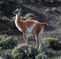

---
aliases:
- guanaco
- "Lama guanicoe"
- Guanako
has_id_wikidata: Q172886
title: "Lama guanicoe"
---

# [[Guanaco]] 

## #has_/text_of_/abstract 

> The **Guanaco** ( ghwuah-NAH-koh; Lama guanicoe) is a camelid native to South America, closely related to the llama. 
> 
> Guanacos are one of two wild South American camelids; 
> the other species is the vicuña, which lives at higher elevations.
>
> [Wikipedia](https://en.wikipedia.org/wiki/Guanaco) 

## Phylogeny 

-   « Ancestral Groups  
    -   [Camel](../../Camel.md)
    -   [Camelidae](Camelidae.md)
    -   [Tylopoda](Tylopoda.md)
    -   [Artiodactyla](Artiodactyla.md)
    -   [Eutheria](Eutheria.md)
    -   [Mammal](Mammal.md)
    -   [Therapsida](../../../../../../../../Therapsida.md)
    -   [Synapsida](../../../../../../../../../Synapsida.md)
    -   [Amniota](../../../../../../../../../../Amniota.md)
    -   [Terrestrial Vertebrates](../../../../../../../../../../../Terrestrial.md)
    -   [Sarcopterygii](../../../../../../../../../../../../Sarc.md)
    -   [Gnathostomata](../../../../../../../../../../../../../Gnath.md)
    -   [Vertebrata](../../../../../../../../../../../../../../Vertebrata.md)
    -   [Craniata](../../../../../../../../../../../../../../../Craniata.md)
    -   [Chordata](../../../../../../../../../../../../../../../../Chordata.md)
    -   [Deuterostomia](../../../../../../../../../../../../../../../../../Deutero.md)
    -   [Bilateria](Bilateria)
    -   [Animals](Animals)
    -   [Eukaryotes](Eukaryotes)
    -   [Tree of Life](../../../../../../../../../../../../../../../../../../../../Tree_of_Life.md)

-   ◊ Sibling Groups of  Camelinae
    -   [Lama pacos](Alpaca.md)
    -   [Camelus bactrianus](Camelus_bactrianus)
    -   Lama guanicoe
    -   [Vicugna vicugna](Vicugna_vicugna)

-   » Sub-Groups 

## Title Illustrations

------------------------------------------------------------

Scientific Name ::     Lama guanicoe
Location ::           Torres del Paine National Park, Chile
Specimen Condition   Live Specimen
Source               [Guanaco](http://flickr.com/photos/merula/153179602/)
Source Collection    [Flickr](http://flickr.com/)
Image Use ::    [Attribution-ShareAlike 2.0 Creative Commons License](http://creativecommons.org/licenses/by-sa/2.0/).
Copyright ::            © 2005 [Alastair Rae](http://flickr.com/people/merula/)

## Confidential Links & Embeds: 

### #is_/same_as :: [Guanaco](/_Standards/bio/bio~Domain/Eukaryotes/Animals/Bilateria/Deutero/Chordata/Craniata/Vertebrata/Gnath/Sarc/Tetrapods/Amniota/Synapsida/Therapsida/Mammal/Eutheria/Artiodactyla/Tylopoda/Camelidae/Camel/Lamini/Guanaco.md) 

### #is_/same_as :: [Guanaco.public](/_public/bio/bio~Domain/Eukaryotes/Animals/Bilateria/Deutero/Chordata/Craniata/Vertebrata/Gnath/Sarc/Tetrapods/Amniota/Synapsida/Therapsida/Mammal/Eutheria/Artiodactyla/Tylopoda/Camelidae/Camel/Lamini/Guanaco.public.md) 

### #is_/same_as :: [Guanaco.internal](/_internal/bio/bio~Domain/Eukaryotes/Animals/Bilateria/Deutero/Chordata/Craniata/Vertebrata/Gnath/Sarc/Tetrapods/Amniota/Synapsida/Therapsida/Mammal/Eutheria/Artiodactyla/Tylopoda/Camelidae/Camel/Lamini/Guanaco.internal.md) 

### #is_/same_as :: [Guanaco.protect](/_protect/bio/bio~Domain/Eukaryotes/Animals/Bilateria/Deutero/Chordata/Craniata/Vertebrata/Gnath/Sarc/Tetrapods/Amniota/Synapsida/Therapsida/Mammal/Eutheria/Artiodactyla/Tylopoda/Camelidae/Camel/Lamini/Guanaco.protect.md) 

### #is_/same_as :: [Guanaco.private](/_private/bio/bio~Domain/Eukaryotes/Animals/Bilateria/Deutero/Chordata/Craniata/Vertebrata/Gnath/Sarc/Tetrapods/Amniota/Synapsida/Therapsida/Mammal/Eutheria/Artiodactyla/Tylopoda/Camelidae/Camel/Lamini/Guanaco.private.md) 

### #is_/same_as :: [Guanaco.personal](/_personal/bio/bio~Domain/Eukaryotes/Animals/Bilateria/Deutero/Chordata/Craniata/Vertebrata/Gnath/Sarc/Tetrapods/Amniota/Synapsida/Therapsida/Mammal/Eutheria/Artiodactyla/Tylopoda/Camelidae/Camel/Lamini/Guanaco.personal.md) 

### #is_/same_as :: [Guanaco.secret](/_secret/bio/bio~Domain/Eukaryotes/Animals/Bilateria/Deutero/Chordata/Craniata/Vertebrata/Gnath/Sarc/Tetrapods/Amniota/Synapsida/Therapsida/Mammal/Eutheria/Artiodactyla/Tylopoda/Camelidae/Camel/Lamini/Guanaco.secret.md)

