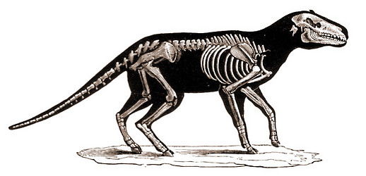

# Miscellaneous fossil artiodactyls
 

## Phylogeny 

-   « Ancestral Groups  
    -   [Artiodactyla](Artiodactyla.md)
    -   [Eutheria](Eutheria.md)
    -   [Mammal](Mammal.md)
    -   [Therapsida](../../../../Therapsida.md)
    -   [Synapsida](../../../../../Synapsida.md)
    -   [Amniota](../../../../../../Amniota.md)
    -   [Terrestrial Vertebrates](../../../../../../../Terrestrial.md)
    -   [Sarcopterygii](../../../../../../../../Sarc.md)
    -   [Gnathostomata](../../../../../../../../../Gnath.md)
    -   [Vertebrata](../../../../../../../../../../Vertebrata.md)
    -   [Craniata](../../../../../../../../../../../Craniata.md)
    -   [Chordata](../../../../../../../../../../../../Chordata.md)
    -   [Deuterostomia](../../../../../../../../../../../../../Deutero.md)
    -   [Bilateria](Bilateria)
    -   [Animals](Animals)
    -   [Eukaryotes](Eukaryotes)
    -   [Tree of Life](../../../../../../../../../../../../../../../../Tree_of_Life.md)

-   ◊ Sibling Groups of  Artiodactyla
    -   [Suidae](Suidae.md)
    -   [Tayassuidae](Tayassuidae.md)
    -   [Hippopotamidae](Hippopotamidae.md)
    -   [Tylopoda](Tylopoda.md)
    -   [Ruminants](Ruminants.md)
    -   Miscellaneous fossil artiodactyls

-   » Sub-Groups
    -   [Agriochoeridae](Agriochoeridae.md)
    -   [Anoplotheriidae](Anoplotheriidae.md)
    -   [Cainotheriidae](Cainotheriidae.md)
    -   [Choeropotamidae](Choeropotamidae.md)
	-   *[Agriochoeridae](Agriochoeridae.md "go to ToL page")*
	-   *Aksyiria* †
	-   *Amphimerycidae* †
	-   *Anthracotheriidae* †
	-   *Cebochoeridae* †
	-   *Dichobunidae* †[
	    (non-monophyletic) ]
	-   *Entelodontidae* †
	-   *Helohyidae* †
	-   *Merycoidodontidae* † [(oreodonts)]
	-   *Mixtotheriidae* †
	-   *Raoellidae* †
	-   *Sanitheriidae* †
	
Containing group: [Artiodactyla](Artiodactyla.md)

## Title Illustrations

----------------------------------
Scientific Name ::     Anoplotherium commune
Location ::           France
Reference            Nicholson, H. A. 1897. Ancient Life-History of the Earth. D. Appleton and Company, New York.
Acknowledgements     after Cuvier
Specimen Condition   Fossil \-- Period: Eocene

## Confidential Links & Embeds: 

### [fossil_artiodactyls](/_Standards/bio/bio~Domain/Eukaryotes/Animals/Bilateria/Deutero/Chordata/Craniata/Vertebrata/Gnath/Sarc/Tetrapods/Amniota/Synapsida/Therapsida/Mammal/Eutheria/Artiodactyla/fossil_artiodactyls.md) 

### [fossil_artiodactyls.public](/_public/bio/bio~Domain/Eukaryotes/Animals/Bilateria/Deutero/Chordata/Craniata/Vertebrata/Gnath/Sarc/Tetrapods/Amniota/Synapsida/Therapsida/Mammal/Eutheria/Artiodactyla/fossil_artiodactyls.public.md) 

### [fossil_artiodactyls.internal](/_internal/bio/bio~Domain/Eukaryotes/Animals/Bilateria/Deutero/Chordata/Craniata/Vertebrata/Gnath/Sarc/Tetrapods/Amniota/Synapsida/Therapsida/Mammal/Eutheria/Artiodactyla/fossil_artiodactyls.internal.md) 

### [fossil_artiodactyls.protect](/_protect/bio/bio~Domain/Eukaryotes/Animals/Bilateria/Deutero/Chordata/Craniata/Vertebrata/Gnath/Sarc/Tetrapods/Amniota/Synapsida/Therapsida/Mammal/Eutheria/Artiodactyla/fossil_artiodactyls.protect.md) 

### [fossil_artiodactyls.private](/_private/bio/bio~Domain/Eukaryotes/Animals/Bilateria/Deutero/Chordata/Craniata/Vertebrata/Gnath/Sarc/Tetrapods/Amniota/Synapsida/Therapsida/Mammal/Eutheria/Artiodactyla/fossil_artiodactyls.private.md) 

### [fossil_artiodactyls.personal](/_personal/bio/bio~Domain/Eukaryotes/Animals/Bilateria/Deutero/Chordata/Craniata/Vertebrata/Gnath/Sarc/Tetrapods/Amniota/Synapsida/Therapsida/Mammal/Eutheria/Artiodactyla/fossil_artiodactyls.personal.md) 

### [fossil_artiodactyls.secret](/_secret/bio/bio~Domain/Eukaryotes/Animals/Bilateria/Deutero/Chordata/Craniata/Vertebrata/Gnath/Sarc/Tetrapods/Amniota/Synapsida/Therapsida/Mammal/Eutheria/Artiodactyla/fossil_artiodactyls.secret.md)

