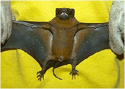

## Phylogeny 

-   « Ancestral Groups  
    -   [Microchiroptera](Microchiroptera.md)
    -   [Chiroptera](Chiroptera.md)
    -   [Eutheria](Eutheria.md)
    -   [Mammal](Mammal.md)
    -   [Therapsida](../../../../../Therapsida.md)
    -   [Synapsida](../../../../../../Synapsida.md)
    -   [Amniota](../../../../../../../Amniota.md)
    -   [Terrestrial Vertebrates](../../../../../../../../Terrestrial.md)
    -   [Sarcopterygii](../../../../../../../../../Sarc.md)
    -   [Gnathostomata](../../../../../../../../../../Gnath.md)
    -   [Vertebrata](../../../../../../../../../../../Vertebrata.md)
    -   [Craniata](../../../../../../../../../../../../Craniata.md)
    -   [Chordata](../../../../../../../../../../../../../Chordata.md)
    -   [Deuterostomia](../../../../../../../../../../../../../../Deutero.md)
    -   [Bilateria](Bilateria)
    -   [Animals](Animals)
    -   [Eukaryotes](Eukaryotes)
    -   [Tree of Life](../../../../../../../../../../../../../../../../../Tree_of_Life.md)

-   ◊ Sibling Groups of  Microchiroptera
    -   [Rhinopomatoidea](Rhinopomatoidea.md)
    -   [Rhinolophoidea](Rhinolophoidea.md)
    -   [Noctilionoidea](Noctilionoidea.md)
    -   [Nataloidea](Nataloidea.md)
    -   Molossoidea
    -   [Vespertilionidae](Vespertilionidae.md)

-   » Sub-Groups
    -   [Molossidae](Molossidae.md)

# Molossoidea 

[Nancy B. Simmons and Tenley Conway](http://www.tolweb.org/)

-   *[Molossidae](Molossidae.md "go to ToL page")*
    [(Free-tailed Bats)]
-   *Antrozoidae*

from Simmons (1998) and Simmons and Gielser (1998).

Containing group: [Microchiroptera](Microchiroptera.md)

## Introduction

Molossoidea includes two families, Molossidae (12 genera and 80 species)
and Antrozoidae (2 genera and 2 species). All molossoids are
insectivores, and most (i.e., all molossids) are fast-flying ariel
insectivorous. Antrozoids glean most of their prey from surfaces and may
have a more generalized diet.

### Characteristics

All Molossoidea share the following features:

1.  one upper incisor on each side of jaw.
2.  body of basihyal u-shaped.
3.  ribs with no anterior laminae.
4.  posterior laminae on ribs narrow, lamina width less than that of
    main body of rib.
5.  ventral process present, distal tip blunt or rounded.
6.  xiphisternum without keel.\

### Discussion of Phylogenetic Relationships

Until recently, Antrozoidea was placed in Vesperilionidae as either a
seperate subfamily (e.g. Miller, 1897), a member of \"Nyctophilinae\"
(e.g. Hill and Smith, 1984), or as a tribe within Vespertilioninae (e.g.
Koopman, 1993, 1994). However, Simmons (1998) and Simmon and Geisler
(1998) demonstrated that antrozoids are more closely related to
molossids than to other vespertilionids. Simmon (1998) raised the group
to family level as Antrozoidae and placed it in Molossoidea to reflect
this relationship.

### Geographic Distribution

The geographical distribution of Molossoidea is shown in red.
Distribution from Hill and Smith (1984).
### References

Hill, J.E., and J.D. Smith. 1984. Bats: a natural history. Austin:
University of Texas Press.

Simmons, N. B. 1998. A reappraisal of interfamilial relationships of
bats. In Bats: Phylogeny, Morphology, Echolocation and Conservation
Biology. T.H. Kunz and P.A. Racey (eds.). Washington: Smithsonian
Institution Press.

Simmons, N. B. & J. H. Geisler. 1998. Phylogenetic relationships of
Icaronycteris, Archeonycteris, Hassianycteris, and Palaeochiropteryx to
extant bat lineages, with comments on the evolution of echolocation and
foraging strategies in microchiroptera. Bulletin of the American Museum
of Natural History. 235:1-82.

## Title Illustrations



  ----------
  Scientific Name ::  Molossus rufus
  Copyright ::         © 1998 Nancy Simmons
  ----------


  ----------
  Scientific Name ::  Molossus rufus
  Copyright ::         © 1998 Nancy Simmons
  ----------

## Confidential Links & Embeds: 

### #is_/same_as :: [Molossoidea](/_Standards/bio/bio~Domain/Eukaryotes/Animals/Bilateria/Deutero/Chordata/Craniata/Vertebrata/Gnath/Sarc/Tetrapods/Amniota/Synapsida/Therapsida/Mammal/Eutheria/Chiroptera/Microchiroptera/Molossoidea.md) 

### #is_/same_as :: [Molossoidea.public](/_public/bio/bio~Domain/Eukaryotes/Animals/Bilateria/Deutero/Chordata/Craniata/Vertebrata/Gnath/Sarc/Tetrapods/Amniota/Synapsida/Therapsida/Mammal/Eutheria/Chiroptera/Microchiroptera/Molossoidea.public.md) 

### #is_/same_as :: [Molossoidea.internal](/_internal/bio/bio~Domain/Eukaryotes/Animals/Bilateria/Deutero/Chordata/Craniata/Vertebrata/Gnath/Sarc/Tetrapods/Amniota/Synapsida/Therapsida/Mammal/Eutheria/Chiroptera/Microchiroptera/Molossoidea.internal.md) 

### #is_/same_as :: [Molossoidea.protect](/_protect/bio/bio~Domain/Eukaryotes/Animals/Bilateria/Deutero/Chordata/Craniata/Vertebrata/Gnath/Sarc/Tetrapods/Amniota/Synapsida/Therapsida/Mammal/Eutheria/Chiroptera/Microchiroptera/Molossoidea.protect.md) 

### #is_/same_as :: [Molossoidea.private](/_private/bio/bio~Domain/Eukaryotes/Animals/Bilateria/Deutero/Chordata/Craniata/Vertebrata/Gnath/Sarc/Tetrapods/Amniota/Synapsida/Therapsida/Mammal/Eutheria/Chiroptera/Microchiroptera/Molossoidea.private.md) 

### #is_/same_as :: [Molossoidea.personal](/_personal/bio/bio~Domain/Eukaryotes/Animals/Bilateria/Deutero/Chordata/Craniata/Vertebrata/Gnath/Sarc/Tetrapods/Amniota/Synapsida/Therapsida/Mammal/Eutheria/Chiroptera/Microchiroptera/Molossoidea.personal.md) 

### #is_/same_as :: [Molossoidea.secret](/_secret/bio/bio~Domain/Eukaryotes/Animals/Bilateria/Deutero/Chordata/Craniata/Vertebrata/Gnath/Sarc/Tetrapods/Amniota/Synapsida/Therapsida/Mammal/Eutheria/Chiroptera/Microchiroptera/Molossoidea.secret.md)

