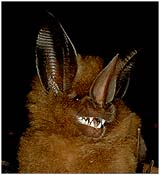
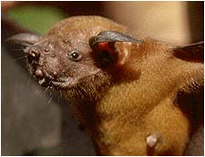

## Phylogeny 

-   « Ancestral Groups  
    -   [Microchiroptera](Microchiroptera.md)
    -   [Chiroptera](Chiroptera.md)
    -   [Eutheria](Eutheria.md)
    -   [Mammal](Mammal.md)
    -   [Therapsida](../../../../../Therapsida.md)
    -   [Synapsida](../../../../../../Synapsida.md)
    -   [Amniota](../../../../../../../Amniota.md)
    -   [Terrestrial Vertebrates](../../../../../../../../Terrestrial.md)
    -   [Sarcopterygii](../../../../../../../../../Sarc.md)
    -   [Gnathostomata](../../../../../../../../../../Gnath.md)
    -   [Vertebrata](../../../../../../../../../../../Vertebrata.md)
    -   [Craniata](../../../../../../../../../../../../Craniata.md)
    -   [Chordata](../../../../../../../../../../../../../Chordata.md)
    -   [Deuterostomia](../../../../../../../../../../../../../../Deutero.md)
    -   [Bilateria](Bilateria)
    -   [Animals](Animals)
    -   [Eukaryotes](Eukaryotes)
    -   [Tree of Life](../../../../../../../../../../../../../../../../../Tree_of_Life.md)

-   ◊ Sibling Groups of  Microchiroptera
    -   [Rhinopomatoidea](Rhinopomatoidea.md)
    -   [Rhinolophoidea](Rhinolophoidea.md)
    -   Noctilionoidea
    -   [Nataloidea](Nataloidea.md)
    -   [Molossoidea](Molossoidea.md)
    -   [Vespertilionidae](Vespertilionidae.md)

-   » Sub-Groups 

# Noctilionoidea 

[Nancy B. Simmons and Tenley Conway]()

Tree from Simmons (1998), Simmons and Geisler (1998), and Kirsch et al.
(1998).

Containing group: [Microchiroptera](Microchiroptera.md)

## Introduction

The superfamily Noctilionoidea includes four families: Mystacinidae,
Noctilionidae, Mormoopidae, and Phyllostomidae. Mystacinidae and
Noctilionidae each include one genus and two species, while Mormoopidae
contains two genera and eight species (Koopman, 1993). In contrast,
Phyllostomidae includes 48 genera and 138 species (Koopman, 1993),
making it the third largest family within Chiroptera.

Food preference varies among taxa in Noctilionoidea, with species
variably specialized to feed principally on insects, other animals
(e.g., rodents, birds, and other bats), nectar, pollen, fruit, or blood.
Many of these bats have unusally facial ornimentation, including
nose-leafs, leaf-chin flaps, swollen lips and other projections in the
labio-nasal region.

 

### Characteristics

All Noctiloinoidea share the following features:

1.  m\. hyoglossus originates from lateral basihyal and lateral
    thyrohyal in two sheets separated by a space.
2.  clitoris elongated.\

### Discussion of Phylogenetic Relationships

A close relationship between Phyllostomidae, Mormoopidae, and
Noctilionidae has long been recognized (see review in Simmons and
Geisler, 1998). Mormoopidae was once considered a subfamily within
Phyllostomidae, but Smith (1972) raised it to family level. Available
data supports either a sister taxa relationship between Mormoopidae and
Phyllostomidae, with Noctilionidae as sister to that clade (Van Valen,
1979; Simmons, 1998; Kirsch et al., In press), or Mormoopidae and
Noctilionidae as sister taxa, with Phyllostomidae as sister to them
(Simmons and Geisler, 1998).

It is only recently that Mystacinidae has been associated with
Noctilionidae, Mormoopidae and Phyllostomidae. Mystacinidae was
historically placed with Molossidae and/or Verspertilionidae (e.g.,
Simmons and Geisler, 1998) but morphological data have been largely
inconclusive concerning the exact affinities of this small family.
However, immunological data (Pierson, 1986; Pierson et al., 1986) and
DNA-hybridization data (Kirsch et al., in press) strongly supported
placement of Mystacinidae within Noctilionoidea. Kirsch et al. suggested
that *Mystacina* is the sister-group of all other noctilionoids, a
hypothesis which is compatible with available morphological data.

 

### Geographic Distribution

The geographical distribution of Noctilionoidea is shown in red.
Distribution from Hill and Smith (1984).
### References

Hill, J.E., and J.D. Smith. 1984. Bats: a natural history. Austin:
University of Texas Press.

Koopman, K. F. 1983. Order Chiroptera. In Mammal species of the world, a
taxonomic and geographic reference, 2nd ed. D. E. Wilson and D. M.
Reeder. Washinton, D. C.: Smithsonian Institution Press.

Kirsch, J. A., J. M. Hutcheon, D. G. Byrnes & B. D. Lloyd. 1998.
Affinites and historical zoogeography of the New Zealand Short-tailed
bat, Mystacina tuberculata Gray 1843, inferred from DNA-hybridization
comparisons. Journal of Mammalian Evolution 5(1): 33-64.

Pierson, E. D. 1986. Molecular systematics of the Mircochiroptera:
higher taxon relationships and biogeography. Unpublished Ph.D. thesis,
University of California, Berkeley.

Pierson, E .D., V. M. Sarich, J. M. Lowenstein, M. J. Daniel & W. E.
Rainey. 1986. A molecular link between the bats of New Zealand and South
America. Nature 323: 60-63.

Simmons, N. B. 1998. A reappraisal of interfamilial relationships of
bats. In Bats: Phylogeny, Morphology, Echolocation and Conservation
Biology. T.H. Kunz and P.A. Racey (eds.). Washington: Smithsonian
Institution Press.

Simmons, N. B. & J. H. Geisler. 1998. Phylogenetic relationships of
Icaronycteris, Archeonycteris, Hassianycteris, and Palaeochiropteryx to
extant bat lineages, with comments on the evolution of echolocation and
foraging strategies in microchiroptera. Bulletin of the American Museum
of Natural History. 235:1-182.

Van Valen, T. A. 1979. The evolution of bats. Evolutionary Theory,
4:104-121.

## Title Illustrations

Mimon bennettii (Phyllostomidae) and Noctilio leporinus (Noctilionidae).
Copyright © Nancy Simmons 1998


  ---------
  Copyright ::   © 1998 Nancy Simmons
  ---------


  ---------
  Copyright ::   © 1998 Nancy Simmons
  ---------

## Confidential Links & Embeds: 

### [Noctilionoidea](/_Standards/bio/bio~Domain/Eukaryotes/Animals/Bilateria/Deutero/Chordata/Craniata/Vertebrata/Gnath/Sarc/Tetrapods/Amniota/Synapsida/Therapsida/Mammal/Eutheria/Chiroptera/Microchiroptera/Noctilionoidea.md) 

### [Noctilionoidea.public](/_public/bio/bio~Domain/Eukaryotes/Animals/Bilateria/Deutero/Chordata/Craniata/Vertebrata/Gnath/Sarc/Tetrapods/Amniota/Synapsida/Therapsida/Mammal/Eutheria/Chiroptera/Microchiroptera/Noctilionoidea.public.md) 

### [Noctilionoidea.internal](/_internal/bio/bio~Domain/Eukaryotes/Animals/Bilateria/Deutero/Chordata/Craniata/Vertebrata/Gnath/Sarc/Tetrapods/Amniota/Synapsida/Therapsida/Mammal/Eutheria/Chiroptera/Microchiroptera/Noctilionoidea.internal.md) 

### [Noctilionoidea.protect](/_protect/bio/bio~Domain/Eukaryotes/Animals/Bilateria/Deutero/Chordata/Craniata/Vertebrata/Gnath/Sarc/Tetrapods/Amniota/Synapsida/Therapsida/Mammal/Eutheria/Chiroptera/Microchiroptera/Noctilionoidea.protect.md) 

### [Noctilionoidea.private](/_private/bio/bio~Domain/Eukaryotes/Animals/Bilateria/Deutero/Chordata/Craniata/Vertebrata/Gnath/Sarc/Tetrapods/Amniota/Synapsida/Therapsida/Mammal/Eutheria/Chiroptera/Microchiroptera/Noctilionoidea.private.md) 

### [Noctilionoidea.personal](/_personal/bio/bio~Domain/Eukaryotes/Animals/Bilateria/Deutero/Chordata/Craniata/Vertebrata/Gnath/Sarc/Tetrapods/Amniota/Synapsida/Therapsida/Mammal/Eutheria/Chiroptera/Microchiroptera/Noctilionoidea.personal.md) 

### [Noctilionoidea.secret](/_secret/bio/bio~Domain/Eukaryotes/Animals/Bilateria/Deutero/Chordata/Craniata/Vertebrata/Gnath/Sarc/Tetrapods/Amniota/Synapsida/Therapsida/Mammal/Eutheria/Chiroptera/Microchiroptera/Noctilionoidea.secret.md)

